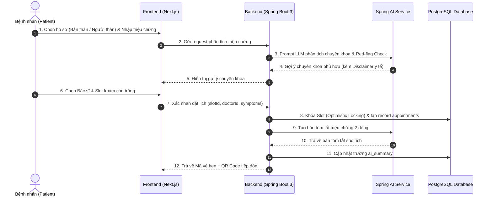
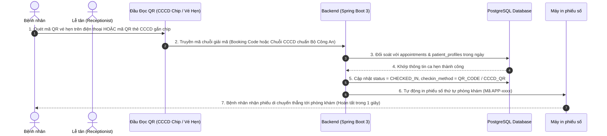
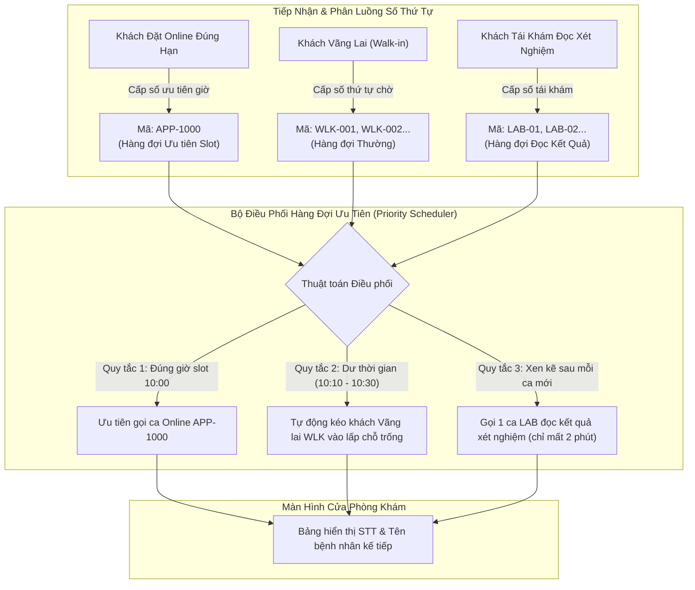

# 🔄 03. Quy Trình Nghiệp Vụ Chính (Clear Luồng Chính) - Dự Án MedSched (Phiên Bản 2.0)

> **Học phần:** Java Spring 2 - Phát triển ứng dụng Web thông minh với Spring Boot & Spring AI  
> **Đề tài:** Hệ thống Quản lý Đặt lịch Khám & Tiếp đón Bệnh viện Thông minh (MedSched)  
> **Cập nhật:** Chuẩn hóa theo toàn bộ góp ý của Giảng viên & Kịch bản thực tế bệnh viện (Tập trung trọng tâm vào Spring Boot 3 + Spring AI, thay thế hoàn toàn module YOLO11 bằng đầu đọc mã QR CCCD gắn chip và quy trình tiếp đón y tế chuẩn mực).

---

## 🌟 Tổng Quan Các Luồng Nghiệp Vụ Trọng Tâm

1. **Luồng 1:** Bệnh nhân đặt lịch trực tuyến có hỗ trợ phân luồng chuyên khoa & AI Guardrails qua Spring AI.
2. **Luồng 2:** Check-in tiếp đón siêu tốc trong 1 giây bằng đầu đọc mã QR vé hẹn hoặc thẻ CCCD gắn chip (kèm fallback tra cứu tay).
3. **Luồng 3:** Bác sĩ khám bệnh dựa trên bản tóm tắt hồ sơ triệu chứng 2 dòng và tiền sử bệnh do Spring AI chuẩn bị trước.
4. **Luồng 4:** Đánh giá chất lượng sau khám & Phân tích cảm xúc bằng Spring AI (Verified Review & Sentiment Analysis).
5. **Luồng 5:** Điều phối hàng đợi khám bệnh thông minh (Smart Examination Queue: Khách Online vs Khách Vãng lai).
6. **Luồng 6:** Khám cận lâm sàng 2 pha (Xét nghiệm / X-Quang và tái khám đọc kết quả).
7. **Luồng 7:** Xử lý 5 tình huống biên không lý tưởng (Edge Cases & Fallbacks).

---

## 1. Luồng 1: Bệnh Nhân Đặt Lịch Khám Trực Tuyến (Online Booking Flow)

### 1.1. Diễn giải các bước thực hiện
1. **Bước 1:** Bệnh nhân chọn hồ sơ người khám (Bản thân hoặc Người thân trong gia đình: Bố mẹ, con cái).
2. **Bước 2 (Spring AI Clinical Triage):** Bệnh nhân nhập mô tả triệu chứng tự nhiên. Spring AI tự động phân tích ngữ nghĩa, kích hoạt bộ lọc cấp cứu (Red-flag Guardrails) và định hướng chuyên khoa phù hợp (vd: Da liễu, Tim mạch, Nội tổng quát).
3. **Bước 3:** Bệnh nhân chọn Bác sĩ, ngày khám và khung giờ còn trống (Time-slot).
4. **Bước 4 (Concurrency Protection):** Hệ thống áp dụng khóa lạc quan (Optimistic Locking) chống đặt trùng, sinh **Mã vé hẹn (Booking Code)** kèm **Mã QR vé khám**.
5. **Bước 5 (Spring AI Summary):** Spring AI tự động trích xuất trước bản **Tóm tắt bệnh án 2 dòng** lưu vào database, sẵn sàng hiển thị cho bác sĩ khi tiếp nhận ca khám.

---

## 2. Luồng 2: Tiếp Đón & Check-in Siêu Tốc 1 Giây Tại Quầy (Check-in Flow)

---

## 3. Luồng 3: Bác Sĩ Khám Bệnh & Kê Đơn (Doctor Consultation Flow)

1. **Xem trước thông tin AI (Pre-consultation):** Bác sĩ mở danh sách hàng đợi trên màn hình phòng khám, nhấp vào ca kế tiếp. Màn hình lập tức hiển thị **Bản tóm tắt triệu chứng 2 dòng do Spring AI chuẩn bị trước** kèm tiền sử bệnh và dị ứng thuốc của bệnh nhân.
2. **Khám lâm sàng:** Bác sĩ tiếp nhận bệnh nhân, thăm khám trực tiếp.
3. **Kết luận ca khám:** Bác sĩ nhập chẩn đoán ICD-10, ghi chú và kê đơn thuốc điện tử ➔ Chuyển trạng thái ca hẹn thành `COMPLETED` (hoặc chuyển `WAITING_FOR_LAB_RESULTS` nếu chỉ định cận lâm sàng).

---

## 4. Luồng 4: Đánh Giá Chất Lượng Sau Khám & Phân Tích Cảm Xúc Spring AI

* Sau khi ca khám hoàn tất (`status = COMPLETED`), bệnh nhân được mở khóa form đánh giá 1 - 5 sao và bình luận.
* Mỗi ca hẹn chỉ được đánh giá 1 lần duy nhất (Verified Review).
* **Spring AI Sentiment Analysis:** Tự động phân loại nhận xét thành `POSITIVE`, `NEUTRAL`, `NEGATIVE`. Các phản hồi tiêu cực kèm đánh giá $\le 2$ sao sẽ tự động kích hoạt cờ cảnh báo trên Dashboard của Quản trị viên/Ban Giám Đốc.

---

## 5. Luồng 5: Thuật Toán Điều Phối Hàng Đợi Thông Minh (Queue Priority Engine)

> **Giải quyết bài toán thực tế:** 9:30 có 10 khách vãng lai (Walk-in), 10:00 có 1 ca hẹn online đặt trước. Bác sĩ khám mỗi ca chỉ 10 phút trong khi slot quy định là 30 phút.

### Quy tắc điều phối thời gian thực:
1. **Ưu tiên Slot hẹn trước:** Khi đến mốc `10:00`, nếu bệnh nhân online `APP-1000` đã Check-in có mặt, hệ thống ưu tiên gọi vào phòng khám ngay sau khi ca hiện tại kết thúc.
2. **Tận dụng Buffer Time (Lấp khoảng trống):** Bác sĩ khám ca online chỉ mất 10 phút (xong lúc 10:10, slot đến 10:30 mới hết):
   - Bác sĩ bấm nút *"Gọi số tiếp theo"*. Hệ thống nhận diện khoảng trống 20 phút trước slot tiếp theo $\rightarrow$ **Tự động gọi ngay khách vãng lai `WLK-001` vào khám**, không để phòng khám bị lãng phí thời gian.
3. **Trường hợp ca online đến muộn (> 15 phút):** Tự động chuyển ca online về xếp cuối hàng đợi của khung giờ tiếp theo để không làm tắc nghẽn cả dây chuyền.

---

## 6. Luồng 6: Quy Trình Cận Lâm Sàng 2 Pha (Two-Phase Clinical Flow)

1. **Pha 1 - Thăm khám ban đầu:** Bác sĩ khám sơ bộ, ra chỉ định làm xét nghiệm máu / chụp X-Quang.
2. **Chuyển trạng thái:** Bác sĩ bấm *"Chỉ định cận lâm sàng"*, ca hẹn chuyển sang `WAITING_FOR_LAB_RESULTS`. Bệnh nhân rời phòng khám đi làm cận lâm sàng.
3. **Pha 2 - Đọc kết quả:** Sau 45 phút khi có kết quả trả về:
   - Bệnh nhân quay lại trước cửa phòng khám, quét lại mã vé hoặc báo số thứ tự.
   - Hệ thống cấp mã ưu tiên đọc kết quả (`LAB-xx`), xếp vào hàng đợi đọc kết quả xen kẽ giữa các ca mới (vì đọc kết quả và kê đơn chỉ mất 2-3 phút, không bắt bệnh nhân phải bốc số xếp hàng lại từ đầu).

---

## 7. Luồng 7: Xử Lý 5 Kịch Bản Không Lý Tưởng (Edge Cases & Fallbacks)

### 7.1. Bác sĩ nghỉ đột xuất / Có ca cấp cứu khẩn cấp (Emergency Cancellation)
* **Kịch bản:** Bác sĩ đang trực thì phải vào phòng mổ cấp cứu đột xuất, còn 6 bệnh nhân đang chờ hoặc đã đặt lịch.
* **Xử lý:** Admin kích hoạt `CANCELLED_EMERGENCY` trên lịch trực:
  * **Nhánh 1 (Điều chuyển tự động):** Hệ thống tìm bác sĩ cùng chuyên khoa còn slot trống trong buổi $\rightarrow$ Điều chuyển tự động và gửi thông báo qua Email/SMS.
  * **Nhánh 2 (Cấp Voucher ưu tiên):** Nếu không có bác sĩ thay thế, hệ thống hủy ca hẹn, gửi tin nhắn xin lỗi kèm **Mã đặt hẹn ưu tiên (Priority Token)** cho phép chọn khám vào bất kỳ ngày nào mà không mất phí.

### 7.2. Ca khám phức tạp bị kéo dài thời gian (Cascading Delay)
* **Kịch bản:** Ca khám 10:00 kéo dài 40 phút thay vì 20 phút.
* **Xử lý:** Bác sĩ bật cờ `is_delayed = true` trên màn hình làm việc $\rightarrow$ Hệ thống tự động gửi thông báo cho các bệnh nhân ở slot 10:20 và 10:40: *"Ca khám trước đang kéo dài, thời gian dự kiến vào khám dời lại 20 phút, quý khách có thể thong thả di chuyển"*.

### 7.3. Bệnh nhân bỏ hẹn (No-Show)
* **Xử lý:** Nếu quá giờ hẹn 15 phút mà chưa Check-in, ca hẹn tự động chuyển sang `MISSED_NO_SHOW`. Slot được giải phóng ngay lập tức cho bệnh nhân vãng lai. Tài khoản bị No-show quá 3 lần/tháng sẽ bị khóa quyền đặt lịch online 30 ngày.

### 7.4. Mã QR trên thẻ CCCD bị trầy xước / Lỗi thiết bị quét (Check-in Fallback)
* **Cơ chế 2 tầng:**
  * **Tầng 1:** Quét mã QR trên thẻ CCCD gắn chip hoặc quét mã QR trên ứng dụng VNeID / vé hẹn trên điện thoại bệnh nhân.
  * **Tầng 2:** Nếu thẻ mờ hoặc quên mang điện thoại, Lễ tân tra cứu nhanh bằng Số điện thoại hoặc Số CCCD trên thanh tìm kiếm tiếp đón và bấm check-in thủ công trong 5 giây (`checkin_method = MANUAL`).

### 7.5. Bệnh nhân chat triệu chứng nguy kịch với Spring AI (Red-flag Guardrails)
* **Rủi ro:** Bệnh nhân đang khó thở dữ dội, đau tim, nôn ra máu nhưng vẫn ngồi chat đặt lịch hẹn tuần sau.
* **Xử lý:** Bộ lọc an toàn y tế trong Spring AI phát hiện từ khóa đỏ (`đau tim`, `đột quỵ`, `nôn ra máu`, `ngất xỉu`, `khó thở cấp`) $\rightarrow$ Bật cảnh báo khẩn cấp màu đỏ toàn màn hình:  
  > 🚨 **CẢNH BÁO Y TẾ KHẨN CẤP:**  
  > Bạn đang có dấu hiệu nguy kịch! Vui lòng gọi ngay **115** hoặc đến Khoa Cấp cứu của bệnh viện gần nhất, tuyệt đối không chờ đợi đặt lịch khám định kỳ!
