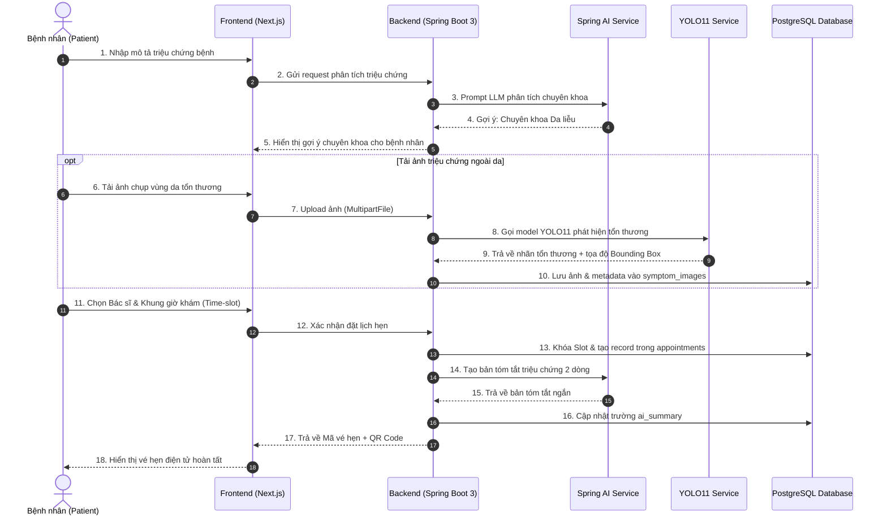
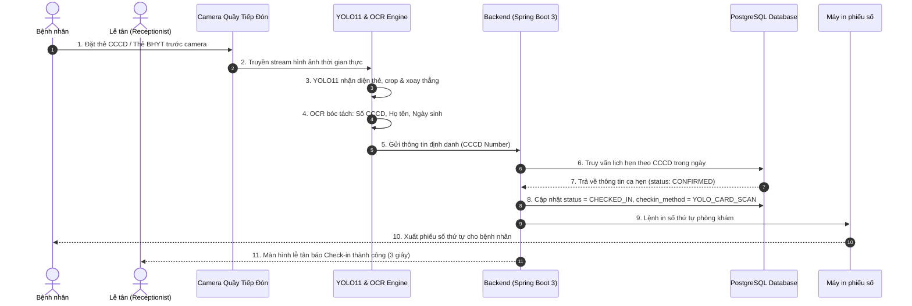
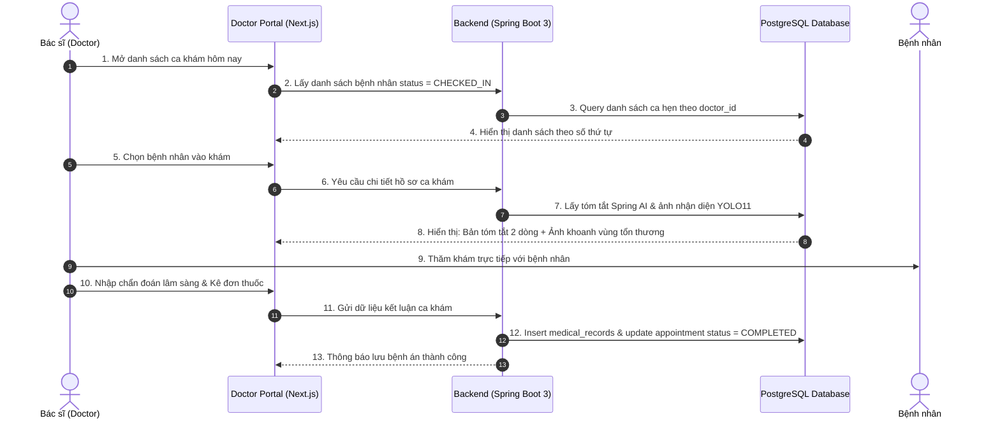
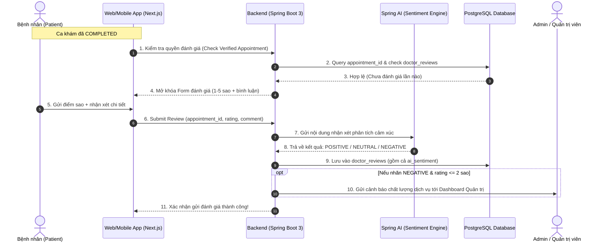

# 🔄 03. Quy Trình Nghiệp Vụ Chính (Clear Luồng Chính) - Dự Án MedSched

> **Học phần:** Java Spring 2 - Phát triển ứng dụng Web thông minh với Spring Boot & AI  
> **Đề tài:** Hệ thống Quản lý Đặt lịch Khám & Tiếp đón Bệnh viện Thông minh (MedSched)

---

## 🌟 Tổng Quan 3 Luồng Nghiệp Vụ Trọng Tâm

Hệ thống MedSched tập trung giải quyết triệt để 3 quy trình then chốt nhất trong khám chữa bệnh ngoại trú:
1. **Luồng 1:** Bệnh nhân đặt lịch trực tuyến có hỗ trợ phân luồng từ Spring AI & Tiền sàng lọc ảnh qua YOLO11.
2. **Luồng 2:** Check-in tiếp đón tự động trong 3 giây bằng Camera quét CCCD/BHYT qua YOLO11.
3. **Luồng 3:** Bác sĩ khám bệnh dựa trên bản tóm tắt hồ sơ AI và ảnh phân tích thị giác máy tính.

---

## 1. Luồng 1: Bệnh Nhân Đặt Lịch Khám Trực Tuyến (Online Booking Flow)

### 1.1. Diễn giải các bước thực hiện
1. **Bước 1:** Bệnh nhân truy cập ứng dụng Web MedSched, nhập các triệu chứng khó chịu (ví dụ: *"Bị ngứa rát, nổi nốt đỏ ở bắp tay 3 ngày nay"*).
2. **Bước 2 (Spring AI):** Hệ thống gửi mô tả đến Spring AI Service. AI nhận diện đây là bệnh ngoài da, gợi ý bệnh nhân chọn chuyên khoa **Da liễu**.
3. **Bước 3 (YOLO11):** Bệnh nhân chụp ảnh vùng da tổn thương và tải lên. Hệ thống gọi sang YOLO11 Vision Service:
   - YOLO11 khoanh vùng vết đỏ (Bounding Box).
   - Dự đoán nhãn phân loại lâm sàng (ví dụ: `rash / eczema` với độ tin cậy 89%).
   - Lưu trữ cả ảnh gốc và ảnh đã khoanh vùng vào kho dữ liệu.
4. **Bước 4:** Bệnh nhân chọn Bác sĩ chuyên khoa Da liễu, chọn ngày và khung giờ khám còn trống (Time-slot).
5. **Bước 5:** Hệ thống giữ chỗ bằng cơ chế khóa lạc quan (Optimistic Locking) để tránh đặt trùng khung giờ, xác nhận lịch hẹn và sinh **Mã đặt chỗ (Booking Code)** kèm **Mã QR vé hẹn**.
6. **Bước 6:** Hệ thống chạy ngầm Spring AI để tạo trước một bản **Tóm tắt triệu chứng 2 dòng** sẵn sàng cho bác sĩ.

### 1.2. Sơ đồ tuần tự (Sequence Diagram)

---

## 2. Luồng 2: Tiếp Đón & Check-in Tự Động Tại Quầy (Check-in Flow)

### 2.1. Diễn giải các bước thực hiện
1. **Bước 1:** Bệnh nhân đến bệnh viện trước giờ hẹn 10 phút và tiến vào quầy tiếp đón.
2. **Bước 2 (Nhận diện thẻ qua YOLO11):** Bệnh nhân đặt thẻ CCCD gắn chip hoặc thẻ BHYT lên mặt kính camera tại quầy.
3. **Bước 3:** YOLO11 phát hiện khung viền thẻ trong luồng video, thực hiện cắt (crop), cân chỉnh góc nghiêng và gửi qua bộ giải mã OCR.
4. **Bước 4:** OCR bóc tách chuỗi **Số CCCD**, **Họ và tên**, **Ngày sinh**.
5. **Bước 5:** Backend nhận số CCCD, truy vấn bảng `patients` và `appointments` tìm lịch hẹn trong ngày của bệnh nhân.
6. **Bước 6:** 
   - Hệ thống chuyển trạng thái lịch hẹn từ `CONFIRMED` ➔ `CHECKED_IN`, ghi nhận thời gian `check_in_time`.
   - Máy in tại quầy tự động in phiếu số thứ tự tiếp đón ghi rõ: Số thứ tự, Tên bác sĩ, Số phòng khám.
   - Toàn bộ quy trình hoàn tất trong **dưới 3 giây** mà không cần lễ tân phải gõ bàn phím.

### 2.2. Sơ đồ tuần tự (Sequence Diagram)

---

## 3. Luồng 3: Bác Sĩ Khám Bệnh & Kê Đơn (Doctor Consultation Flow)

### 3.1. Diễn giải các bước thực hiện
1. **Bước 1:** Bác sĩ mở màn hình làm việc (Doctor Workspace), hệ thống hiển thị danh sách bệnh nhân đã check-in đang ngồi chờ ngoài phòng khám theo đúng số thứ tự.
2. **Bước 2 (Hỗ trợ từ AI trước khi khám):**
   - Bác sĩ nhấp vào bệnh nhân kế tiếp. Màn hình lập tức hiển thị **Bản tóm tắt triệu chứng 2 dòng của Spring AI**. Bác sĩ nắm bắt nhanh chóng lý do đến khám chỉ trong 5 giây.
   - Nếu bệnh nhân có gửi kèm ảnh tổn thương da, màn hình hiển thị ảnh đã được YOLO11 khoanh vùng tổn thương kèm nhãn phân loại dự đoán.
3. **Bước 3:** Bác sĩ gọi bệnh nhân vào phòng, thăm khám lâm sàng trực tiếp.
4. **Bước 4:** Bác sĩ nhập chẩn đoán xác định, mã bệnh quốc tế ICD-10, các chỉ định cận lâm sàng (nếu có) và kê đơn thuốc điện tử.
5. **Bước 5:** Bác sĩ bấm **"Hoàn tất ca khám"**. Hệ thống lưu hồ sơ bệnh án vào bảng `medical_records`, chuyển trạng thái ca hẹn sang `COMPLETED`, giải phóng phòng khám cho bệnh nhân tiếp theo.

### 3.2. Sơ đồ tuần tự (Sequence Diagram)

---

## 4. Luồng 4: Đánh Giá Chất Lượng Sau Khám & Phân Tích Cảm Xúc Bằng Spring AI (Verified Review & Sentiment Analysis)

### 4.1. Diễn giải các bước thực hiện
1. **Bước 1 (Mở khóa đánh giá):** Sau khi ca khám hoàn tất (`status = COMPLETED`), ứng dụng của bệnh nhân hiển thị thông báo mời đánh giá chất lượng dịch vụ của Bác sĩ.
2. **Bước 2:** Bệnh nhân thực hiện:
   - Chấm điểm số sao (từ 1 đến 5 ⭐).
   - Viết cảm nghĩ / nhận xét cụ thể (ví dụ: *"Bác sĩ khám rất ân cần, giải thích kỹ phác đồ điều trị, phòng khám sạch sẽ"* hoặc *"Bác sĩ vội vàng, thời gian chờ quá lâu"*).
   - Chọn chế độ hiển thị công khai hoặc ẩn danh (`is_anonymous`).
3. **Bước 3 (Kiểm tra xác thực - Verified Check):** Backend kiểm tra ràng buộc `appointment_id` phải có `status = COMPLETED` và chưa từng có review nào trước đó (ngăn chặn hoàn toàn việc spam đánh giá ảo).
4. **Bước 4 (Spring AI Sentiment Analysis):**
   - Backend gửi đoạn nhận xét của bệnh nhân sang Spring AI.
   - Spring AI phân tích ngữ nghĩa và trả về nhãn cảm xúc: `POSITIVE`, `NEUTRAL`, hoặc `NEGATIVE`.
   - Nếu phát hiện cảm xúc `NEGATIVE` kèm điểm số thấp (<= 2 sao), hệ thống tự động đánh dấu cảnh báo để Ban Giám Đốc/Admin xử lý khiếu nại.
5. **Bước 5:** Lưu đánh giá vào bảng `doctor_reviews`, tự động tính toán lại điểm đánh giá trung bình (Average Rating) của bác sĩ trên giao diện tìm kiếm.

### 4.2. Sơ đồ tuần tự (Sequence Diagram)

---

## 5. Tài Liệu Kiến Trúc & Sơ Đồ Trực Quan Đi Kèm
- Xem sơ đồ tương tác trực quan toàn hệ thống tại file: [`medsched-architecture.html`](../medsched-architecture.html)
- Các ảnh sơ đồ độ phân giải cao phục vụ thuyết trình:
  - Chế độ sáng (Light Mode): [`medsched-architecture.visual-check.1440x900.light.png`](../medsched-architecture.visual-check.1440x900.light.png)
  - Chế độ tối (Dark Mode): [`medsched-architecture.visual-check.1440x900.dark.png`](../medsched-architecture.visual-check.1440x900.dark.png)

