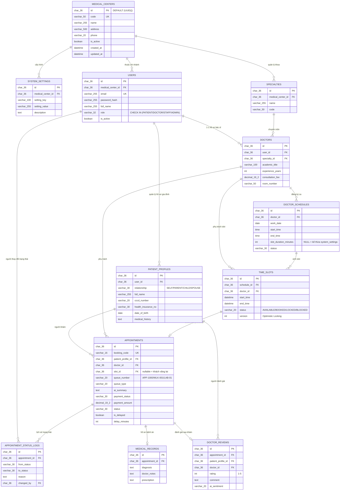

# 🗄️ 04. Thiết Kế Cơ Sở Dữ Liệu (Database Design) - Dự Án MedSched (Phiên Bản 2.0)

> **Học phần:** Java Spring 2 - Phát triển ứng dụng Web thông minh với Spring Boot & Spring AI  
> **Hệ quản trị CSDL:** PostgreSQL 16 (chạy trên Docker container, Port `5433`, DB: `medsched_db`) / PostgreSQL 18 Local (`localhost:5432`)  
> **File kịch bản SQL:** [`medsched_schema.sql`](./medsched_schema.sql)  
> **Cập nhật:** Chuẩn hóa theo toàn bộ góp ý của Giảng viên & Kịch bản thực tế bệnh viện (Tập trung trọng tâm vào Spring Boot 3 + Spring AI, loại bỏ Computer Vision YOLO11).

---

## 1. Danh Sách 12 Bảng Thực Thể & Kiến Trúc Dữ Liệu

Hệ thống được thiết kế theo chuẩn hóa 3NF gồm **12 bảng quan hệ chặt chẽ**, tích hợp đầy đủ 4 trường Audit tiêu chuẩn doanh nghiệp (`created_at`, `updated_at`, `created_by`, `updated_by`):

```
                                  ┌────────────────────┐
                                  │  medical_centers   │ (Multi-tenant SaaS)
                                  └─────────┬──────────┘
                                            │ 1
                 ┌──────────────────────────┼──────────────────────────┐
                1│                         1│                         1│
                 ▼                          ▼                          ▼
       ┌───────────────────┐      ┌───────────────────┐      ┌───────────────────┐
       │  system_settings  │      │       users       │      │    specialties    │
       │(Slot & Buffer Cfg)│      └─────────┬─────────┘      └─────────┬─────────┘
       └───────────────────┘                │ 1                        │ 1
                                            ├────────────────┐         │
                                           1│               1│         │
                                            ▼                ▼         ▼
                                 ┌───────────────────┐     ┌───────────────────┐
                                 │ patient_profiles  │     │      doctors      │
                                 │(Self & Người thân)│     └─────────┬─────────┘
                                 └──────────┬────────┘               │ 1
                                            │ 1                      ▼
                                            │              ┌───────────────────┐
                                            │              │ doctor_schedules  │
                                            │              └─────────┬─────────┘
                                            │                        │ 1
                                            │                        ▼
                                            │              ┌───────────────────┐
                                            │              │    time_slots     │
                                            │              │(Optimistic Lock)  │
                                            │              └─────────┬─────────┘
                                            │                        │ 1 (One-to-One)
                                            └───────────┐   ┌────────┘
                                                        ▼   ▼
                                                 ┌───────────────────┐
                                                 │   appointments    │
                                                 │(Queue & Điều phối)│
                                                 └─────────┬─────────┘
                    ┌──────────────────────────────────────┼──────────────────────────────────────┐
                   1│                                     1│                                     1│
                    ▼                                      ▼                                      ▼
         ┌─────────────────────┐                ┌─────────────────────┐                ┌─────────────────────┐
         │appointment_status_  │                │   medical_records   │                │   doctor_reviews    │
         │       logs          │                │(Hồ sơ bệnh án điện) │                │ (Verified & Spring  │
         │ (Truy vết đổi lịch) │                └─────────────────────┘                │    AI Sentiment)    │
         └─────────────────────┘                                                       └─────────────────────┘
```

---

## 2. Giải Trình Tiếp Thu Các Góp Ý Của Giảng Viên

1. **Chuẩn hóa 4 trường Audit trên mọi bảng:**
   * Mọi bảng đều sở hữu: `created_at`, `updated_at`, `created_by`, `updated_by`.
   * **Lợi ích:** Phục vụ phân trang (paging), sắp xếp (sorting) và truy vết trách nhiệm pháp lý bắt buộc trong lĩnh vực y tế số.
2. **Tách bảng `system_settings` (Tránh hardcode `slot_duration_minutes`):**
   * Không lưu cứng thời lượng khám trong từng dòng ca trực. Bảng cấu hình lưu tập trung: thời lượng khám mặc định (30 phút), khoảng đệm chuẩn bị (5 phút), quy định hủy lịch trước (2 giờ), giới hạn bỏ hẹn No-show (3 lần).
3. **Bổ sung bảng `appointment_status_logs`:**
   * Ghi nhận lịch sử mỗi khi ca hẹn chuyển trạng thái: từ `CONFIRMED` $\rightarrow$ `CANCELLED` hoặc `WAITING_FOR_LAB_RESULTS`. Lưu rõ ai đổi, lý do đổi và thời điểm đổi.
4. **Bổ sung bảng `medical_centers` (Khả năng mở rộng SaaS / Multi-tenant):**
   * Giúp hệ thống dễ dàng mở rộng từ 1 phòng khám đơn lẻ thành nền tảng quản lý chuỗi bệnh viện hoặc bán dịch vụ phần mềm y tế dạng SaaS.
5. **Cải tiến bảng `patient_profiles` (Hỗ trợ đặt lịch hộ cho người thân):**
   * 1 tài khoản `users` có thể quản lý nhiều hồ sơ gia đình (`SELF`, `PARENT`, `CHILD`, `SPOUSE`). Khi người thân đến khám và quét mã QR CCCD tại quầy, hệ thống luôn khớp chính xác thông tin bệnh nhân thực tế.
6. **Tích hợp cơ chế Điều phối hàng đợi (Examination Queue) vào `appointments`:**
   * Bổ sung cột `queue_number` (Số thứ tự khám: `APP-1000`, `WLK-001`, `LAB-01`).
   * Bổ sung `queue_type` (`ONLINE_BOOKED`, `WALKIN`, `POST_LAB_RESULT`).
   * Bổ sung `payment_status` (`UNPAID`, `PAID_AT_COUNTER`, `DEPOSITED_VNPAY`, `REFUNDED`).
   * Bổ sung cờ báo ca trước kéo dài `is_delayed` và `delay_minutes` để tự động báo bệnh nhân sau không bị bất ngờ.

---

## 3. Chi Tiết Cấu Trúc Các Bảng Mới & Cải Tiến

### 3.1. Bảng `medical_centers` (Cơ sở y tế / Chi nhánh)
* `id` (UUID, PK): Khóa chính.
* `code` (VARCHAR(50), UNIQUE): Mã cơ sở y tế (vd: `MED_Q1`, `MED_Q7`).
* `name` (VARCHAR(255)): Tên cơ sở y tế / Bệnh viện.
* `address` (VARCHAR(500)), `phone` (VARCHAR(20)), `is_active` (BOOLEAN).
* 4 trường audit tiêu chuẩn.

### 3.2. Bảng `system_settings` (Cấu hình hệ thống tập trung)
* `id` (UUID, PK): Khóa chính.
* `medical_center_id` (UUID, FK ➔ `medical_centers.id`).
* `setting_key` (VARCHAR(100)): Tên biến cấu hình (vd: `DEFAULT_SLOT_DURATION_MINUTES`, `BUFFER_TIME_MINUTES`, `CANCELLATION_LIMIT_HOURS`).
* `setting_value` (VARCHAR(255)): Giá trị cấu hình.
* `description` (TEXT): Ý nghĩa tham số.

### 3.3. Bảng `patient_profiles` (Hồ sơ người khám & Gia đình)
* `id` (UUID, PK): Khóa chính.
* `user_id` (UUID, FK ➔ `users.id`): Tài khoản người đặt lịch.
* `relationship` (VARCHAR(30)): Mối quan hệ (`SELF`, `PARENT`, `CHILD`, `SPOUSE`, `OTHER`).
* `full_name` (VARCHAR(255)): Họ tên bệnh nhân thực tế khám.
* `cccd_number` (VARCHAR(20)): Số CCCD (phục vụ đối soát thẻ CCCD gắn chip và mã QR).
* `health_insurance_no` (VARCHAR(30)): Mã thẻ BHYT.
* `date_of_birth` (DATE), `gender` (VARCHAR(10)), `phone` (VARCHAR(20)), `address` (VARCHAR(500)), `medical_history` (TEXT).

### 3.4. Bảng `appointments` (Ca hẹn khám & Điều phối hàng đợi)
* `id` (UUID, PK): Khóa chính.
* `booking_code` (VARCHAR(16), UNIQUE): Mã đặt hẹn phục vụ sinh mã QR tiếp đón.
* `patient_profile_id` (UUID, FK ➔ `patient_profiles.id`): Bệnh nhân khám.
* `doctor_id` (UUID, FK ➔ `doctors.id`): Bác sĩ chỉ định.
* `slot_id` (UUID, NULLABLE, FK ➔ `time_slots.id`): Slot giờ (NULL nếu là khách vãng lai cấp số chờ).
* `queue_number` (VARCHAR(20)): Số thứ tự hàng đợi (vd: `APP-1000`, `WLK-001`, `LAB-01`).
* `queue_type` (VARCHAR(20)): Loại hàng đợi (`ONLINE_BOOKED`, `WALKIN`, `POST_LAB_RESULT`).
* `payment_status` (VARCHAR(30)): Trạng thái thanh toán (`UNPAID`, `PAID_AT_COUNTER`, `DEPOSITED_VNPAY`, `REFUNDED`).
* `status` (VARCHAR(30)): Vòng đời ca khám (`PENDING`, `CONFIRMED`, `CHECKED_IN`, `IN_PROGRESS`, `WAITING_FOR_LAB_RESULTS`, `COMPLETED`, `CANCELLED`, `MISSED_NO_SHOW`).
* `is_delayed` (BOOLEAN) & `delay_minutes` (INT): Cờ báo ca trước kéo dài để điều phối thời gian thực.
* `ai_summary` (TEXT): **Tóm tắt 2 dòng triệu chứng do Spring AI tự động trích xuất**.
* `checkin_method` (VARCHAR(30)): `QR_CODE`, `CCCD_QR`, `MANUAL`.

### 3.5. Bảng `appointment_status_logs` (Nhật ký thay đổi trạng thái ca khám)
* `id` (UUID, PK): Khóa chính.
* `appointment_id` (UUID, FK ➔ `appointments.id`).
* `from_status` (VARCHAR(30)): Trạng thái trước khi đổi.
* `to_status` (VARCHAR(30)): Trạng thái mới.
* `reason` (TEXT): Lý do đổi trạng thái (bác sĩ bận cấp cứu, bệnh nhân xin dời giờ, no-show...).
* `changed_by` (UUID, FK ➔ `users.id`): Người thực hiện thao tác.
* `created_at` (TIMESTAMPTZ): Thời điểm ghi nhận.

---

## 4. Hướng Dẫn Nạp Schema Vào PostgreSQL Bằng DBeaver

1. Mở **DBeaver**, kết nối vào PostgreSQL (Cổng `5433` qua Docker hoặc `5432` cục bộ, Database: `medsched_db`).
2. Mở file script [`medsched_schema.sql`](./medsched_schema.sql) và nhấn tổ hợp phím **`Alt + X`** (Execute SQL Script).
3. Sau khi chạy thành công, nhấp đúp vào thư mục **`Tables`** ➔ chuyển qua tab **`Diagram`** để kiểm tra và xuất ảnh sơ đồ quan hệ ERD 12 bảng.

---

## 5. Phiên Bản Chuyển Đổi Cho XAMPP / MySQL / MariaDB (phpMyAdmin)

> Dùng khi nhóm muốn chạy CSDL ngay trên máy cá nhân bằng **XAMPP** (không cần cài Docker/PostgreSQL), phục vụ code nhanh Spring Boot bằng driver MySQL hoặc demo offline khi báo cáo.
>
> File script: [`medsched_schema_mysql_xampp.sql`](./medsched_schema_mysql_xampp.sql) — **đã được kiểm thử thực tế và chạy thành công (không lỗi)** trên chính bản MariaDB `10.4.32` đi kèm XAMPP.

### 5.1. Bảng quy đổi kiểu dữ liệu (PostgreSQL ➔ MySQL/MariaDB)

| Kiểu trong PostgreSQL | Kiểu tương đương MySQL/MariaDB | Ghi chú |
|:---|:---|:---|
| `UUID` + `DEFAULT gen_random_uuid()` | `CHAR(36)` + `DEFAULT (UUID())` | MariaDB ≥ 10.2.1 / MySQL ≥ 8.0.13 hỗ trợ default là biểu thức. Khuyến nghị: tầng Spring Boot (Hibernate) tự sinh `UUID.randomUUID()` trước khi insert để không phụ thuộc phiên bản DB. |
| `TIMESTAMP WITH TIME ZONE` | `DATETIME` | MySQL không có kiểu có múi giờ đúng nghĩa; quy ước lưu giờ theo **UTC+7 (giờ Việt Nam)** thống nhất toàn hệ thống. |
| `NOW()` | `CURRENT_TIMESTAMP` | Cột `updated_at` dùng thêm `ON UPDATE CURRENT_TIMESTAMP` để tự cập nhật khi `UPDATE`. |
| `NUMERIC(19,2)` | `DECIMAL(19,2)` | Tương đương 1-1, không mất độ chính xác số tiền. |
| `BOOLEAN` | `BOOLEAN` (map ngầm sang `TINYINT(1)`) | Không cần đổi cú pháp. |
| `CHECK (...)` | Giữ nguyên `CHECK (...)` | Được **thực thi thật** (không bị bỏ qua) trên MariaDB ≥ 10.2.1 và MySQL ≥ 8.0.16 — tức là mọi bản XAMPP hiện hành (8.x) đều dùng được. |
| Không khai báo charset | `ENGINE=InnoDB DEFAULT CHARSET=utf8mb4 COLLATE=utf8mb4_unicode_ci` | Bắt buộc `utf8mb4` để không vỡ font tiếng Việt có dấu. |

### 5.2. Kết quả kiểm thử trên máy có XAMPP cài sẵn
Đã dựng một instance MariaDB `10.4.32` tạm thời (cùng phiên bản đóng gói trong `C:\xampp\mysql`) và nạp trực tiếp file `medsched_schema_mysql_xampp.sql` để xác nhận:
* ✅ Tạo đủ **12/12 bảng**, đủ **18 khóa ngoại (FK)** đúng chiều tham chiếu như bản Postgres.
* ✅ Ràng buộc `CHECK` hoạt động thật — thử insert `role = 'ROLE_HACKER'` (giá trị không hợp lệ) bị **MariaDB từ chối đúng như thiết kế** (`ERROR 4025: CONSTRAINT 'users.role' failed`).
* ✅ `DEFAULT (UUID())` tự sinh khóa chính hợp lệ khi insert không truyền `id`.
* ✅ Dữ liệu mẫu tiếng Việt có dấu (`Bệnh Viện Đa Khoa...`, `Lễ Tân Tiếp Đón 01`...) lưu và đọc lại đúng nhờ `utf8mb4`.

### 5.3. Hướng Dẫn Nạp Schema Vào XAMPP Bằng phpMyAdmin
1. Mở **XAMPP Control Panel** ➔ bấm **Start** ở dòng `MySQL` (và `Apache` nếu cần chạy phpMyAdmin qua trình duyệt).
2. Truy cập `http://localhost/phpmyadmin`.
3. Chọn tab **Import** (Nhập) ➔ **Choose File** ➔ trỏ tới [`medsched_schema_mysql_xampp.sql`](./medsched_schema_mysql_xampp.sql) ➔ bấm **Go**.
   * File tự tạo database `medsched_db` (nếu chưa có) nên **không cần** tạo database thủ công trước.
4. Sau khi Import báo thành công, vào database `medsched_db` ➔ tab **Structure** ➔ liên kết **Designer** (hoặc **Relation view**) để xem sơ đồ ERD trực quan tương tự DBeaver.
5. Cấu hình `application.properties` / `application.yml` phía Spring Boot trỏ về:
   ```properties
   spring.datasource.url=jdbc:mysql://localhost:3306/medsched_db?useUnicode=true&characterEncoding=utf8&serverTimezone=Asia/Ho_Chi_Minh
   spring.datasource.username=root
   spring.datasource.password=
   spring.jpa.hibernate.ddl-auto=validate
   ```

### 5.4. Sơ Đồ Thực Thể Liên Kết (ERD) — Bản Vẽ Lại Cho MySQL/XAMPP



> **Ghi chú đọc sơ đồ:** GitHub tự render khối ```mermaid``` ở trên thành hình ERD trực quan ngay trong trang này. Nếu muốn xuất ảnh PNG để chèn slide báo cáo, mở database `medsched_db` đã import trong **phpMyAdmin ➔ Designer** (hoặc DBeaver nếu kết nối MySQL) rồi xuất ảnh từ tab Diagram.

### 5.5. Chọn Postgres hay MySQL/XAMPP?
* **PostgreSQL (`medsched_schema.sql`)** vẫn là phương án **chính thức nộp báo cáo**, đúng với công nghệ đã cam kết với Giảng viên (Spring Boot 3 + Spring AI + PGVector cho RAG y khoa — PGVector **chỉ chạy trên PostgreSQL**, MySQL không có kiểu vector tương đương).
* **MySQL/XAMPP (`medsched_schema_mysql_xampp.sql`)** là phương án **dự phòng / phát triển cá nhân**: dùng khi thành viên nào chưa cài Docker, cần code offline nhanh trên Windows, hoặc muốn demo cục bộ không phụ thuộc mạng. Cấu trúc bảng, tên cột, ràng buộc nghiệp vụ **giữ nguyên 100%** giữa hai bản để code Spring Boot (Entity/DTO) dùng chung, chỉ khác `application-{profile}.yml` (đổi driver + dialect Hibernate: `PostgreSQLDialect` ⇄ `MySQLDialect`).
