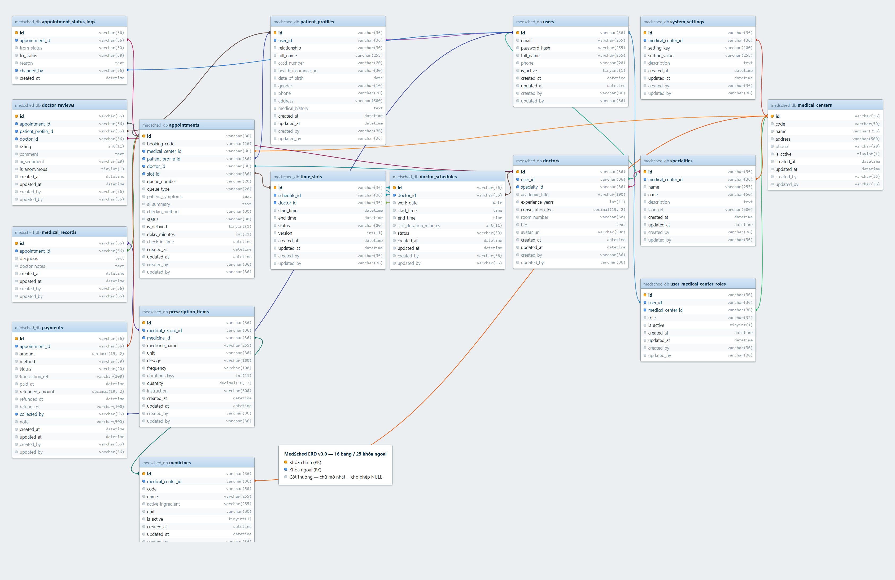
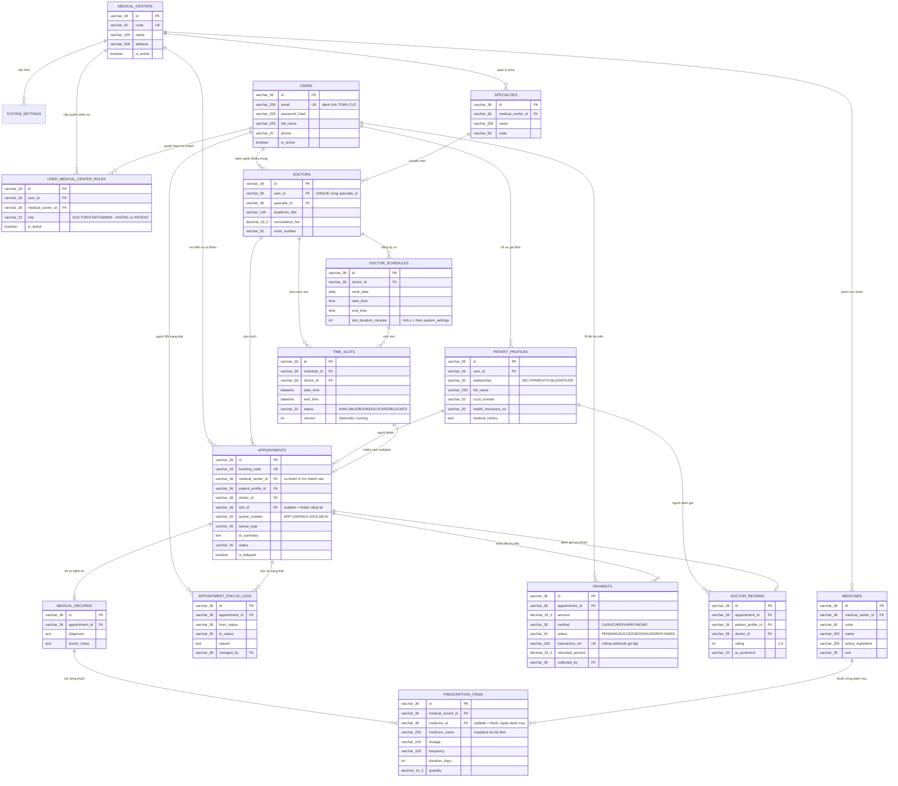

# 🗄️ 04. Thiết Kế Cơ Sở Dữ Liệu (Database Design) - Dự Án MedSched (Phiên Bản 3.0)

> **Học phần:** Java Spring 2 - Phát triển ứng dụng Web thông minh với Spring Boot & Spring AI  
> **Hệ quản trị CSDL:** PostgreSQL 16/18 (chính thức) — kèm bản MySQL/MariaDB chạy trên XAMPP (mục 5)  
> **File kịch bản SQL:** [`medsched_schema.sql`](./medsched_schema.sql) (PostgreSQL) · [`medsched_schema_mysql_xampp.sql`](./medsched_schema_mysql_xampp.sql) (XAMPP)  
> **Sơ đồ ERD:** [`medsched_erd_v3.png`](./medsched_erd_v3.png) — xem mục 5.4  
> **Cập nhật:** Phiên bản 3.0 — **16 bảng**, sửa 3 lỗi thiết kế được phản biện (xem mục 0).

---

## 0. ⚠️ Ba Lỗi Thiết Kế Của Phiên Bản 2.0 Và Cách Sửa

Bản 2.0 (12 bảng) bị phản biện đúng 3 điểm. Cả 3 đều **có thật** và đã được sửa trong bản 3.0 này:

### 0.1. LỖI NẶNG NHẤT — Tài khoản bị khóa vào 1 phòng khám

* **Phản biện:** *"Nếu user kết nối với medical_center vậy thì khi user đến khám 1 phòng khám khác phải tạo 1 account mới hả?"*
* **Nguyên nhân:** bảng `users` bản 2.0 có cột `medical_center_id` **và** cột `role`. Một bệnh nhân đăng ký tại Chi nhánh Quận 1 sẽ bị gán cứng `medical_center_id = Q1`. Khi người đó muốn khám ở Quận 7 thì hoặc phải **tạo tài khoản thứ hai** (mất toàn bộ lịch sử khám, hồ sơ bệnh án, tiền sử dị ứng — cực kỳ nguy hiểm trong y tế), hoặc cột đó trở thành vô nghĩa.
* **Cách sửa:**
  1. `users` **bỏ hẳn** `medical_center_id` và `role` ➔ trở thành **danh tính toàn cục**: đăng ký 1 lần, khám ở mọi chi nhánh, dùng chung 1 hồ sơ bệnh án.
  2. Thêm bảng nối **`user_medical_center_roles`** (`user_id`, `medical_center_id`, `role`): chỉ dùng cho **quyền nhân sự** (bác sĩ/lễ tân/admin) và có phạm vi theo từng chi nhánh. Một bác sĩ trực ở 2 chi nhánh = 2 dòng.
  3. `ROLE_PATIENT` bị **xóa khỏi** danh sách role. Lý do: "bệnh nhân" không phải một đặc quyền cần cấp — **mọi tài khoản đều mặc định đặt lịch khám được ở mọi chi nhánh**. Tài khoản không có dòng nào trong bảng nối chính là bệnh nhân thuần.
  4. `appointments` thêm `medical_center_id` ➔ vì `users` đã toàn cục, đây là nơi ghi nhận **ca khám này diễn ra ở chi nhánh nào**.
  5. `doctors` đổi `UNIQUE(user_id)` thành `UNIQUE(user_id, specialty_id)` ➔ 1 người hành nghề được ở nhiều chuyên khoa / nhiều chi nhánh.

### 0.2. Thanh toán chỉ là 2 cột nhét trong `appointments`

* **Phản biện:** *"Nếu đã làm thanh toán thì thêm 1 bảng thanh toán đàng hoàng."*
* **Nguyên nhân:** bản 2.0 chỉ có `appointments.payment_status` + `payment_amount`. Thiết kế này **không ghi nổi** các tình huống có thật: bệnh nhân cọc online 100k rồi trả thêm 200k tiền mặt tại quầy (2 lần thu, 2 phương thức); lần trả thất bại rồi trả lại; hoàn tiền một phần; mã giao dịch của cổng thanh toán để đối soát; ai là người thu tiền.
* **Cách sửa:** thêm bảng **`payments`** — mỗi dòng là 1 lần thu tiền (`amount`, `method`, `status`, `transaction_ref`, `paid_at`, `refunded_amount`, `collected_by`). Hai cột cũ trong `appointments` **bị bỏ** để tránh lệch dữ liệu; tình trạng thanh toán được **suy ra** từ bảng `payments` (xem truy vấn mẫu ở mục 3.7).

### 0.3. Đơn thuốc là một cột TEXT

* **Phản biện:** *"Nếu đã làm prescription (đơn thuốc) thì nên tách riêng table thay vì text."*
* **Nguyên nhân:** `medical_records.prescription TEXT` chỉ là một đoạn văn bản tự do ➔ **không thể** thống kê thuốc kê nhiều nhất, không kiểm tra được tương tác thuốc, không nối được kho dược, không in đơn thuốc có cấu trúc.
* **Cách sửa:** thêm **`medicines`** (danh mục thuốc theo chi nhánh) + **`prescription_items`** (từng dòng thuốc: hàm lượng, cách dùng, số ngày, số lượng). Cột `prescription TEXT` **bị bỏ**.

> **Ghi chú về thứ tự ưu tiên:** người phản biện nói mục 0.2 và 0.3 "để sau cũng được, tập trung luồng chính trước". Nhóm vẫn làm luôn ở tầng **thiết kế CSDL + JPA Entity** (rẻ, làm sớm tránh phải migration đau về sau), nhưng **API và giao diện** cho 2 phần này được xếp Giai đoạn 2 — luồng chính (đặt lịch ➔ check-in ➔ khám ➔ đơn thuốc) vẫn là trọng tâm code trước.

---

## 1. Danh Sách 16 Bảng Thực Thể & Kiến Trúc Dữ Liệu

Hệ thống được thiết kế theo chuẩn hóa 3NF gồm **16 bảng quan hệ chặt chẽ** (12 bảng cũ + 4 bảng mới: `user_medical_center_roles`, `payments`, `medicines`, `prescription_items`), tích hợp đầy đủ 4 trường Audit tiêu chuẩn doanh nghiệp (`created_at`, `updated_at`, `created_by`, `updated_by`):

```
                        ┌──────────────────────────┐
                        │     medical_centers      │ (Multi-tenant / SaaS)
                        └────────────┬─────────────┘
        ┌────────────────┬───────────┼────────────┬────────────────┐
        ▼                ▼           ▼            ▼                ▼
┌───────────────┐ ┌─────────────┐ ┌───────────┐ ┌─────────┐ ┌──────────────┐
│system_settings│ │ specialties │ │ medicines │ │appoint- │ │user_medical_ │
│(Slot/Buffer)  │ └──────┬──────┘ └─────┬─────┘ │ments ▼  │ │center_roles  │
└───────────────┘        │ 1            │       │(mục 10) │ │(QUYỀN nhân sự│
                         ▼              │       └─────────┘ │ theo chi     │
                  ┌─────────────┐       │                   │ nhánh)       │
     ┌───────────▶│   doctors   │       │                   └──────┬───────┘
     │  UNIQUE    └──────┬──────┘       │                          │ N
     │ (user_id,         │ 1            │                          │
     │  specialty_id)    ▼              │                          │
     │            ┌──────────────┐      │                          │
     │            │doctor_       │      │                          │
     │            │schedules     │      │                          │
     │            └──────┬───────┘      │                          │
     │                   │ 1            │                          │
     │                   ▼              │                          │
     │            ┌──────────────┐      │                          │
     │            │  time_slots  │      │                          │
     │            │(Optimistic   │      │                          │
     │            │ Locking)     │      │                          │
     │            └──────┬───────┘      │                          │
     │                   │ 1            │                          │
┌────┴──────────┐        │              │                          │
│     users     │◀───────┼──────────────┼──────────────────────────┘
│ DANH TÍNH     │        │              │
│ TOÀN CỤC      │        │              │       ⚠️ users KHÔNG còn
│ (không thuộc  │        │              │       medical_center_id / role
│  chi nhánh!)  │        │              │       ⇒ 1 tài khoản khám được
└────┬──────────┘        │              │         ở MỌI chi nhánh
     │ 1                 │              │
     ▼                   │              │
┌──────────────────┐     │              │
│ patient_profiles │     │              │
│ (Bản thân &      │     │              │
│  người thân)     │     │              │
└────────┬─────────┘     │              │
         │ 1             │ 0..1         │
         └───────┬───────┘              │
                 ▼                      │
        ┌────────────────────┐          │
        │    appointments    │          │
        │ + medical_center_id│          │
        │ (ca khám ở ĐÂU)    │          │
        │ Queue & Điều phối  │          │
        └─────────┬──────────┘          │
     ┌────────────┼───────────┬─────────┴──────┐
     ▼            ▼           ▼                │
┌──────────┐ ┌──────────┐ ┌──────────────┐     │
│appoint-  │ │ doctor_  │ │   payments   │     │
│ment_     │ │ reviews  │ │ (MỚI: nhiều  │     │
│status_   │ │(AI       │ │  lần thu,    │     │
│logs      │ │ Sentim.) │ │  hoàn tiền)  │     │
└──────────┘ └──────────┘ └──────────────┘     │
     ▼                                         │
┌──────────────────┐                            │
│ medical_records  │                            │
│ (KHÔNG còn cột   │                            │
│  prescription)   │                            │
└────────┬─────────┘                            │
         │ 1                                    │
         ▼                                      │
┌─────────────────────┐    medicine_id (nullable)│
│ prescription_items  │◀─────────────────────────┘
│ (MỚI: từng dòng     │
│  thuốc, snapshot    │
│  tên thuốc lúc kê)  │
└─────────────────────┘
```

---

## 2. Giải Trình Tiếp Thu Các Góp Ý Của Giảng Viên

1. **Chuẩn hóa 4 trường Audit trên mọi bảng:**
   * Mọi bảng đều sở hữu: `created_at`, `updated_at`, `created_by`, `updated_by`.
   * **Lợi ích:** Phục vụ phân trang (paging), sắp xếp (sorting) và truy vết trách nhiệm pháp lý bắt buộc trong lĩnh vực y tế số.
2. **Tách bảng `system_settings` (Tránh hardcode `slot_duration_minutes`):**
   * Không lưu cứng thời lượng khám trong từng dòng ca trực. Bảng cấu hình lưu tập trung: thời lượng khám mặc định (30 phút), khoảng đệm chuẩn bị (5 phút), quy định hủy lịch trước (2 giờ), giới hạn bỏ hẹn No-show (3 lần).
3. **Bổ sung bảng `appointment_status_logs`:**
   * Ghi nhận lịch sử mỗi khi ca hẹn chuyển trạng thái: từ `CONFIRMED` $\rightarrow$ `CANCELLED` hoặc `WAITING_FOR_LAB_RESULTS`. Lưu rõ ai đổi, lý do đổi và thời điểm đổi.
4. **Bổ sung bảng `medical_centers` (Khả năng mở rộng SaaS / Multi-tenant):**
   * Giúp hệ thống dễ dàng mở rộng từ 1 phòng khám đơn lẻ thành nền tảng quản lý chuỗi bệnh viện hoặc bán dịch vụ phần mềm y tế dạng SaaS.
5. **Cải tiến bảng `patient_profiles` (Hỗ trợ đặt lịch hộ cho người thân):**
   * 1 tài khoản `users` có thể quản lý nhiều hồ sơ gia đình (`SELF`, `PARENT`, `CHILD`, `SPOUSE`). Khi người thân đến khám và quét mã QR CCCD tại quầy, hệ thống luôn khớp chính xác thông tin bệnh nhân thực tế.
6. **Tích hợp cơ chế Điều phối hàng đợi (Examination Queue) vào `appointments`:**
   * Bổ sung cột `queue_number` (Số thứ tự khám: `APP-1000`, `WLK-001`, `LAB-01`).
   * Bổ sung `queue_type` (`ONLINE_BOOKED`, `WALKIN`, `POST_LAB_RESULT`).
   * Bổ sung cờ báo ca trước kéo dài `is_delayed` và `delay_minutes` để tự động báo bệnh nhân sau không bị bất ngờ.
   * *(Bản 3.0: `payment_status` / `payment_amount` đã được **bỏ khỏi** bảng này và thay bằng bảng `payments` — xem mục 0.2 và 3.7.)*

---

## 3. Chi Tiết Cấu Trúc Các Bảng Mới & Cải Tiến

### 3.1. Bảng `medical_centers` (Cơ sở y tế / Chi nhánh)
* `id` (UUID, PK): Khóa chính.
* `code` (VARCHAR(50), UNIQUE): Mã cơ sở y tế (vd: `MED_Q1`, `MED_Q7`).
* `name` (VARCHAR(255)): Tên cơ sở y tế / Bệnh viện.
* `address` (VARCHAR(500)), `phone` (VARCHAR(20)), `is_active` (BOOLEAN).
* 4 trường audit tiêu chuẩn.

### 3.2. Bảng `system_settings` (Cấu hình hệ thống tập trung)
* `id` (UUID, PK): Khóa chính.
* `medical_center_id` (UUID, FK ➔ `medical_centers.id`).
* `setting_key` (VARCHAR(100)): Tên biến cấu hình (vd: `DEFAULT_SLOT_DURATION_MINUTES`, `BUFFER_TIME_MINUTES`, `CANCELLATION_LIMIT_HOURS`).
* `setting_value` (VARCHAR(255)): Giá trị cấu hình.
* `description` (TEXT): Ý nghĩa tham số.

### 3.3. Bảng `patient_profiles` (Hồ sơ người khám & Gia đình)
* `id` (UUID, PK): Khóa chính.
* `user_id` (UUID, FK ➔ `users.id`): Tài khoản người đặt lịch.
* `relationship` (VARCHAR(30)): Mối quan hệ (`SELF`, `PARENT`, `CHILD`, `SPOUSE`, `OTHER`).
* `full_name` (VARCHAR(255)): Họ tên bệnh nhân thực tế khám.
* `cccd_number` (VARCHAR(20)): Số CCCD (phục vụ đối soát thẻ CCCD gắn chip và mã QR).
* `health_insurance_no` (VARCHAR(30)): Mã thẻ BHYT.
* `date_of_birth` (DATE), `gender` (VARCHAR(10)), `phone` (VARCHAR(20)), `address` (VARCHAR(500)), `medical_history` (TEXT).

### 3.4. Bảng `appointments` (Ca hẹn khám & Điều phối hàng đợi)
* `id` (UUID, PK): Khóa chính.
* `booking_code` (VARCHAR(16), UNIQUE): Mã đặt hẹn phục vụ sinh mã QR tiếp đón.
* `patient_profile_id` (UUID, FK ➔ `patient_profiles.id`): Bệnh nhân khám.
* `doctor_id` (UUID, FK ➔ `doctors.id`): Bác sĩ chỉ định.
* `slot_id` (UUID, NULLABLE, FK ➔ `time_slots.id`): Slot giờ (NULL nếu là khách vãng lai cấp số chờ).
* `queue_number` (VARCHAR(20)): Số thứ tự hàng đợi (vd: `APP-1000`, `WLK-001`, `LAB-01`).
* `queue_type` (VARCHAR(20)): Loại hàng đợi (`ONLINE_BOOKED`, `WALKIN`, `POST_LAB_RESULT`).
* `medical_center_id` (UUID, FK ➔ `medical_centers.id`) **(MỚI ở bản 3.0)**: Chi nhánh diễn ra ca khám. Vì `users` đã là danh tính toàn cục, đây là nơi duy nhất cho biết bệnh nhân đến khám ở đâu.
* `status` (VARCHAR(30)): Vòng đời ca khám (`PENDING`, `CONFIRMED`, `CHECKED_IN`, `IN_PROGRESS`, `WAITING_FOR_LAB_RESULTS`, `COMPLETED`, `CANCELLED`, `MISSED_NO_SHOW`).
* `is_delayed` (BOOLEAN) & `delay_minutes` (INT): Cờ báo ca trước kéo dài để điều phối thời gian thực.
* `ai_summary` (TEXT): **Tóm tắt 2 dòng triệu chứng do Spring AI tự động trích xuất**.
* `checkin_method` (VARCHAR(30)): `QR_CODE`, `CCCD_QR`, `MANUAL`.

### 3.5. Bảng `appointment_status_logs` (Nhật ký thay đổi trạng thái ca khám)
* `id` (UUID, PK): Khóa chính.
* `appointment_id` (UUID, FK ➔ `appointments.id`).
* `from_status` (VARCHAR(30)): Trạng thái trước khi đổi.
* `to_status` (VARCHAR(30)): Trạng thái mới.
* `reason` (TEXT): Lý do đổi trạng thái (bác sĩ bận cấp cứu, bệnh nhân xin dời giờ, no-show...).
* `changed_by` (UUID, FK ➔ `users.id`): Người thực hiện thao tác.
* `created_at` (TIMESTAMPTZ): Thời điểm ghi nhận.

### 3.6. Bảng `user_medical_center_roles` (MỚI — Quyền nhân sự theo chi nhánh)
* `id` (UUID, PK).
* `user_id` (UUID, FK ➔ `users.id`), `medical_center_id` (UUID, FK ➔ `medical_centers.id`).
* `role` (VARCHAR(32)): Chỉ nhận `ROLE_DOCTOR`, `ROLE_STAFF`, `ROLE_ADMIN` — **cố ý không có `ROLE_PATIENT`**.
* `is_active` (BOOLEAN): Cho phép thu hồi quyền mà vẫn giữ lịch sử (không xóa dòng).
* `UNIQUE (user_id, medical_center_id, role)`: chặn cấp trùng quyền.
* **Cách dùng với Spring Security:** khi đăng nhập, nạp toàn bộ dòng `is_active = true` của tài khoản để dựng authority dạng `ROLE_DOCTOR@MED_Q1`, `ROLE_DOCTOR@MED_Q7`. Tài khoản **không có dòng nào** vẫn đăng nhập và đặt lịch bình thường ở mọi chi nhánh (bệnh nhân).

### 3.7. Bảng `payments` (MỚI — Thanh toán đúng nghĩa)
* `id` (UUID, PK), `appointment_id` (UUID, FK ➔ `appointments.id`, `ON DELETE RESTRICT` để **không bao giờ xóa mất lịch sử tiền**).
* `amount` (NUMERIC(19,2)), `method` (`CASH`, `CARD`, `VNPAY`, `MOMO`, `BANK_TRANSFER`).
* `status` (`PENDING`, `SUCCEEDED`, `FAILED`, `REFUNDED`).
* `transaction_ref` (VARCHAR(100), **UNIQUE**): Mã giao dịch cổng thanh toán. Ràng buộc UNIQUE này chính là **chốt chống webhook gọi lặp** làm ghi nhận/hoàn tiền 2 lần (kịch bản 7.8 trong [`Luong_Nghiep_Vu_Chinh.md`](../03_Luong_Chinh/Luong_Nghiep_Vu_Chinh.md)). NULL với tiền mặt (nhiều dòng NULL vẫn hợp lệ ở cả MySQL và PostgreSQL).
* `paid_at`, `refunded_amount`, `refunded_at`, `refund_ref`, `collected_by` (FK ➔ `users.id` — lễ tân thu tiền), `note`.
* Ràng buộc dữ liệu: `CHECK (amount > 0)` và `CHECK (refunded_amount >= 0 AND refunded_amount <= amount)` — không thể hoàn nhiều hơn số đã thu.
* **1 ca khám có nhiều dòng payments.** Tình trạng thanh toán không lưu trùng ở `appointments` mà **suy ra** bằng truy vấn:
  ```sql
  SELECT a.booking_code,
         COALESCE(SUM(CASE WHEN p.status = 'SUCCEEDED'
                           THEN p.amount - p.refunded_amount ELSE 0 END), 0) AS da_thu,
         d.consultation_fee AS phi_kham
  FROM appointments a
  JOIN doctors d ON d.id = a.doctor_id
  LEFT JOIN payments p ON p.appointment_id = a.id
  GROUP BY a.id, a.booking_code, d.consultation_fee;
  ```

### 3.8. Bảng `medicines` (MỚI — Danh mục thuốc của chi nhánh)
* `id` (UUID, PK), `medical_center_id` (UUID, FK ➔ `medical_centers.id`).
* `code` (VARCHAR(50)), `name` (VARCHAR(255)), `active_ingredient` (VARCHAR(255)), `unit` (`VIÊN`, `CHAI`, `ỐNG`, `GÓI`, `TUÝP`...), `is_active` (BOOLEAN).
* `UNIQUE (medical_center_id, code)`: mỗi chi nhánh có danh mục thuốc riêng.

### 3.9. Bảng `prescription_items` (MỚI — Từng dòng thuốc trong đơn)
* `id` (UUID, PK), `medical_record_id` (UUID, FK ➔ `medical_records.id`).
* `medicine_id` (UUID, FK ➔ `medicines.id`, **NULLABLE**): cho phép bác sĩ kê thuốc ngoài danh mục bệnh viện.
* `medicine_name` (VARCHAR(255)) + `unit` (VARCHAR(30)): **bản chụp (snapshot) tại thời điểm kê đơn**, cố ý lưu trùng với danh mục. Lý do y tế: đơn thuốc cũ phải in lại **đúng như đã kê**, dù sau này danh mục đổi tên thuốc hoặc ngừng lưu hành. Đây đúng là nguyên tắc `order_items` lưu kèm `name`/`unit_price` trong repo tham khảo `spring-ai-demo` (EvShop) mà nhóm đưa cho tôi đọc.
* `dosage` (`500mg`), `frequency` (`2 lần/ngày sau ăn`), `duration_days`, `quantity` (NUMERIC(10,2)), `instruction`.
* Ràng buộc: `CHECK (quantity > 0)`, `CHECK (duration_days IS NULL OR duration_days > 0)`.
* **Giá trị thực tế:** truy vấn kiểu này chỉ làm được sau khi tách bảng, không thể làm với cột TEXT:
  ```sql
  SELECT medicine_name, COUNT(*) AS so_lan_ke, SUM(quantity) AS tong_sl
  FROM prescription_items GROUP BY medicine_name ORDER BY so_lan_ke DESC;
  ```

---

## 4. Hướng Dẫn Nạp Schema Vào PostgreSQL Bằng DBeaver

1. Mở **DBeaver**, kết nối vào PostgreSQL (Cổng `5433` qua Docker hoặc `5432` cục bộ, Database: `medsched_db`).
2. Mở file script [`medsched_schema.sql`](./medsched_schema.sql) và nhấn tổ hợp phím **`Alt + X`** (Execute SQL Script).
3. Sau khi chạy thành công, nhấp đúp vào thư mục **`Tables`** ➔ chuyển qua tab **`Diagram`** để kiểm tra và xuất ảnh sơ đồ quan hệ ERD 16 bảng.

---

## 5. Phiên Bản Chuyển Đổi Cho XAMPP / MySQL / MariaDB (phpMyAdmin)

> Dùng khi nhóm muốn chạy CSDL ngay trên máy cá nhân bằng **XAMPP** (không cần cài Docker/PostgreSQL), phục vụ code nhanh Spring Boot bằng driver MySQL hoặc demo offline khi báo cáo.
>
> File script: [`medsched_schema_mysql_xampp.sql`](./medsched_schema_mysql_xampp.sql) — **đã được kiểm thử thực tế và chạy thành công (không lỗi)** trên chính bản MariaDB `10.4.32` đi kèm XAMPP.

### 5.1. Bảng quy đổi kiểu dữ liệu (PostgreSQL ➔ MySQL/MariaDB)

| Kiểu trong PostgreSQL | Kiểu tương đương MySQL/MariaDB | Ghi chú |
|:---|:---|:---|
| `UUID` + `DEFAULT gen_random_uuid()` | `CHAR(36)` + `DEFAULT (UUID())` | MariaDB ≥ 10.2.1 / MySQL ≥ 8.0.13 hỗ trợ default là biểu thức. Khuyến nghị: tầng Spring Boot (Hibernate) tự sinh `UUID.randomUUID()` trước khi insert để không phụ thuộc phiên bản DB. |
| `TIMESTAMP WITH TIME ZONE` | `DATETIME` | MySQL không có kiểu có múi giờ đúng nghĩa; quy ước lưu giờ theo **UTC+7 (giờ Việt Nam)** thống nhất toàn hệ thống. |
| `NOW()` | `CURRENT_TIMESTAMP` | Cột `updated_at` dùng thêm `ON UPDATE CURRENT_TIMESTAMP` để tự cập nhật khi `UPDATE`. |
| `NUMERIC(19,2)` | `DECIMAL(19,2)` | Tương đương 1-1, không mất độ chính xác số tiền. |
| `BOOLEAN` | `BOOLEAN` (map ngầm sang `TINYINT(1)`) | Không cần đổi cú pháp. |
| `CHECK (...)` | Giữ nguyên `CHECK (...)` | Được **thực thi thật** (không bị bỏ qua) trên MariaDB ≥ 10.2.1 và MySQL ≥ 8.0.16 — tức là mọi bản XAMPP hiện hành (8.x) đều dùng được. |
| Không khai báo charset | `ENGINE=InnoDB DEFAULT CHARSET=utf8mb4 COLLATE=utf8mb4_unicode_ci` | Bắt buộc `utf8mb4` để không vỡ font tiếng Việt có dấu. |

### 5.2. Kết quả kiểm thử thực tế bản 3.0 (đã chạy, không phải đoán cú pháp)

**a) MariaDB 10.4.32** (đúng bản đóng gói trong `C:\xampp\mysql`, dựng instance tạm ở port 3307):
* ✅ Tạo đủ **16/16 bảng**, **25 khóa ngoại**, **16 CHECK**, **11 UNIQUE**, **16 PRIMARY KEY**.
* ✅ Nạp seed data thành công và **truy vấn chứng minh sửa đổi [1]**: cùng 1 tài khoản `benhnhan.demo@gmail.com` có 2 ca khám ở 2 chi nhánh `MED_Q1` và `MED_Q7` — **không cần tạo account thứ hai**.
* ✅ Chứng minh sửa đổi [2]: 1 ca khám có 2 dòng `payments` (cọc VNPay 100.000đ + thu tiền mặt tại quầy 200.000đ = đủ 300.000đ phí khám).
* ✅ Chứng minh sửa đổi [3]: đơn thuốc gồm 2 dòng `prescription_items` (1 thuốc trong danh mục, 1 thuốc ngoài danh mục với `medicine_id = NULL`), và chạy được truy vấn thống kê thuốc kê nhiều nhất.
* ✅ **7/7 phép thử ràng buộc đều bị từ chối đúng như thiết kế:**

  | Phép thử dữ liệu sai | Kết quả MariaDB |
  |:---|:---|
  | Cấp `ROLE_PATIENT` trong bảng quyền nhân sự | `ERROR 4025: CONSTRAINT 'user_medical_center_roles.role' failed` |
  | Cấp trùng quyền (cùng user + chi nhánh + role) | `ERROR 1062: Duplicate entry ... for key 'uq_user_center_role'` |
  | Thanh toán số tiền âm | `ERROR 4025: CONSTRAINT 'chk_payment_amount' failed` |
  | Hoàn tiền nhiều hơn số đã thu | `ERROR 4025: CONSTRAINT 'chk_payment_refund' failed` |
  | Webhook gọi lặp cùng `transaction_ref` | `ERROR 1062: Duplicate entry 'VNPAY_...' for key 'uq_payment_txn'` |
  | Dòng thuốc số lượng = 0 | `ERROR 4025: CONSTRAINT 'chk_item_quantity' failed` |
  | Xóa ca khám đã có thanh toán | `ERROR 1451: Cannot delete or update a parent row` (bảo vệ lịch sử tiền) |

**b) PostgreSQL 18.6** (dựng cluster tạm ở port 5433, tách biệt hoàn toàn instance có sẵn trên máy):
* ✅ Cả `medsched_schema.sql` (bản standalone) và 2 file Flyway `postgresql/V1+V2` chạy với `ON_ERROR_STOP=1` — **không lỗi**, tạo đủ 16 bảng.
* ✅ Số ràng buộc **khớp y hệt MariaDB**: 16 CHECK / 25 FK / 16 PK / 11 UNIQUE.
* ✅ Ràng buộc `CHECK` và truy vấn chứng minh đa chi nhánh cho kết quả giống hệt bản MySQL.

**c) Đối chiếu chống lệch giữa các file:**
* ✅ So sánh `information_schema` giữa bản standalone XAMPP và bản Flyway MySQL: **185/185 cột khớp**, **68/68 ràng buộc khớp**. Khác biệt duy nhất là 16 cột `id` (bản standalone có thêm `DEFAULT (UUID())`) — đúng như thiết kế đã ghi trong header 2 file.
* ✅ Đối chiếu **16 JPA Entity ↔ schema thật**: toàn bộ **185 `@Column`** đều tồn tại trong DB và trùng khớp ràng buộc `NOT NULL` (tương đương Hibernate `ddl-auto=validate` PASS).
* ✅ `javac` compile sạch **44/44 file** `.java` của module `05_Y_Tuong_Database_Tai`.

### 5.3. Hướng Dẫn Nạp Schema Vào XAMPP Bằng phpMyAdmin
1. Mở **XAMPP Control Panel** ➔ bấm **Start** ở dòng `MySQL` (và `Apache` nếu cần chạy phpMyAdmin qua trình duyệt).
2. Truy cập `http://localhost/phpmyadmin`.
3. Chọn tab **Import** (Nhập) ➔ **Choose File** ➔ trỏ tới [`medsched_schema_mysql_xampp.sql`](./medsched_schema_mysql_xampp.sql) ➔ bấm **Go**.
   * File tự tạo database `medsched_db` (nếu chưa có) nên **không cần** tạo database thủ công trước.
4. Sau khi Import báo thành công, vào database `medsched_db` ➔ tab **Structure** ➔ liên kết **Designer** (hoặc **Relation view**) để xem sơ đồ ERD trực quan tương tự DBeaver.
5. Cấu hình `application.properties` / `application.yml` phía Spring Boot trỏ về:
   ```properties
   spring.datasource.url=jdbc:mysql://localhost:3306/medsched_db?useUnicode=true&characterEncoding=utf8&serverTimezone=Asia/Ho_Chi_Minh
   spring.datasource.username=root
   spring.datasource.password=
   spring.jpa.hibernate.ddl-auto=validate
   ```

### 5.4. Sơ Đồ Thực Thể Liên Kết (ERD) 16 Bảng — Bản Vẽ Lại



> **Ảnh gốc:** [`medsched_erd_v3.png`](./medsched_erd_v3.png) (3375 × 2190 px, chèn trực tiếp vào slide/báo cáo).
> **File nguồn:** [`medsched_erd_v3.html`](./medsched_erd_v3.html) — mở bằng trình duyệt để xem/zoom, hoặc chụp lại ảnh sau khi schema đổi.
> Sơ đồ này được **sinh tự động trực tiếp từ file SQL** (`db/migration/mysql/V1__init_schema.sql`) nên không thể lệch với schema thật: tên bảng, tên cột, kiểu dữ liệu, dấu PK/FK và 25 đường khóa ngoại đều đọc ra từ chính DDL. Chữ **mờ nhạt** = cột cho phép NULL.

Bản Mermaid dưới đây để GitHub render nhanh ngay trong trang (cùng nội dung, gọn hơn):



> **Xuất ảnh ERD từ công cụ GUI:** sau khi import, mở `medsched_db` trong **phpMyAdmin ➔ Designer** (hoặc DBeaver tab **Diagram** nếu dùng PostgreSQL) rồi xuất ảnh — cách này cho sơ đồ do chính DBMS đọc ra từ metadata.

### 5.5. Chọn Postgres hay MySQL/XAMPP?
* **PostgreSQL (`medsched_schema.sql`)** vẫn là phương án **chính thức nộp báo cáo**, đúng với công nghệ đã cam kết với Giảng viên (Spring Boot 3 + Spring AI + PGVector cho RAG y khoa — PGVector **chỉ chạy trên PostgreSQL**, MySQL không có kiểu vector tương đương).
* **MySQL/XAMPP (`medsched_schema_mysql_xampp.sql`)** là phương án **dự phòng / phát triển cá nhân**: dùng khi thành viên nào chưa cài Docker, cần code offline nhanh trên Windows, hoặc muốn demo cục bộ không phụ thuộc mạng. Cấu trúc bảng, tên cột, ràng buộc nghiệp vụ **giữ nguyên 100%** giữa hai bản để code Spring Boot (Entity/DTO) dùng chung, chỉ khác `application-{profile}.yml` (đổi driver + dialect Hibernate: `PostgreSQLDialect` ⇄ `MySQLDialect`).
