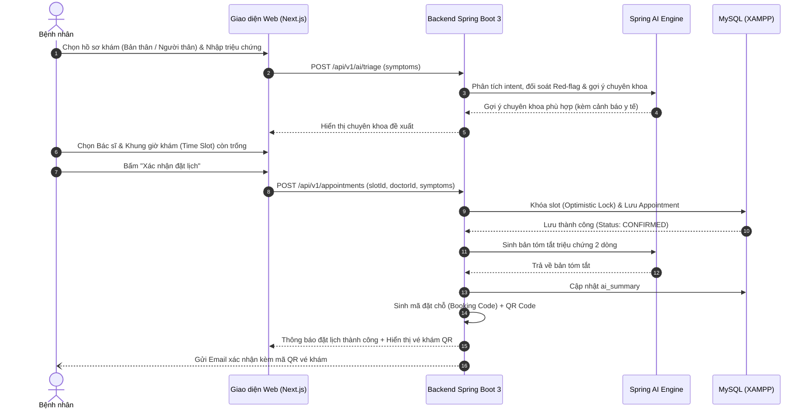
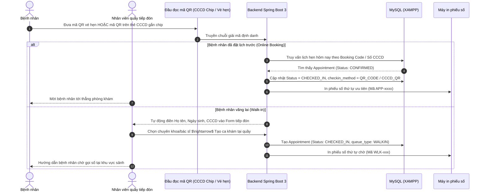
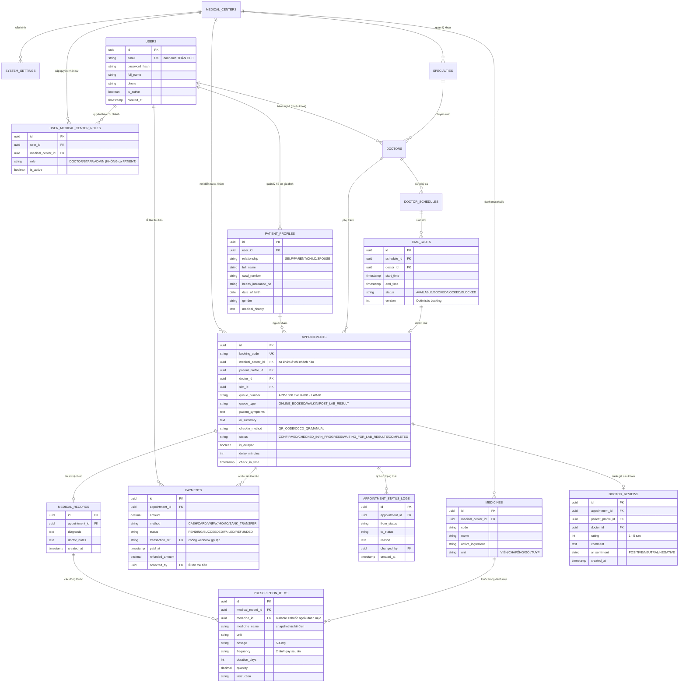

# BÁO CÁO ĐỀ XUẤT DỰ ÁN CAPSTONE: MEDSCHED
## Hệ Thống Quản Lý Lịch Khám Bệnh Thông Minh Tích Hợp Spring Boot 3 & Spring AI

---

## 1. TỔNG QUAN DỰ ÁN
* **Tên dự án:** **MedSched – Smart Healthcare Appointment Management System**
* **Mục tiêu:** Xây dựng nền tảng đặt lịch khám và điều phối tiếp đón bệnh nhân trực tuyến đa kênh, kết hợp sức mạnh của:
  * **Spring Boot 3 & Clean Architecture:** Quản trị nghiệp vụ lõi, bảo mật JWT, điều phối hàng đợi thông minh và cơ sở dữ liệu MySQL/MariaDB (XAMPP) chuẩn 3NF.
  * **Spring AI (LLM / RAG / Guardrails):** Chatbot hỗ trợ hội thoại tự nhiên, phân luồng chuyên khoa (Clinical Triage), tóm tắt bệnh án 2 dòng cho bác sĩ, phân tích cảm xúc đánh giá sau khám (Sentiment Analysis) và bộ lọc an toàn cấp cứu (Red-Flag Guardrails).
  * **Tiếp đón y tế hiện đại bằng QR Code & CCCD Chip:** Tiếp đón siêu tốc trong 1 giây qua máy quét mã QR vé hẹn và mã QR chuẩn Bộ Công An trên thẻ Căn cước công dân gắn chip / Thẻ BHYT, loại bỏ các mô hình thị giác máy tính nặng nề không cần thiết.

---

## 2. DANH SÁCH TÁC NHÂN (LIST ACTOR)

| STT | Tác nhân (Actor) | Mô tả vai trò & Phạm vi trách nhiệm |
| :---: | :--- | :--- |
| **1** | **Bệnh nhân (Patient)** | - Đăng ký/đăng nhập tài khoản cá nhân. - Quản lý hồ sơ gia đình (đặt lịch hộ cho bố mẹ, con cái). - Tìm kiếm bác sĩ, chuyên khoa, phòng khám. - Đặt lịch khám: Nhập triệu chứng và khảo sát tiền sử bệnh lý chuyên sâu. - Chat với Spring AI Chatbot để được định hướng đúng chuyên khoa. - Quản lý lịch sử khám, nhận vé khám điện tử có mã QR và đánh giá bác sĩ sau khám. |
| **2** | **Bác sĩ (Doctor)** | - Thiết lập khung giờ làm việc linh hoạt (ca sáng/chiều/tối). - Xem danh sách bệnh nhân đặt khám theo ngày và thứ tự hàng đợi điều phối. - Xem trước **bản tóm tắt bệnh án 2 dòng từ Spring AI** và lịch sử tiền sử bệnh. - Tiếp nhận ca khám, chỉ định cận lâm sàng 2 pha, ghi chú chẩn đoán ICD-10 và kê đơn thuốc điện tử. |
| **3** | **Nhân viên tiếp đón (Staff / Receptionist)** | - Tiếp nhận và đặt lịch hộ cho bệnh nhân vãng lai tại quầy. - Sử dụng máy quét mã QR để **quét thẻ CCCD gắn chip / thẻ BHYT** giúp Check-in hoặc lập hồ sơ trong 1 giây. - Quét mã QR vé hẹn trên điện thoại bệnh nhân. - Theo dõi màn hình điều phối hàng đợi (Queue Monitor) và in phiếu số thứ tự. |
| **4** | **Quản trị viên (Admin)** | - Quản trị cơ sở y tế (Medical Centers - mô hình SaaS), phân quyền RBAC (`PATIENT`, `DOCTOR`, `STAFF`, `ADMIN`). - Quản lý danh mục chuyên khoa, dịch vụ y tế, thông tin phòng bệnh. - Cấu hình hệ thống tập trung (System Settings): thời lượng slot, buffer time, quy định hủy hẹn. - Giám sát cảnh báo đánh giá tiêu cực từ Spring AI và xem báo cáo thống kê vận hành. |
| **5** | **Hệ thống & Spring AI Engine (System / Spring AI)** | - Tự động sinh khung giờ khám (slots), khóa lạc quan (Optimistic Locking) chống đặt trùng. - **Spring AI Engine:** Xử lý ngôn ngữ tự nhiên, gợi ý chuyên khoa (Triage), tóm tắt hồ sơ bệnh án và phân tích sắc thái cảm xúc. - **AI Red-Flag Guardrails:** Phát hiện triệu chứng nguy kịch và bật cảnh báo đỏ cấp cứu 115. - Tự động gửi Email/SMS thông báo và nhắc lịch (trước 24h, 2h). |

---

## 3. DANH SÁCH TÍNH NĂNG (LIST FEATURE)

### 3.1. Phân hệ Quản trị & Xác thực người dùng (Auth & User Management)
* **F01. Đăng ký & Đăng nhập:** Xác thực người dùng qua Email/Password kết hợp mã hóa BCrypt và cấp JWT Access/Refresh Token.
* **F02. Phân quyền RBAC theo từng chi nhánh:** Quyền nhân sự `ROLE_DOCTOR`, `ROLE_STAFF`, `ROLE_ADMIN` được cấp trong bảng nối `user_medical_center_roles` (1 bác sĩ trực 2 chi nhánh = 2 dòng). **Không có `ROLE_PATIENT`** — mọi tài khoản đều mặc định đặt lịch khám được ở mọi chi nhánh.
* **F03. Quản lý hồ sơ gia đình:** 1 tài khoản có thể quản lý nhiều hồ sơ người khám (`Bản thân`, `Bố mẹ`, `Con cái`, `Vợ/chồng`) phục vụ đặt lịch hộ chính xác.

### 3.2. Phân hệ Quản lý Lịch làm việc & Khung giờ (Doctor Scheduling & Time Slots)
* **F04. Khởi tạo lịch làm việc:** Bác sĩ / Admin thiết lập lịch làm việc định kỳ hàng tuần.
* **F05. Tự động sinh Time Slots:** Hệ thống tự động chia ca làm việc thành các slot 20 - 30 phút dựa trên tham số từ bảng `system_settings`.
* **F06. Quản lý trạng thái Slot:** Quản lý trạng thái thời gian thực: `AVAILABLE` (còn trống), `BOOKED` (đã đặt), `LOCKED` (tạm khóa giữ chỗ), `BLOCKED` (bác sĩ bận/nghỉ đột xuất).

### 3.3. Phân hệ Tìm kiếm & Đặt lịch khám (Appointment Booking Engine)
* **F07. Tìm kiếm & Bộ lọc nâng cao:** Lọc theo chuyên khoa, tên bác sĩ, ngày khám, mức giá dịch vụ.
* **F08. Đặt lịch khám trực tuyến:** Bệnh nhân chọn Bác sĩ $\rightarrow$ Chọn ngày $\rightarrow$ Chọn khung giờ trống $\rightarrow$ Điền lý do/triệu chứng $\rightarrow$ Xác nhận đặt.
* **F09. Đặt lịch hộ tại quầy:** Nhân viên y tế quét CCCD người bệnh vãng lai và tạo lịch hẹn tức thì.
* **F10. Mã đặt hẹn & QR Code:** Mỗi ca hẹn được sinh một mã đặt chỗ độc nhất (`Booking Code`) kèm mã QR định danh phục vụ tiếp đón tự động.
* **F11. Hủy / Dời lịch khám:** Cho phép hủy lịch hoặc đổi slot trước ca hẹn tối thiểu 2 tiếng theo quy định cấu hình hệ thống.

### 3.4. Phân hệ Tiếp đón & Điều phối hàng đợi (Check-in & Smart Queue) ⭐
* **F12. Check-in nhanh bằng mã QR vé hẹn:** Quét mã QR trên điện thoại bệnh nhân để chuyển trạng thái ca hẹn thành `CHECKED_IN` trong 1 giây.
* **F13. Tiếp đón siêu tốc bằng thẻ CCCD gắn chip / Thẻ BHYT:** Đầu đọc quét mã QR chuẩn Bộ Công An trên thẻ CCCD, bóc tách chính xác Họ tên, Ngày sinh, Số CCCD để đối soát lịch hẹn hoặc tạo hồ sơ vãng lai tức thì.
* **F14. Thuật toán điều phối hàng đợi thông minh (Queue Priority Engine):**
  - Ưu tiên gọi đúng giờ cho bệnh nhân đặt online (`APP-xxxx`).
  - Tự động tận dụng thời gian dôi dư của slot (bác sĩ khám nhanh 10p/slot 30p) để gọi ngay bệnh nhân vãng lai (`WLK-xxx`) vào lấp chỗ trống.
  - Chuyển ca online đến trễ (> 15 phút) về cuối hàng đợi kế tiếp.

### 3.5. Phân hệ Phòng khám Bác sĩ & Cận lâm sàng (Doctor & Clinical Workflow)
* **F15. Xem trước tóm tắt AI (Spring AI 2-line Summary):** Nắm bắt triệu chứng chính và tiền sử bệnh của bệnh nhân trong 5 giây trước khi vào phòng.
* **F16. Xem lịch sử khám & Toa thuốc cũ:** Truy xuất tức thì hồ sơ các lần khám trước của bệnh nhân.
* **F17. Ghi nhận kết quả khám & Đơn thuốc điện tử:** Nhập chẩn đoán ICD-10, ghi chú y khoa và kê đơn thuốc số.
* **F18. Quy trình cận lâm sàng 2 pha:** Chuyển trạng thái `WAITING_FOR_LAB_RESULTS` khi chỉ định xét nghiệm; cấp số ưu tiên (`LAB-xx`) đọc kết quả khi bệnh nhân quay lại mà không phải xếp hàng từ đầu.

### 3.6. Phân hệ Trí tuệ nhân tạo Spring AI (Spring AI Core Features) ⭐
* **F19. AI Chatbot phân luồng chuyên khoa (Clinical Triage):** Phân tích mô tả triệu chứng ngôn ngữ tự nhiên, gợi ý chuyên khoa chuẩn xác kèm Disclaimer y tế.
* **F20. Tóm tắt bệnh án 2 dòng tự động:** Trích xuất thông tin cốt lõi từ mô tả bệnh nhân tạo bản tóm tắt súc tích cho bác sĩ.
* **F21. Phân tích cảm xúc đánh giá sau khám (Sentiment Analysis):** Phân loại nhận xét thành `POSITIVE`, `NEUTRAL`, `NEGATIVE`, tự động cảnh báo Ban Giám Đốc khi có phản hồi tiêu cực.
* **F22. Bộ lọc cảnh báo đỏ triệu chứng nguy kịch (Red-Flag Guardrails):** Phát hiện các triệu chứng khẩn cấp (đau thắt ngực, khó thở cấp, đột quỵ, nôn ra máu) và hiển thị cảnh báo đỏ yêu cầu gọi 115 ngay.

### 3.7. Phân hệ Quản trị, Mở rộng SaaS & Báo cáo
* **F23. Quản lý cơ sở y tế đa chi nhánh (Medical Centers - SaaS):** Thiết lập cấu hình và dữ liệu riêng biệt cho từng chi nhánh bệnh viện.
* **F24. Cấu hình hệ thống tập trung (System Settings):** Quản trị thời lượng slot, buffer time, giới hạn hủy hẹn, số lần No-show tối đa.
* **F25. Nhật ký thay đổi trạng thái ca khám (Status History Logs):** Truy vết chi tiết ai đổi trạng thái, lý do đổi và thời điểm đổi.
* **F26. Báo cáo thống kê thời gian thực:** Thống kê số lượng ca khám, thời gian chờ trung bình tại quầy, tỷ lệ đúng giờ và tỷ lệ No-show.

---

## 4. CHI TIẾT CÁC LUỒNG NGHIỆP VỤ CHÍNH (CLEAR LUỒNG CHÍNH)

### 4.1. Luồng 1: Bệnh nhân đặt lịch khám trực tuyến tích hợp Spring AI

---

### 4.2. Luồng 2: Tiếp đón & Check-in tự động tại quầy bằng mã QR

---

### 4.3. Luồng 3: Bác sĩ tiếp nhận ca khám bệnh
1. **Chuẩn bị ca khám:**
   * Bác sĩ mở danh sách hàng đợi các ca khám có trạng thái `CHECKED_IN`.
   * Bấm vào hồ sơ bệnh nhân tiếp theo:
     * Xem **Bản tóm tắt triệu chứng 2 dòng** do Spring AI cô đọng lại.
     * Xem **Lịch sử khám cũ, bệnh lý nền và dị ứng thuốc**.
2. **Tiến hành khám:**
   * Bác sĩ bấm **Bắt đầu khám** $\rightarrow$ Trạng thái chuyển thành `IN_PROGRESS`.
   * Khám thực tế, nhập kết luận chẩn đoán ICD-10 và kê đơn thuốc điện tử (hoặc chuyển `WAITING_FOR_LAB_RESULTS` nếu chỉ định cận lâm sàng).
3. **Kết thúc ca khám:**
   * Bác sĩ bấm **Hoàn thành khám** $\rightarrow$ Trạng thái chuyển thành `COMPLETED`.
   * Thuật toán tự động kích hoạt gọi ca tiếp theo theo độ ưu tiên.

---

## 5. THIẾT KẾ CƠ SỞ DỮ LIỆU CHI TIẾT (DATABASE DESIGN)

### 5.1. Sơ đồ thực thể liên kết (Entity Relationship Diagram - ERD 16 Bảng)

> **Ảnh ERD đầy đủ:** [`04_Database_Design/medsched_erd_v3.png`](./04_Database_Design/medsched_erd_v3.png)
> **Phiên bản 3.0** đã sửa 3 lỗi thiết kế được phản biện — xem mục 0 của [`Database_Design.md`](./04_Database_Design/Database_Design.md):
> 1. `USERS` **không còn** `medical_center_id` / `role` ➔ tài khoản là **danh tính toàn cục**, 1 bệnh nhân khám được ở mọi chi nhánh với cùng hồ sơ bệnh án. Quyền nhân sự tách sang bảng nối `USER_MEDICAL_CENTER_ROLES`.
> 2. Thêm bảng `PAYMENTS` đúng nghĩa (nhiều lần thu, hoàn tiền, mã giao dịch) thay cho 2 cột nhét trong `APPOINTMENTS`.
> 3. Thêm `MEDICINES` + `PRESCRIPTION_ITEMS` thay cột `prescription TEXT`.

---

## 6. KIẾN TRÚC TRIỂN KHAI KỸ THUẬT (SYSTEM ARCHITECTURE)

Hệ thống được tổ chức theo kiến trúc phân tầng sạch (Clean / Hexagonal Architecture), bám sát chương trình Spring Boot 3:
1. **Frontend App:** Next.js 16 (React 19, TypeScript, Vanilla CSS/Design System) – Giao diện đặt lịch cho bệnh nhân & Cổng điều phối tiếp đón cho Lễ tân và Bác sĩ.
2. **Backend API Core:** Java 21 & Spring Boot 3 – Xử lý nghiệp vụ lõi, bảo mật Spring Security & JWT, Quản trị hàng đợi, Audit trail.
3. **AI Engine (Spring AI):** Tích hợp trực tiếp trong Spring Boot qua thư viện `spring-ai-core` (kết nối OpenAI / Gemini / Ollama cục bộ) – Thực hiện Triage, 2-line summary, Sentiment analysis và Red-flag guardrails.
4. **Database:** MySQL/MariaDB chạy trên **XAMPP** (17 bảng quan hệ chuẩn 3NF). Kho vector cho RAG y khoa giai đoạn sau sẽ dùng giải pháp ngoài (file-based hoặc dịch vụ vector riêng) để không phải đổi hệ quản trị.

---

## 7. KẾ HOẠCH BÁO CÁO VÀ PHÂN CÔNG NHÓM (6 THÀNH VIÊN)

| STT | Thành viên phụ trách | Vai trò | Nhiệm vụ chính trong dự án |
| :---: | :--- | :--- | :--- |
| **1** | **Châu Tuấn Kiệt** | **Nhóm trưởng (Leader)** | Quản lý tiến độ chung, thiết kế kiến trúc hệ thống, kiểm soát chất lượng luồng nghiệp vụ và thuyết trình chính. |
| **2** | **Nguyễn Văn Hiếu** | Thành viên | Phát triển Backend Core Spring Boot 3, xây dựng API Time-slots, khóa lạc quan Optimistic Locking và Spring Security JWT. |
| **3** | **Lê Thành Tài** | Thành viên | Phụ trách CSDL: schema 17 bảng chuẩn 3NF trên MySQL/XAMPP, JPA Entity + Repository, seed data và migration Flyway. |
| **4** | **Nguyễn Thị Yến Nhi** | Thành viên | Phân tích nghiệp vụ (BA), hoàn thiện danh sách tính năng (F01–F31), ma trận phân quyền RBAC và kịch bản người dùng. |
| **5** | **Tân Cùng Bàn** (Tân) | Thành viên | Tích hợp Spring AI Service: Xây dựng ChatClient, Prompt engineering cho Triage phân loại khoa, Tóm tắt bệnh án 2 dòng và Sentiment Analysis. |
| **6** | **Trang Huynh** (Trang) | Thành viên | Phát triển giao diện Frontend Next.js (Màn hình đặt lịch, Quầy tiếp đón QR, Bàn làm việc bác sĩ) và thiết kế Slide thuyết trình. |

---

## 8. TIẾP THU VÀ GIẢI TRÌNH GÓP Ý CỦA GIẢNG VIÊN (REVIEW FEEDBACK RESPONSE)

### 8.1. Cải tiến Cơ sở dữ liệu (Database Refactoring)
1. **Chuẩn hóa 4 trường Audit:** Tất cả các bảng đều sở hữu `created_at`, `updated_at`, `created_by`, `updated_by` để phục vụ phân trang, sắp xếp và đảm bảo tính minh bạch pháp lý y tế.
2. **Bảng cấu hình hệ thống (`system_settings`):** Tách thời lượng slot và khoảng đệm khỏi ca trực của bác sĩ, quản lý tập trung thời lượng slot mặc định (30p), buffer (5p), thời hạn hủy hẹn (2h).
3. **Nhật ký thay đổi trạng thái ca khám (`appointment_status_logs`):** Ghi vết chi tiết từng lượt chuyển trạng thái (ai đổi, lý do đổi, thời điểm đổi).
4. **Hồ sơ bệnh nhân gia đình (`patient_profiles`):** Cho phép 1 tài khoản đặt lịch hộ cho người thân (bố mẹ, con cái) để khi người thân quét CCCD tại quầy luôn khớp đúng người khám.
5. **Hỗ trợ mở rộng SaaS (`medical_centers`):** Bổ sung bảng cơ sở y tế / chi nhánh để hệ thống sẵn sàng nhân bản thành chuỗi phòng khám đa điểm.

### 8.2. Lời giải cho bài toán Hàng đợi điều phối: Khách Vãng lai (Walk-in) vs Khách Đặt Online
* **Tình huống 9:30 có 10 khách vãng lai, 10:00 có ca online:**
  * Khách online nhận mã số ưu tiên slot (`APP-xxxx`), khách vãng lai nhận số chờ (`WLK-xxx`).
  * Đúng 10:00, nếu ca online có mặt, hệ thống **ưu tiên gọi ngay ca online** sau khi ca trước kết thúc.
* **Tận dụng khe thời gian trống (Bác sĩ khám nhanh 10p, slot 30p còn dư 20p):**
  * Bác sĩ bấm nút *"Gọi số tiếp theo"*, thuật toán nhận diện còn 20 phút trước slot online tiếp theo $\rightarrow$ **tự động gọi ngay bệnh nhân vãng lai kế tiếp vào khám**, xóa bỏ thời gian "chết" của phòng khám.
* **Quy trình cận lâm sàng 2 pha:** Bệnh nhân đi xét nghiệm máu/X-quang quay lại được cấp số ưu tiên (`LAB-xx`) đọc kết quả xen kẽ với ca mới, không phải xếp hàng lại từ đầu.

### 8.3. Định vị lại Scope AI khả thi & Loại bỏ YOLO11
* **Tiếp thu phản hồi của Giảng viên:** Giáo viên góp ý không nên "vẽ quá ác" dẫn đến quá tải khối lượng trong thời lượng môn học 10 tuần. Nhóm đã **quyết định loại bỏ hoàn toàn module YOLO11 (thị giác máy tính)**.
* **Giải pháp thay thế thực tế:** 
  * Thay vì nhận diện hình ảnh thẻ bằng camera phức tạp, nhóm sử dụng **đầu đọc mã QR chuẩn y tế**. Trên thẻ CCCD gắn chip hiện hành của Bộ Công An đã tích hợp sẵn mã QR chứa đầy đủ chuỗi ký tự định danh (Số CCCD, Họ tên, Ngày sinh, Giới tính, Địa chỉ). Quét mã QR này đạt độ chính xác 100%, diễn ra trong 1 giây và không phát sinh chi phí hạ tầng GPU.
* **Tập trung 100% vào giá trị cốt lõi của Spring AI:**
  1. **Clinical Triage:** Chatbot định hướng chuyên khoa tự nhiên kèm Disclaimer y tế.
  2. **2-line Clinical Summary:** Tự động tóm tắt bệnh án 2 dòng cho bác sĩ (`ai_summary`).
  3. **Sentiment Analysis:** Phân tích cảm xúc phản hồi sau khám trên verified review.
  4. **Emergency Red-Flag Guardrails:** Bộ lọc an toàn tự động phát hiện triệu chứng nguy kịch và kích hoạt cảnh báo gọi 115 ngay.
  5. **Medical RAG:** Truy vấn cơ sở tri thức y khoa chuẩn xác (kho vector dùng giải pháp ngoài, không phụ thuộc hệ quản trị CSDL chính).

### 8.4. Luồng thanh toán (Payment Flow)
* **Giai đoạn 1:** Mặc định hỗ trợ thanh toán tại quầy khi Check-in — ghi 1 dòng `payments` với `method = CASH/CARD`, `collected_by` = lễ tân thu tiền.
* **Giai đoạn 2:** Tích hợp tùy chọn đặt cọc giữ chỗ online qua cổng VNPay/MoMo Sandbox nhằm giảm thiểu tỷ lệ bùng lịch (No-show). Bảng `payments` cho phép **1 ca khám có nhiều dòng thu tiền** (cọc online + thu thêm tại quầy) và hoàn tiền từng phần; `transaction_ref` UNIQUE chặn webhook cổng thanh toán gọi lặp.
