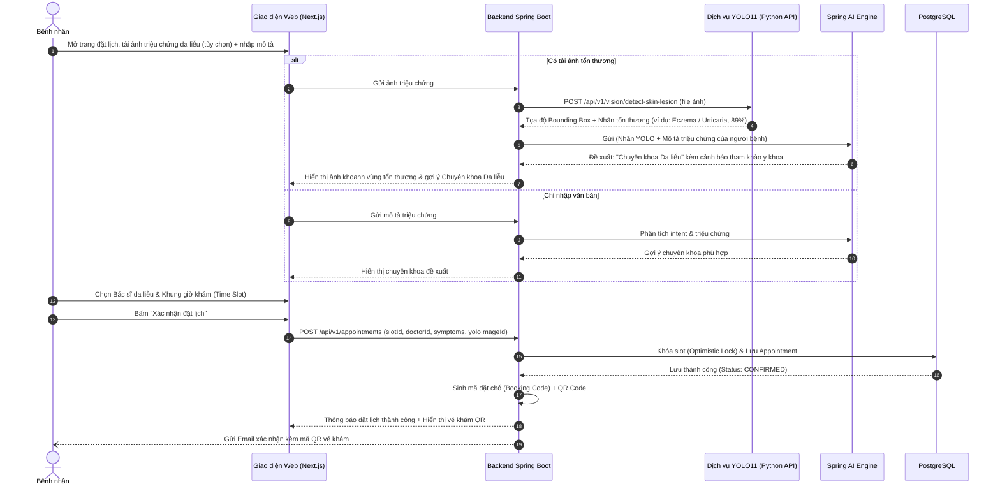
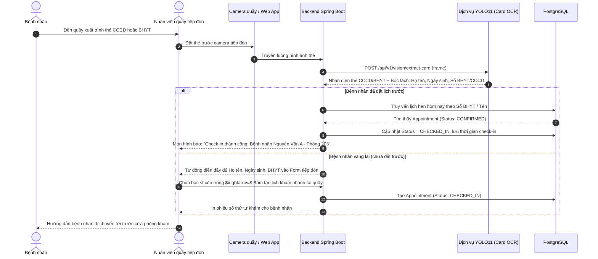
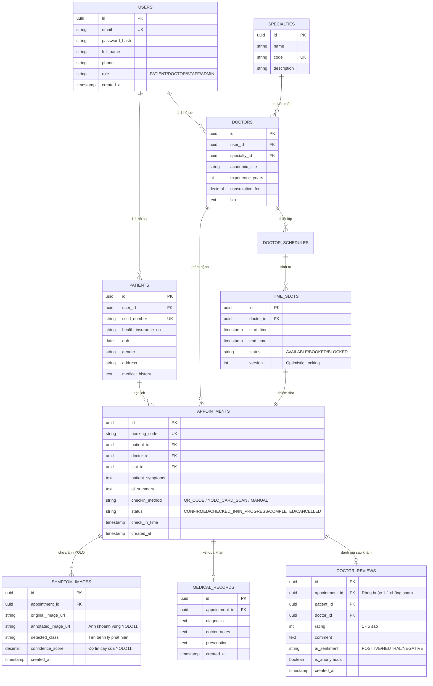

# BÁO CÁO ĐỀ XUẤT DỰ ÁN CAPSTONE: MEDSCHED
## Hệ Thống Quản Lý Lịch Khám Bệnh Thông Minh Tích Hợp Spring Boot, Spring AI & YOLO11

---

## 1. TỔNG QUAN DỰ ÁN
* **Tên dự án:** **MedSched – Smart Healthcare Appointment Management System**
* **Mục tiêu:** Xây dựng nền tảng đặt lịch khám và điều phối tiếp đón bệnh nhân trực tuyến đa kênh, kết hợp sức mạnh của:
  * **Spring Boot 3 & Clean Architecture:** Quản trị nghiệp vụ lõi, bảo mật JWT và cơ sở dữ liệu PostgreSQL.
  * **Spring AI (LLM / NLP):** Chatbot hỗ trợ hội thoại tự nhiên, tóm tắt bệnh án và gợi ý chuyên khoa theo ngữ cảnh.
  * **YOLO11 (Computer Vision):** Thị giác máy tính hiện đại bậc nhất hỗ trợ:
    1. *Tự động nhận diện & trích xuất thẻ CCCD/BHYT tại quầy tiếp đón.*
    2. *Phát hiện và phân loại sơ bộ hình ảnh tổn thương da liễu khi đặt lịch khám.*

---

## 2. DANH SÁCH TÁC NHÂN (LIST ACTOR)

| STT | Tác nhân (Actor) | Mô tả vai trò & Phạm vi trách nhiệm |
| :---: | :--- | :--- |
| **1** | **Bệnh nhân (Patient)** | - Đăng ký/đăng nhập tài khoản cá nhân. - Tìm kiếm bác sĩ, chuyên khoa, phòng khám. - Đặt lịch khám: Nhập triệu chứng và **chụp/tải ảnh vùng tổn thương ngoài da (YOLO11 phân tích)**. - Chat với AI Chatbot để được định hướng chuyên khoa. - Quản lý lịch sử khám và nhận vé khám có mã QR. |
| **2** | **Bác sĩ (Doctor)** | - Thiết lập khung giờ làm việc linh hoạt (ca sáng/chiều/tối). - Xem danh sách bệnh nhân đặt khám theo ngày. - Xem trước **ảnh tổn thương đã được YOLO11 khoanh vùng** và bản tóm tắt bệnh án từ Spring AI. - Tiếp nhận ca khám, ghi chú kết quả khám sơ bộ và đơn thuốc. |
| **3** | **Nhân viên tiếp đón (Staff / Receptionist)** | - Tiếp nhận và đặt lịch hộ cho bệnh nhân vãng lai tại quầy. - Sử dụng camera quầy để **quét thẻ CCCD/BHYT (YOLO11 tự động bóc tách thông tin)** giúp Check-in hoặc lập hồ sơ trong 3 giây. - Quét mã QR vé khám, điều phối thứ tự phòng khám. |
| **4** | **Quản trị viên (Admin)** | - Quản trị tài khoản người dùng, phân quyền hệ thống (`PATIENT`, `DOCTOR`, `STAFF`, `ADMIN`). - Quản lý danh mục chuyên khoa, dịch vụ y tế, thông tin phòng bệnh. - Xem báo cáo thống kê vận hành (doanh thu, lượt khám, tỷ lệ bỏ hẹn no-show). |
| **5** | **Hệ thống & AI Engine (System / AI / YOLO11)** | - Tự động sinh khung giờ khám (slots), khóa slot chống đặt trùng (concurrency lock). - **YOLO11 Model:** Xử lý hình ảnh (quét thẻ định danh & phát hiện bất thường trên da). - **Spring AI Engine:** Xử lý ngôn ngữ tự nhiên, bóc tách thực thể và tóm tắt hồ sơ. - Tự động gửi Email/SMS thông báo và nhắc lịch (trước 24h, 2h). |

---

## 3. DANH SÁCH TÍNH NĂNG (LIST FEATURE)

### 3.1. Phân hệ Quản trị & Xác thực người dùng (Auth & User Management)
* **F01. Đăng ký & Đăng nhập:** Xác thực người dùng qua Email/Password kết hợp mã hóa BCrypt và cấp JWT Access/Refresh Token.
* **F02. Phân quyền RBAC:** Phân tách quyền chặt chẽ: `ROLE_PATIENT`, `ROLE_DOCTOR`, `ROLE_STAFF`, `ROLE_ADMIN`.
* **F03. Quản lý hồ sơ cá nhân:**
  * Bệnh nhân: Cập nhật thông tin cơ bản, tiền sử dị ứng/bệnh án, BHYT, số điện thoại liên hệ.
  * Bác sĩ: Cập nhật học hàm/học vị, số năm kinh nghiệm, chứng chỉ hành nghề, ảnh chân dung.

### 3.2. Phân hệ Quản lý Lịch làm việc & Khung giờ (Doctor Scheduling & Time Slots)
* **F04. Khởi tạo lịch làm việc:** Bác sĩ / Admin thiết lập lịch làm việc định kỳ hàng tuần.
* **F05. Tự động sinh Time Slots:** Hệ thống tự động chia ca làm việc thành các slot nhỏ 20 - 30 phút.
* **F06. Quản lý trạng thái Slot:** Quản lý trạng thái thời gian thực: `AVAILABLE` (còn trống), `BOOKED` (đã đặt), `LOCKED` (tạm khóa khi đang thanh toán/giữ chỗ), `BLOCKED` (bác sĩ bận đột xuất).

### 3.3. Phân hệ Tìm kiếm & Đặt lịch khám (Appointment Booking Engine)
* **F07. Tìm kiếm & Bộ lọc nâng cao:** Lọc theo chuyên khoa, tên bác sĩ, ngày khám, mức giá dịch vụ.
* **F08. Đặt lịch khám trực tuyến:** Bệnh nhân chọn Bác sĩ $\rightarrow$ Chọn ngày $\rightarrow$ Chọn khung giờ trống $\rightarrow$ Điền lý do/triệu chứng $\rightarrow$ Xác nhận đặt.
* **F09. Đặt lịch hộ tại quầy:** Nhân viên y tế nhập thông tin bệnh nhân vãng lai và tạo lịch hẹn tức thì.
* **F10. Mã đặt hẹn & QR Code:** Mỗi ca hẹn được sinh một mã đặt chỗ độc nhất (`Booking Code`) kèm mã QR định danh gửi về email bệnh nhân.
* **F11. Hủy / Dời lịch khám:** Cho phép hủy lịch hoặc đổi slot trước ca hẹn tối thiểu 4 - 12 tiếng.

### 3.4. Phân hệ Tiếp đón & Khám bệnh (Check-in & Consultation)
* **F12. Check-in nhanh bằng QR Code:** Nhân viên quét mã QR của bệnh nhân tại quầy tiếp đón để chuyển trạng thái ca hẹn thành `CHECKED_IN`.
* **F13. Điều phối hàng đợi khám:** Bảng hiển thị danh sách bệnh nhân đang chờ trước cửa phòng khám của bác sĩ.
* **F14. Ghi nhận kết quả khám:** Bác sĩ cập nhật kết quả khám ban đầu, ghi chú y khoa và kết luận ca khám (`COMPLETED`).

### 3.5. Phân hệ Thị giác máy tính YOLO11 (Computer Vision Features) ⭐
* **F15. YOLO11 – Tự động nhận diện & trích xuất thẻ CCCD/BHYT tại quầy tiếp đón:**
  * Camera tiếp đón tự động nhận diện thẻ CCCD/BHYT, căn chỉnh góc chụp thẳng (perspective transform).
  * YOLO11 khoanh vùng và bóc tách các trường: *Họ tên, Ngày sinh, Giới tính, Số BHYT, Địa chỉ, Mã QR*.
  * Tự động điền dữ liệu vào form tiếp đón bệnh nhân hoặc hoàn tất Check-in trong **3 giây**, giảm 90% thời gian chờ tại quầy.
* **F16. YOLO11 – Phát hiện sơ bộ tổn thương ngoài da khi đặt lịch:**
  * Khi người bệnh đặt lịch hẹn khám Da liễu / Ngoại khoa, hệ thống cho phép tải lên hình ảnh vùng da bất thường.
  * Model YOLO11 phát hiện, phân loại và vẽ bounding box khoanh vùng tổn thương (ví dụ: *Nốt ban, Mẩn ngứa dị ứng, Mụn viêm, Vết trầy xước...*).
  * Ảnh kết quả phân tích được đính kèm vào hồ sơ bệnh án điện tử để Bác sĩ xem xét trực quan trước ca khám.

### 3.6. Phân hệ Trí tuệ nhân tạo Spring AI (NLP Features) ⭐
* **F17. AI Chatbot đặt lịch thông minh:** Bệnh nhân chat tự nhiên (*"Tôi muốn khám răng vào sáng thứ Bảy"*), AI tự bóc tách ý định (Intent & Entity Extraction) và lọc slot giờ phù hợp.
* **F18. Gợi ý chuyên khoa đa phương thức (Multimodal Triage):** Kết hợp kết quả phân tích hình ảnh từ **YOLO11** + lời mô tả triệu chứng của bệnh nhân, **Spring AI** tổng hợp và đề xuất chuyên khoa chính xác nhất (ví dụ: *"Hình ảnh phát hiện nốt ban dạng mề đay dị ứng, hệ thống gợi ý bạn đặt khám tại Chuyên khoa Da liễu"*).
* **F19. Tóm tắt lý do khám cho bác sĩ:** AI tự động tóm lược thông tin lời kể dài dòng của bệnh nhân thành bản tóm tắt 2 dòng ngắn gọn.

### 3.7. Phân hệ Thông báo, Đánh giá & Báo cáo (Notification, Review & Analytics)
* **F20. Nhắc lịch hẹn tự động:** Tự động gửi email/SMS nhắc nhở trước 24 giờ và trước 2 giờ khám.
* **F21. Thống kê & Dashboard:** Thống kê số lượng ca khám, thời gian chờ trung bình tại quầy, tỷ lệ tiếp đón tự động bằng YOLO11.
* **F22. Đánh giá chất lượng sau khám & Phân tích cảm xúc qua Spring AI (Verified Review & Sentiment Analysis):** Bệnh nhân hoàn tất ca khám (`status = COMPLETED`) được đánh giá 1-5 sao kèm nhận xét. Spring AI tự động phân tích cảm xúc (Positive/Neutral/Negative) để cảnh báo kịp thời các trường hợp dịch vụ chưa tốt.

---

## 4. CHI TIẾT CÁC LUỒNG NGHIỆP VỤ CHÍNH (CLEAR LUỒNG CHÍNH)

### 4.1. Luồng 1: Bệnh nhân đặt lịch khám trực tuyến tích hợp YOLO11 & Spring AI

---

### 4.2. Luồng 2: Tiếp đón & Check-in tự động tại quầy bằng YOLO11

---

### 4.3. Luồng 3: Bác sĩ tiếp nhận ca khám bệnh
1. **Chuẩn bị ca khám:**
   * Bác sĩ mở danh sách hàng đợi các ca khám có trạng thái `CHECKED_IN`.
   * Bấm vào hồ sơ bệnh nhân tiếp theo:
     * Xem **Bản tóm tắt triệu chứng** do Spring AI cô đọng lại.
     * Xem **Hình ảnh vết tổn thương da đã được YOLO11 khoanh vùng phát hiện**.
2. **Tiến hành khám:**
   * Bác sĩ bấm **Bắt đầu khám** $\rightarrow$ Hệ thống chuyển trạng thái thành `IN_PROGRESS`.
   * Bác sĩ khám thực tế, đối chiếu triệu chứng, nhập chẩn đoán kết luận và dặn dò/kê đơn.
3. **Kết thúc ca khám:**
   * Bác sĩ bấm **Hoàn thành khám** $\rightarrow$ Trạng thái chuyển thành `COMPLETED`.
   * Hệ thống tự động đẩy bệnh nhân tiếp theo trong hàng đợi lên đầu danh sách.

---

## 5. THIẾT KẾ CƠ SỞ DỮ LIỆU CHI TIẾT (DATABASE DESIGN - OPTIONAL)

### 5.1. Sơ đồ thực thể liên kết (Entity Relationship Diagram - ERD)

### 5.2. Các bảng dữ liệu bổ sung cho tính năng AI & YOLO11

#### 1. Bảng `symptom_images` (Lưu kết quả phân tích hình ảnh của YOLO11)
| Tên cột | Kiểu dữ liệu | Ràng buộc | Ý nghĩa |
| :--- | :--- | :--- | :--- |
| `id` | UUID | PRIMARY KEY | Khóa chính của ảnh triệu chứng |
| `appointment_id` | UUID | FOREIGN KEY | Liên kết với ca hẹn khám |
| `original_image_url` | VARCHAR(500) | NOT NULL | Đường dẫn ảnh gốc do bệnh nhân tải lên |
| `annotated_image_url` | VARCHAR(500) | NULL | Đường dẫn ảnh đã được YOLO11 vẽ Bounding Box |
| `detected_class` | VARCHAR(100) | NULL | Nhãn tổn thương (ví dụ: `eczema`, `rash`, `acne`) |
| `confidence_score` | DECIMAL(5, 4) | NULL | Độ chính xác nhận diện của model (ví dụ: `0.9250`) |
| `created_at` | TIMESTAMP | DEFAULT NOW() | Thời điểm phân tích |

#### 2. Cột mở rộng trong bảng `appointments`
* `checkin_method`: Lưu hình thức check-in (`YOLO_CARD_SCAN`: quét CCCD/BHYT, `QR_CODE`: quét mã vé, `MANUAL`: bấm tay).
* `ai_summary`: Tóm tắt triệu chứng 2 dòng do Spring AI tự động trích xuất.

---

## 6. KIẾN TRÚC TRIỂN KHAI KỸ THUẬT (SYSTEM ARCHITECTURE)

Hệ thống được tổ chức thành các micro-services gọn gàng chạy chung qua **Docker Compose**:
1. **Frontend:** Next.js 16 (React 19, TypeScript, TailwindCSS) – Giao diện bệnh nhân & Bàn làm việc bác sĩ/lễ tân.
2. **Backend API:** Java 21 & Spring Boot 3 – Xử lý nghiệp vụ, bảo mật JWT, điều phối luồng dữ liệu.
3. **Computer Vision AI Service:** Python (FastAPI + Ultralytics YOLO11) – Nhận diện ảnh CCCD/BHYT và phân tích tổn thương ngoài da.
4. **LLM AI Service:** Spring AI tích hợp OpenAI / Google Gemini / Ollama – Chatbot và tóm tắt bệnh án.
5. **Database:** PostgreSQL 16 (hỗ trợ lưu trữ quan hệ và mở rộng PGVector).

---

## 7. KẾ HOẠCH BÁO CÁO VÀ PHÂN CÔNG NHÓM

| Hạng mục | Thành viên phụ trách | Kết quả bàn giao thứ 6 |
| :--- | :--- | :--- |
| **Actor & Feature List** | Thành viên 1 | Danh sách 5 Actor và 21 Tính năng (đặc biệt nhấn mạnh 2 tính năng YOLO11). |
| **Clear Luồng Chính** | Thành viên 2 (Nhóm trưởng) | Sơ đồ Sequence Diagram luồng Đặt lịch AI + Luồng Check-in thẻ YOLO11. |
| **Database Design** | Thành viên 3 | Sơ đồ ERD có bảng `symptom_images` và các bảng quan hệ PostgreSQL. |
| **Kiến trúc & Tổng hợp** | Toàn đội | File báo cáo PDF/Slide 6-8 trang sẵn sàng thuyết trình trước giảng viên. |
