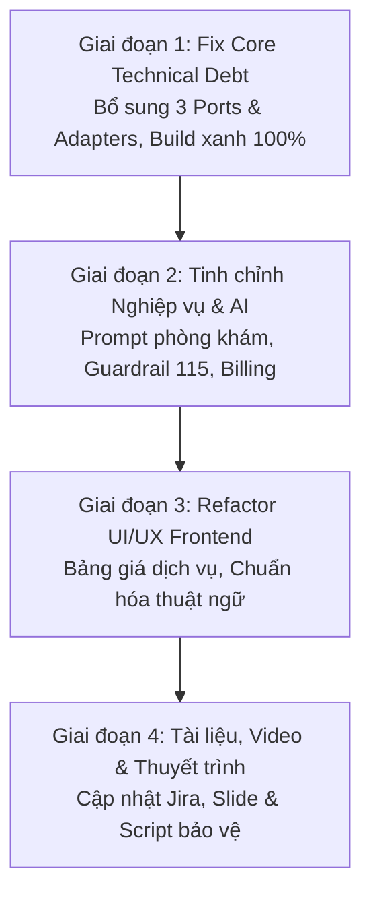

# 📋 KẾ HOẠCH CHUYỂN ĐỔI TOÀN DIỆN DỰ ÁN MEDSCHED
## Từ "Hệ thống Bệnh viện Đa khoa" sang "Nền tảng Quản lý & Đặt lịch Chuỗi Phòng khám Tư nhân Thông minh"

> **Dự án**: MedSched – Smart Clinic Appointment Booking (Mã Jira môn học: **CAB**)  
> **Người lập**: Châu Tuấn Kiệt (*Project Leader / System Architect*)  
> **Mục tiêu**: Tinh gọn hóa nghiệp vụ, giải quyết triệt để lỗi kỹ thuật, khớp 100% đề bài của thầy Bình, nâng tầm trải nghiệm khám dịch vụ tư nhân và chuẩn bị báo cáo đạt điểm xuất sắc.

---

## 🧭 I. TẦM NHÌN & LÝ DO CHUYỂN ĐỔI CHIẾN LƯỢC

### 1. Tại sao chuyển sang "Phòng khám tư" là quyết định đúng đắn?
1. **Khớp 100% với Đề bài gốc của Thầy**: Mã đề tài trên Jira là **CAB** (*Clinic Appointment Booking*), tức bản chất ban đầu chính là dành cho Phòng khám.
2. **Loại bỏ rủi ro bị vặn bẻ nghiệp vụ**: Bệnh viện công có cơ cấu quá cồng kềnh (nội trú, giường bệnh, liên khoa phức tạp, BHYT nhà nước khắt khe). Phòng khám tư hoạt động **100% ngoại trú (Outpatient)**: Khám xong $\rightarrow$ Kê đơn / Dịch vụ $\rightarrow$ Về trong ngày.
3. **Làm nổi bật giá trị công nghệ**:
   - Khách đi khám tư ghét nhất là phải xếp hàng chờ đợi $\rightarrow$ Nhóm giải quyết bằng **Đặt lịch theo Time-slot 30 phút** (có khóa chống trùng lịch).
   - Tiếp đón siêu tốc tại quầy $\rightarrow$ **Quét mã QR / CCCD check-in trong 1 giây**.
   - Khám dịch vụ chuyên nghiệp $\rightarrow$ **AI Triage tư vấn gói khám**, **bác sĩ kê đơn điện tử**, **thu phí minh bạch**.

---

## 🗺️ II. LỘ TRÌNH TRIỂN KHAI 4 GIAI ĐOẠN (ROADMAP)



---

### GIAI ĐOẠN 1: KHẮC PHỤC DỨT ĐIỂM NỢ KỸ THUẬT (Ưu tiên số 1)
* **Thời gian dự kiến**: 1 - 2 ngày
* **Mục tiêu**: Dự án biên dịch sạch sẽ (`BUILD SUCCESSFUL`), chạy được cả Backend & Frontend.

| Hạng mục | Chi tiết thực hiện | Phụ trách |
| :--- | :--- | :---: |
| **Bổ sung 3 Outbound Ports** | Tạo 3 interface trong `backend/core/port/out/`:<br>1. `AppointmentRepositoryPort`<br>2. `TimeSlotRepositoryPort`<br>3. `AiTriagePort` | **Kiệt / Hiếu** |
| **Viết Adapters tương ứng** | Tạo các class trong `backend/app/adapter/out/` implements các port trên, nối với Spring Data JPA Repository và Spring AI ChatClient. | **Hiếu / Tài** |
| **Kiểm thử Compile & Run** | Chạy `./gradlew :app:bootRun`, đảm bảo 81+ file Java compile thành công, các API Task 1 và Task 2 hoạt động bình thường. | **Tài / Kiệt** |

---

### GIAI ĐOẠN 2: TINH CHỈNH NGHIỆP VỤ & PROMPT AI PHÒNG KHÁM
* **Thời gian dự kiến**: 2 - 3 ngày
* **Mục tiêu**: Nghiệp vụ mượt mà, đúng chuẩn quy trình phòng khám dịch vụ.

| Hạng mục | Chi tiết thực hiện | Phụ trách |
| :--- | :--- | :---: |
| **Tái cấu trúc Prompt Spring AI Triage** | - Đổi vai trò AI: *"Trợ lý tư vấn dịch vụ khám và hỗ trợ bệnh nhân chuẩn bị trước khi đến Phòng khám tư MedSched"**.<br>- **Bổ sung Medical Safety Guardrail**: Tự động phát hiện triệu chứng cấp cứu nguy kịch (khó thở cấp, đau ngực dữ dội, chấn thương nặng) $\rightarrow$ Lập tức cảnh báo gọi 115 hoặc đến Bệnh viện tuyến trên cấp cứu. | **Tân** |
| **Khóa chống trùng lịch (Concurrency)** | Đảm bảo thuật toán Optimistic Locking tại `BookAppointmentService` xử lý đúng trạng thái slot: `AVAILABLE` $\rightarrow$ `BOOKED`, khi hủy chuyển về `AVAILABLE`. | **Hiếu** |
| **Mô hình Thu ngân Dịch vụ (`CLAB-108`)** | - Tính tổng hóa đơn: **Chi phí khám chuyên khoa + Tiền thuốc/thủ thuật**.<br>- Cung cấp 2 phương thức: Tiền mặt (`CASH`) hoặc Quét mã VietQR chuyển khoản (`BANK_TRANSFER`). | **Hiếu** |

---

### GIAI ĐOẠN 3: ĐỒNG BỘ GIAO DIỆN & TRẢI NGHIỆM FRONTEND (NEXT.JS)
* **Thời gian dự kiến**: 2 - 3 ngày
* **Mục tiêu**: Giao diện mang phong cách phòng khám cao cấp, rõ ràng, minh bạch.

| Hạng mục | Chi tiết thực hiện | Phụ trách |
| :--- | :--- | :---: |
| **Chuẩn hóa Thuật ngữ (Terminology)** | - Thay "Viện phí" bằng **"Chi phí khám / Phí dịch vụ"**.<br>- Thay "Bệnh viện" bằng **"Phòng khám MedSched"**.<br>- Thay "Khoa" bằng **"Chuyên khoa dịch vụ"** (Nhi, Răng Hàm Mặt, Da Liễu, Đa Khoa). | **Trang** |
| **Minh bạch Bảng giá tại Màn hình Đặt lịch** | Tại bước chọn Chuyên khoa và Bác sĩ (`/booking`), hiển thị giá khám niêm yết (ví dụ: *200.000 VNĐ*), giúp bệnh nhân an tâm đặt lịch. | **Trang** |
| **Tối ưu Quầy Tiếp đón (`/reception`)** | Màn hình lễ tân tập trung vào 2 thao tác chính:<br>1. Ô quét mã QR vé hẹn / nhập CCCD $\rightarrow$ Check-in trong 1 giây.<br>2. Bảng hiển thị số thứ tự hàng đợi (`Q1, Q2, Q3...`) vào các phòng bác sĩ. | **Trang / Nhi** |

---

### GIAI ĐOẠN 4: CẬP NHẬT TÀI LIỆU, JIRA & BẢO VỆ ĐỒ ÁN
* **Thời gian dự kiến**: 1 - 2 ngày
* **Mục tiêu**: Bộ hồ sơ đồ án chuẩn chỉ, video demo trơn tru, slide thuyết phục.

| Hạng mục | Chi tiết thực hiện | Phụ trách |
| :--- | :--- | :---: |
| **Cập nhật Bảng Jira CAB** | Đóng (Done) các ticket Sprint 1 & chuẩn bị các ticket Sprint 2 theo đúng mã `CAB-xx`. | **Nhi / Kiệt** |
| **Cập nhật Slide Thuyết trình** | Sửa định vị trong `NOI_DUNG_SLIDE_BAO_CAO_TIEN_DO_DU_AN.md` thành "Hệ thống Quản lý và Đặt lịch Phòng khám tư MedSched". | **Kiệt** |
| **Quay Video Demo 5-7 Phút** | Thực hiện quay theo kịch bản `KichBan_QuayVideo_BaoCao_TienDo_Jira_CAB.md` thể hiện trọn vẹn luồng từ Đặt lịch $\rightarrow$ Tiếp đón $\rightarrow$ Bác sĩ $\rightarrow$ Thu ngân. | **Kiệt / Tân** |

---

## 👥 III. PHÂN CÔNG TRÁCH NHIỆM CHO 6 THÀNH VIÊN

```
┌────────────────────────────────────────────────────────────────────────┐
│                   PHÂN CÔNG NHÓM MEDSCHED (6 THÀNH VIÊN)               │
├──────────────────────┬────────────────────────┬────────────────────────┤
│ Thành viên           │ Vai trò                │ Nhiệm vụ trọng tâm     │
├──────────────────────┼────────────────────────┼────────────────────────┤
│ 1. Châu Tuấn Kiệt    │ Leader / Architect     │ Kiến trúc Ports,       │
│                      │                        │ Slide báo cáo & Video  │
│ 2. Nguyễn Văn Hiếu   │ Backend Developer      │ Adapters, Concurrency, │
│                      │                        │ Đơn thuốc & Thanh toán │
│ 3. Lê Thành Tài      │ Database / Persistence │ CSDL 17 bảng, Seed data│
│                      │                        │ & Build verification   │
│ 4. Nguyễn Thị Yến Nhi│ BA / QA Lead           │ Test Cases, Jira CAB,  │
│                      │                        │ Kiểm thử luồng tiếp đón│
│ 5. Tân Cùng Bàn      │ AI Engineer            │ Prompt Spring AI,      │
│                      │                        │ Guardrail 115 & Tóm tắt│
│ 6. Trang Huynh       │ Frontend Developer     │ UI Booking, Bảng giá,  │
│                      │                        │ Tiếp đón QR & Wording  │
└──────────────────────┴────────────────────────┴────────────────────────┘
```

---

## ✅ IV. TIÊU CHÍ NGHIỆM THU (DEFINITION OF DONE)

Một ca khám mẫu trong buổi báo cáo với Thầy cần đạt được các bước sau mà không gặp bất kỳ lỗi nào:
1. **Khách hàng**: Đăng ký tài khoản $\rightarrow$ Dùng Trợ lý AI hỏi triệu chứng $\rightarrow$ AI tư vấn Chuyên khoa kèm phí khám $\rightarrow$ Đặt lịch chọn Bác sĩ và Time-slot 30 phút $\rightarrow$ Nhận vé hẹn có mã QR `MED-xxxxxx`.
2. **Lễ tân**: Đăng nhập màn hình Tiếp đón $\rightarrow$ Quét mã QR của khách $\rightarrow$ Hệ thống check-in tức thì và cấp số thứ tự `Q1`.
3. **Bác sĩ**: Đăng nhập phòng khám $\rightarrow$ Thấy bệnh nhân `Q1` trong hàng chờ $\rightarrow$ Khám, đọc tóm tắt AI $\rightarrow$ Kê đơn thuốc điện tử $\rightarrow$ Hoàn tất ca khám.
4. **Thu ngân**: Mở ca khám $\rightarrow$ Hệ thống tự cộng tiền khám + tiền thuốc $\rightarrow$ Xác nhận thanh toán $\rightarrow$ Xuất hóa đơn.
5. **Kiểm thử tự động**: Cả 2 module `:core:test` và `:app:test` đều màu xanh (100% pass).
