# Developing Smart Web Apps with Spring Boot & AI
## Day 1: Kick-off Dự Án & Kiến Thức Triển Khai Phần Mềm Trong Doanh Nghiệp

---

## Mục Lục
1. [01. Tổng Quan Khóa Học & Lộ Trình](#01-tổng-quan-khóa-học--lộ-trình)
   - [Giới thiệu khóa học](#giới-thiệu-khóa-học)
   - [Lộ trình học tập 10 tuần](#lộ-trình-học-tập-10-tuần)
2. [02. Giới Thiệu Dự Án (Capstone Project)](#02-giới-thiệu-dự-án-capstone-project)
   - [Mục tiêu dự án](#mục-tiêu-dự-án)
   - [Lộ trình thực hiện bài tập lớn theo nhóm](#lộ-trình-thực-hiện-bài-tập-lớn-theo-nhóm)
   - [Chia nhóm & Tổ chức nhóm](#chia-nhóm--tổ-chức-nhóm)
3. [03. Quy Trình Phát Triển Phần Mềm](#03-quy-trình-phát-triển-phần-mềm)
   - [Phương pháp Thác nước (Waterfall)](#phương-pháp-thác-nước-waterfall)
   - [Phương pháp Agile](#phương-pháp-agile)
   - [Khung làm việc Scrum](#khung-làm-việc-scrum)
   - [Phương pháp Kanban](#phương-pháp-kanban)
4. [04. Git & Workflow Chuẩn Doanh Nghiệp](#04-git--workflow-chuẩn-doanh-nghiệp)
   - [Git cơ bản](#git-cơ-bản)
   - [Thực hành 1: Basic Git](#thực-hành-1-basic-git)
   - [Gitflow Workflow](#gitflow-workflow)
   - [Trunk-based Development](#trunk-based-development)
5. [05. DevOps & CI/CD Cơ Bản](#05-devops--cicd-cơ-bản)
   - [Khái niệm DevOps](#khái-niệm-devops)
   - [CI (Continuous Integration) vs CD (Continuous Delivery / Deployment)](#ci-continuous-integration-vs-cd-continuous-delivery--deployment)
   - [Thực hành 2: CI với GitHub Actions](#thực-hành-2-ci-với-github-actions)
6. [06. Tổng Kết (Summary)](#06-tổng-kết-summary)

---

## 01. Tổng Quan Khóa Học & Lộ Trình

### Giới thiệu khóa học
* **Thời lượng:** 10 tuần
* **Tần suất:** 3 buổi / tuần
* **Mục tiêu khóa học:** Xây dựng ứng dụng Web thông minh tích hợp **Spring Boot & AI** (*Developing Smart Web Apps with Spring Boot & AI*).

---

### Lộ trình học tập 10 tuần

| Giai đoạn | Chủ đề chính | Nội dung chi tiết |
| :--- | :--- | :--- |
| **Tuần 1 — 3** | **Khởi động dự án & Thiết kế API thông minh** | <ul><li>Quy trình làm việc với Git (Git workflow), phương pháp Agile</li><li>Kiến trúc phần mềm sạch: Clean Architecture / Hexagonal Architecture</li><li>Làm quen và tích hợp Spring AI</li></ul> |
| **Tuần 4 — 6** | **Tích hợp RAG & Tự động hóa quy trình** | <ul><li>RAG (Retrieval-Augmented Generation), Cơ sở dữ liệu vector (Vector DB)</li><li>Tool / Function Calling, giao thức MCP (Model Context Protocol)</li><li>Quản lý hạn mức (Rate Limit), kiểm soát chi phí (Cost Control) & Bảo mật (Security)</li></ul> |
| **Tuần 7 — 10** | **Kiểm thử, tối ưu hóa & Triển khai Cloud** | <ul><li>Streaming API, Tích hợp Frontend (FE Integration)</li><li>Kiểm thử phần mềm (Testing), Cơ chế bộ nhớ đệm (Caching)</li><li>Điện toán đám mây (Cloud) & Tự động hóa CI/CD</li></ul> |

---

## 02. Giới Thiệu Dự Án (Capstone Project)

### Mục tiêu dự án
* **Sản phẩm:** Ứng dụng Web thông minh (**Smart Web App**), hướng tới việc ứng dụng AI vào giải quyết bài toán thực tế của sản phẩm.
* **Tài liệu dự án cần bàn giao:**
  * **SRS** (*Software Requirement Specification* - Tài liệu đặc tả yêu cầu phần mềm).
  * Slide báo cáo tổng kết dự án.
* **Hình thức đánh giá:** Triển khai sản phẩm thực tế và báo cáo, thuyết trình trước đại diện doanh nghiệp và giảng viên hướng dẫn.

---

### Lộ trình thực hiện bài tập lớn theo nhóm

```mermaid
gantt
    title Lộ trình Thực hiện Dự án theo Nhóm (10 Tuần)
    dateFormat  X
    axisFormat Tuần %s
    section Kế hoạch
    Làm rõ yêu cầu, thiết kế DB, thiết lập môi trường    :active, 1, 2
    Triển khai Business Logic API & Giao diện            :2, 5
    Triển khai chức năng AI & Tối ưu hóa                 :5, 7
    Kiểm thử, Deploy Production & Báo cáo kết quả       :7, 10
```

* **Tuần 1 — 2:** Làm rõ yêu cầu nghiệp vụ, thiết kế cơ sở dữ liệu (Database Design), thiết lập môi trường phát triển (Development Environment).
* **Tuần 2 — 5:** Triển khai các API xử lý Business Logic và hoàn thiện giao diện ứng dụng (Frontend & UI).
* **Tuần 5 — 7:** Triển khai thêm các chức năng về AI (RAG, Function calling...), tối ưu hóa các tính năng đã xây dựng.
* **Tuần 7 — 10:** Tiến hành kiểm thử toàn diện (Testing), triển khai dự án lên môi trường Production, hoàn thiện tài liệu báo cáo và thuyết trình kết quả.

---

### Chia nhóm & Tổ chức nhóm
* **Quy mô nhóm:** Thống nhất số lượng thành viên phù hợp cho mỗi nhóm.
* **Bầu nhóm trưởng (Team Leader):** Chịu trách nhiệm quản lý chung, phân phối công việc và theo dõi tiến độ.
* **Xác định vai trò và trách nhiệm:**
  * **Theo vai trò chuyên môn:** Frontend (FE), Backend (BE), Tester, DevOps...
  * **Theo chức năng/module:** Mỗi thành viên đảm nhận hoàn thiện trọn vẹn một luồng tính năng.
* **Nguyên tắc phối hợp hiệu quả:**
  * **Rõ việc:** Mỗi người hiểu chính xác nhiệm vụ mình phải làm.
  * **Rõ hạn (Deadline):** Có mốc thời gian hoàn thành cụ thể cho từng đầu việc.
  * **Rõ người phụ trách:** Luôn có người chịu trách nhiệm chính (Owner) cho từng task.

---

## 03. Quy Trình Phát Triển Phần Mềm

### Phương pháp Thác nước (Waterfall)
* **Đặc trưng:**
  * Quy trình tuần tự nghiêm ngặt, trải qua từng bước rõ ràng: *Yêu cầu (Requirements) $\rightarrow$ Thiết kế (Design) $\rightarrow$ Triển khai (Implementation) $\rightarrow$ Kiểm thử (Verification) $\rightarrow$ Vận hành/Bảo trì (Maintenance)*.
  * Mỗi giai đoạn phải kết thúc và nghiệm thu tài liệu đầy đủ trước khi bắt đầu giai đoạn tiếp theo.
* **Ưu & Nhược điểm:**
  * *Ưu điểm:* Quy trình rõ ràng, dễ quản lý kế hoạch và ngân sách cố định.
  * *Nhược điểm:* Cố định, ít linh hoạt, khó thích ứng nếu khách hàng thay đổi yêu cầu ở giai đoạn muộn.
* **Trường hợp áp dụng:** Phù hợp với các dự án có yêu cầu rõ ràng, chi tiết ngay từ đầu và ít phát sinh thay đổi.
* *(Tham khảo: [waterfall-methodology](https://management.org/waterfall-methodology))*

---

### Phương pháp Agile
* **Đặc trưng:**
  * Linh hoạt, thích ứng nhanh với sự thay đổi của yêu cầu thực tế và thị trường.
  * Chia nhỏ sản phẩm thành các chu kỳ phát triển ngắn, lặp đi lặp lại.
  * Tập trung vào sự tương tác, giá trị thực tế của phần mềm, nhận phản hồi nhanh và cải tiến liên tục (Continuous Improvement).
* **Trường hợp áp dụng:** Rất phù hợp với các dự án công nghệ hiện đại, phần mềm phát triển và tiến hóa liên tục.

---

### Khung làm việc Scrum
* **Sprint:** Công việc được phân bổ và thực hiện theo từng chu kỳ ngắn cố định gọi là **Sprint** (thường kéo dài từ 1 đến 4 tuần).
* **Quản lý công việc (Backlogs):**
  * **Product Backlog:** Danh sách toàn bộ các yêu cầu, ý tưởng và tính năng mong muốn cho sản phẩm, được quản lý và ưu tiên hóa bởi Product Owner.
  * **Sprint Backlog:** Tập hợp các hạng mục được chọn từ Product Backlog mà đội ngũ phát triển cam kết hoàn thành trong Sprint hiện tại.
* **Các vai trò chính (Scrum Roles):**
  * **Product Owner (PO):** Đại diện cho nghiệp vụ và khách hàng, định hình tầm nhìn sản phẩm và quyết định thứ tự ưu tiên của backlog.
  * **Scrum Master (SM):** Người hỗ trợ điều phối quy trình, đảm bảo nhóm tuân thủ các nguyên tắc Scrum và giúp loại bỏ mọi rào cản cản trở tiến độ.
  * **Development Team:** Nhóm chuyên trách thiết kế, lập trình, kiểm thử và chuyển giao sản phẩm hoàn chỉnh cuối mỗi Sprint.
* **Hoạt động định kỳ:**
  * **Daily Stand-up Meeting:** Cuộc họp ngắn đầu ngày (10 - 15 phút) để đồng bộ thông tin giữa các thành viên: *Hôm qua đã làm gì? Hôm nay sẽ làm gì? Có gặp khó khăn/blocker nào không?*

---

### Phương pháp Kanban
* **Triết lý:** **FLOW (Luồng công việc) · CONTINUITY (Tính liên tục) · WIP (Giới hạn công việc đang xử lý)**.
* **Bảng Kanban trực quan gồm 3 cột cơ bản:**
  * **TO-DO:** Danh sách các công việc chờ xử lý.
  * **IN PROGRESS:** Các công việc đang được thực hiện. Áp dụng giới hạn **WIP** (*Work In Progress limit*) nhằm ngăn chặn quá tải và tối ưu luồng chảy công việc.
  * **DONE:** Các công việc đã hoàn thành và qua kiểm định.

---

## 04. Git & Workflow Chuẩn Doanh Nghiệp

### Git cơ bản
* **Vấn đề thực tế:** Khi nhiều lập trình viên cùng làm việc trên một codebase, việc quản lý source code thủ công rất dễ gây xung đột, đè code hoặc mất lịch sử phát triển.
* **Giải pháp:** Sử dụng hệ thống quản lý phiên bản phân tán — **Git** (*Distributed Version Control System* - DVCS), một công cụ miễn phí và mã nguồn mở phổ biến nhất thế giới.
* **GitHub:** Nền tảng lưu trữ mã nguồn trực tuyến trên nền Git, đóng vai trò như kho code tập trung và không gian cộng tác (mạng xã hội cho lập trình viên) để lưu trữ code, review, sửa lỗi và làm việc nhóm hiệu quả.

#### Các khái niệm và thao tác cốt lõi:
* `BRANCH` (Nhánh): Tạo không gian làm việc độc lập mà không ảnh hưởng tới nhánh chính.
* `COMMIT`: Lưu lại một mốc thay đổi cụ thể của mã nguồn kèm thông điệp mô tả chi tiết.
* `PUSH`: Đẩy các commit từ máy tính cá nhân (local) lên kho lưu trữ trực tuyến (remote).
* `PULL`: Lấy và đồng bộ các thay đổi mới nhất từ remote repository về máy local.
* `MERGE`: Hợp nhất lịch sử và thay đổi từ hai nhánh lại với nhau.
* `CONFLICT` (Xung đột): Trạng thái xảy ra khi cùng một dòng code bị thay đổi khác nhau ở hai nhánh được hợp nhất, yêu cầu lập trình viên phải chủ động giải quyết bằng tay.

---

### Thực hành 1: Basic Git
1. Khởi tạo tài khoản GitHub và tạo mới repository cho dự án.
2. Thực hiện các thao tác dòng lệnh cơ bản để đồng bộ mã nguồn giữa máy local và GitHub.
3. Thực hành tạo nhánh tính năng mới, đẩy commit, tạo **Pull Request (PR)**, tiến hành code review và giải quyết xung đột (**Conflict**).

---

### Gitflow Workflow
* **Cơ chế phân nhánh tiêu chuẩn:**
  * `main` / `master`: Chứa mã nguồn ổn định, dùng cho bản phát hành chính thức (Production).
  * `develop`: Nhánh tích hợp trung tâm dành cho các tính năng mới trước khi release.
  * `feature/*`: Mỗi tính năng mới được phát triển độc lập trên nhánh tách ra từ `develop`.
* **Pull Request (PR):** Khi hoàn tất tính năng trên nhánh `feature/*`, lập trình viên tạo PR để xin phép hợp nhất vào nhánh `develop`. Code được các thành viên khác review và phê duyệt trước khi gộp.
* **Hợp nhất code: Merge vs Rebase**
  * **Merge:** Nhập 2 nhánh lại với nhau bằng cách tạo thêm một commit mới (*Merge commit*), giữ nguyên toàn vẹn mọi lịch sử commit của nhánh con.
  * **Rebase:** Viết lại lịch sử bằng cách chuyển gốc các commit của nhánh hiện tại lên đỉnh của nhánh đích, tạo ra lịch sử commit tuyến tính, thẳng hàng.
* **Khuyến nghị chuẩn doanh nghiệp để giữ Git tree sạch đẹp (Clean Git Tree):**
  * Sử dụng **Merge** khi nạp code từ nhánh tính năng vào các nhánh chính (`develop`, `main`) nhằm lưu giữ mốc tích hợp rõ ràng.
  * Sử dụng **Rebase** khi muốn kéo cập nhật mới nhất từ nhánh chính về nhánh tính năng cá nhân đang làm việc.

---

### Trunk-based Development
* **Triết lý:** **\"Nhỏ. Thường xuyên. Liên tục.\"**
* **Cơ chế hoạt động:** Thay vì tạo các nhánh tính năng sống dài ngày, lập trình viên thường xuyên gộp các phần thay đổi nhỏ trực tiếp vào một nhánh chính duy nhất (**Trunk** hoặc **Main**).
* **Lợi ích:**
  * Giảm thiểu xung đột lớn, loại bỏ tình trạng thảm họa ghép nhánh (*Merge Hell*).
  * Hỗ trợ tối đa cho quy trình Tích hợp liên tục (CI).
* **So với Gitflow:** Linh hoạt hơn, tốc độ đưa tính năng vào hệ thống nhanh hơn rất nhiều, tuy nhiên đòi hỏi quy trình kiểm thử tự động (Automated Testing) và kỷ luật CI cực kỳ nghiêm ngặt.

---

## 05. DevOps & CI/CD Cơ Bản

### Khái niệm DevOps
> **Định nghĩa (IBM):**
> *"DevOps is a software development methodology that accelerates the delivery of high-performance applications and services by combining and automating the work of software development (Dev) and IT operations (Ops) teams."*
>
> *(DevOps là phương pháp phát triển phần mềm kết hợp và tự động hóa công việc giữa đội ngũ phát triển - Dev và đội ngũ vận hành IT - Ops, giúp tăng tốc độ phân phối các ứng dụng và dịch vụ có hiệu năng cao).*

---

### CI (Continuous Integration) vs CD (Continuous Delivery / Deployment)
* **CI/CD** là viết tắt của:
  * **CI - Continuous Integration (Tích hợp liên tục):** Phương pháp tự động hóa quá trình đóng gói (Build) và chạy kiểm thử tự động (Test) ngay khi lập trình viên đẩy mã nguồn mới lên repository. Giúp phát hiện lỗi sớm và giảm thiểu sự cố tích hợp.
  * **CD - Continuous Delivery (Chuyển giao liên tục):** Tự động chuẩn bị và đóng gói sản phẩm (Docker Image, JAR package...) sẵn sàng để triển khai lên môi trường thử nghiệm (Beta/Staging) bất cứ lúc nào với một cú nhấp chuột.
  * **CD - Continuous Deployment (Triển khai liên tục):** Mọi thay đổi vượt qua các bước kiểm định tự động sẽ được đẩy trực tiếp lên môi trường vận hành thực tế (Production) mà không cần sự can thiệp thủ công của con người.
* **Các công cụ CI/CD phổ biến:** GitHub Actions, GitLab CI, Jenkins, CircleCI, Bitbucket Pipelines...

---

### Thực hành 2: CI với GitHub Actions
Thiết lập quy trình CI/CD mẫu cho dự án Spring Boot:
* **Khi Push code lên bất kỳ nhánh nào (CI Pipeline):**
  * Kích hoạt tự động: Build dự án và chạy toàn bộ Unit/Integration Test.
* **Khi Merge code vào nhánh `develop` (CD Pipeline - Môi trường Thử nghiệm):**
  * Tự động đóng gói và triển khai ứng dụng lên môi trường Beta / Staging.
* **Khi Merge code vào nhánh `main` (CD Pipeline - Môi trường Thực tế):**
  * Tự động triển khai phiên bản ổn định lên môi trường Production.

---

## 06. Tổng Kết (Summary)

* **01. Khóa học & Đề tài:** 10 tuần xây dựng Smart Web App tích hợp Spring Boot & AI; tổ chức làm việc nhóm chặt chẽ theo chuẩn doanh nghiệp.
* **02. Quy trình phát triển phần mềm:** Hiểu và phân biệt phương pháp Thác nước (Waterfall), phương pháp Agile, khung làm việc Scrum (Sprint, Backlog, Daily Stand-up) và mô hình Kanban (WIP).
* **03. Git & Git Workflow:** Nắm vững các thao tác Git cơ bản, quy trình phân nhánh Gitflow (Merge vs Rebase, Pull Request) và phương pháp Trunk-based Development.
* **04. DevOps & CI/CD:** Nắm bắt tư duy DevOps, quy trình Tích hợp và Triển khai liên tục (CI/CD), thực hành cấu hình pipeline tự động với GitHub Actions.
