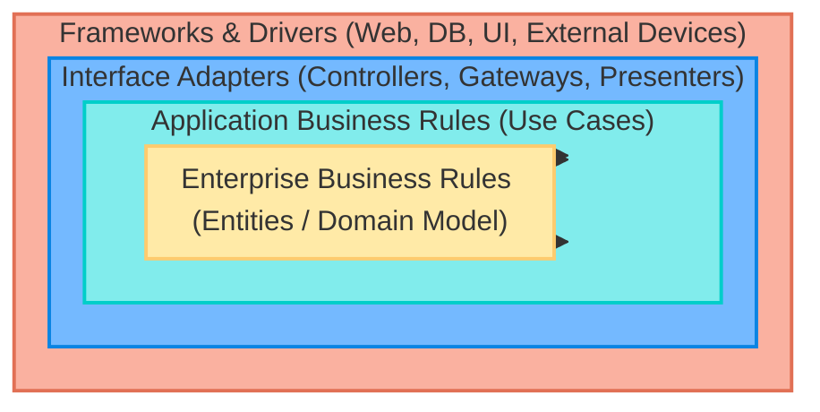
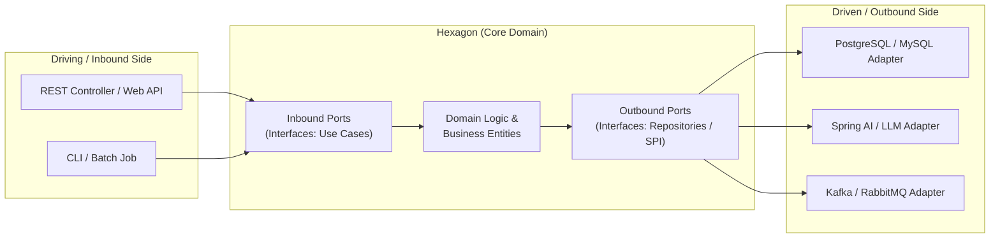
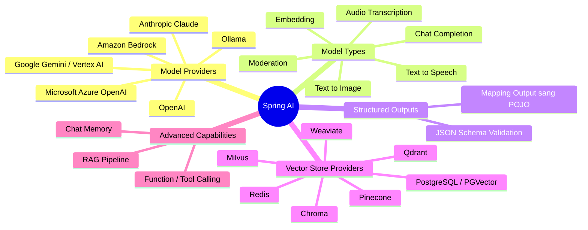

# Developing Smart Web Apps with Spring Boot & AI

## Session 2 — 3: Clean / Hexagonal Architecture & Spring AI

---

## Mục Lục

1. [01. Kiến Trúc Phần Mềm: Clean & Hexagonal Architecture](#01-kiến-trúc-phần-mềm-clean--hexagonal-architecture)
   - [Tổng quan về Software Architecture Patterns](#tổng-quan-về-software-architecture-patterns)
   - [Vấn đề của kiến trúc Layered truyền thống](#vấn-đề-của-kiến-trúc-layered-truyền-thống)
   - [Kiến trúc Clean Architecture](#kiến-trúc-clean-architecture)
   - [Kiến trúc Hexagonal (Ports & Adapters)](#kiến-trúc-hexagonal-ports--adapters)
   - [Thực hành 1: Triển khai Hexagonal Architecture](#thực-hành-1-triển-khai-hexagonal-architecture)
2. [02. Khái Niệm AI Agent & Agentic AI](#02-khái-niệm-ai-agent--agentic-ai)
   - [AI Agent là gì?](#ai-agent-là-gì)
   - [Agentic AI vs. AI Agents](#agentic-ai-vs-ai-agents)
   - [Kiến trúc Single-Agent và Multi-Agent](#kiến-trúc-single-agent-và-multi-agent)
3. [03. Tổng Quan & Các Tính Năng Của Spring AI](#03-tổng-quan--các-tính-năng-của-spring-ai)
   - [Các tính năng cốt lõi của Spring AI](#các-tính-năng-cốt-lõi-của-spring-ai)
   - [Core Concept: ChatClient trong Spring AI](#core-concept-chatclient-trong-spring-ai)
   - [Thực hành 2: Làm quen với Spring AI Demo](#thực-hành-2-làm-quen-với-spring-ai-demo)
4. [04. Tổng Kết (Summary)](#04-tổng-kết-summary)

---

## 01. Kiến Trúc Phần Mềm: Clean & Hexagonal Architecture

### Tổng quan về Software Architecture Patterns

- **Khái niệm:** Software Architecture (Kiến trúc phần mềm) của một hệ thống mô tả các component (thành phần) chính, mối quan hệ giữa chúng và cách thức chúng tương tác với nhau.
- Được xem như một **bản thiết kế chi tiết (blueprint)** cung cấp mô hình để:
  - Quản lý hệ thống hiệu quả.
  - Thiết lập và điều phối giao tiếp giữa các thành phần phần mềm.
- **Một số mẫu kiến trúc phần mềm phổ biến:**
  - **N-Tier / Layered Architecture:** Kiến trúc phân tầng truyền thống (Controller $\rightarrow$ Service $\rightarrow$ Repository $\rightarrow$ Database).
  - **Microservices Architecture:** Chia nhỏ hệ thống thành các dịch vụ độc lập triển khai phân tán.
  - **Domain-Driven Design (DDD Architecture):** Thiết kế hướng miền nghiệp vụ.
  - **Hexagonal / Clean Architecture:** Đặt Business/Domain Model ở trung tâm, đảo ngược sự phụ thuộc.
- _(Tham khảo: [ByteByteGo - Top 5 Software Architectural Patterns](https://bytebytego.com/guides/top-5-software-architectural-patterns/))_

---

### Vấn đề của kiến trúc Layered truyền thống

Trong mô hình Layered thông thường:
$$\text{UI / Presentation Layer} \longrightarrow \text{Business / Service Layer} \longrightarrow \text{Persistence / Data Access Layer}$$

- **Các hạn chế thực tế:**
  1. **Business logic dễ bị phân tán:** Logic nghiệp vụ thường bị rải rác khắp các tầng (lẫn trong Controller, Service, thậm chí trong Stored Procedure / Database).
  2. **Phụ thuộc chặt chẽ vào hạ tầng (Infrastructure):** Tầng Domain/Business phụ thuộc trực tiếp vào Entity của database hoặc thư viện bên thứ ba.
  3. **Coupling theo chiều dọc (Vertical Coupling):** Một thay đổi nhỏ ở cơ sở dữ liệu có thể làm thay đổi từ tầng DAO/Repository lên tới Service và Controller.
  4. **Khó kiểm thử và bảo trì:** Rất khó viết Unit Test cô lập cho nghiệp vụ nếu không mock hàng loạt kết nối database.

> **Giải pháp hiện đại:**
> Lấy **Business Model (Domain)** làm trung tâm, cô lập hoàn toàn khỏi cơ sở dữ liệu và các framework bên ngoài bằng nguyên lý **Đảo ngược phụ thuộc (Inversion of Control - IoC)** và **Nguyên tắc đảo ngược phụ thuộc (Dependency Inversion Principle - DIP)**.

---

### Kiến trúc Clean Architecture



- **Quy tắc phụ thuộc (The Dependency Rule):**
  - Chiều phụ thuộc luôn luôn **hướng vào bên trong** (từ ngoài vào trong).
  - Các tầng bên trong tuyệt đối **không biết gì** về các tầng bên ngoài.
  - Tầng lõi (`Entities` và `Use Cases`) độc lập hoàn toàn với Framework, UI, Database, hay bất kỳ thư viện bên thứ 3 nào.

---

### Kiến trúc Hexagonal (Ports & Adapters)



- **Ý tưởng cốt lõi:**
  - **Core Domain:** Chứa toàn bộ nghiệp vụ thuần túy, không có annotations liên quan đến JPA hay web framework.
  - **Ports (Cổng giao tiếp):** Là các Interface trong Core:
    - _Inbound / Driving Ports:_ Interface định nghĩa những gì bên ngoài có thể yêu cầu Domain thực hiện (Use Cases).
    - _Outbound / Driven Ports:_ Interface định nghĩa những gì Domain cần từ bên ngoài (Database, External API, Mail, AI Model...).
  - **Adapters (Bộ chuyển đổi):** Hiện thực hóa các Ports:
    - _Inbound Adapters:_ REST Controllers, gRPC Handlers, Message Listeners tiếp nhận yêu cầu từ người dùng rồi gọi Inbound Ports.
    - _Outbound Adapters:_ JPA Repositories, REST Clients, Spring AI Clients hiện thực Outbound Ports để kết nối xuống DB hay gọi service ngoài.

---

### Thực hành 1: Triển khai Hexagonal Architecture

- **Source code mẫu:** [spring-ai-demo Repository](https://github.com/richard-truong/spring-ai-demo)
- **Yêu cầu thực hành:**
  1. Clone và mở source code trên IDE.
  2. Quan sát cấu trúc gói phân tách giữa Domain, Ports (Inbound/Outbound) và Adapters (Controller, Repository, Service Client).
  3. Chạy thử nghiệm và xác minh luồng gọi thông qua các Port/Adapter.

---

## 02. Khái Niệm AI Agent & Agentic AI

### AI Agent là gì?

- **Định nghĩa:** AI Agents là các hệ thống phần mềm sử dụng trí tuệ nhân tạo (AI) để theo đuổi mục tiêu và hoàn thành các tác vụ thay mặt cho người dùng.
- **Đặc trưng chính:**
  - Có khả năng suy luận (**Reasoning**).
  - Lập kế hoạch hành động (**Planning**).
  - Ghi nhớ ngữ cảnh (**Memory**).
  - Có tính tự chủ (**Autonomy**) để đưa ra quyết định, học hỏi và tự điều chỉnh thích ứng.

$$\mathbf{AI\ Agent} = \mathbf{Brain}\ (LLM / Reasoning) + \mathbf{Memory} + \mathbf{Tools / Actions}$$

---

### Agentic AI vs. AI Agents

- **Sự khác biệt tinh tế:**
  - **AI Agents:** Là các thành phần đơn lẻ (building blocks) đóng vai trò thực thi các tác vụ cụ thể.
  - **Agentic AI:** Là triết lý kiến trúc điều phối tổng thể — sự phối hợp nhịp nhàng giữa nhiều agent, công cụ và quy trình để giải quyết một bài toán lớn, phức tạp.
    > _Hình ảnh ẩn dụ:_ Hãy coi **AI Agents** như từng công cụ riêng biệt trong một chiếc hộp đồ nghề (búa, đục, thước kẻ), còn **Agentic AI** là việc phối hợp nhịp nhàng tất cả các công cụ đó để xây dựng nên cả một ngôi nhà.

---

### Kiến trúc Single-Agent và Multi-Agent

| Tiêu chí        | Single-Agent System                                                              | Multi-Agent Systems                                                                             |
| :-------------- | :------------------------------------------------------------------------------- | :---------------------------------------------------------------------------------------------- |
| **Cấu trúc**    | Một Agent duy nhất đảm nhận toàn bộ quá trình suy luận, gọi tool và trả kết quả. | Nhiều Agent chuyên môn hóa cộng tác, trao đổi và giám sát lẫn nhau.                             |
| **Độ phức tạp** | Đơn giản, dễ xây dựng, triển khai nhanh.                                         | Phức tạp trong việc định tuyến, chia sẻ ngữ cảnh và kiểm soát xung đột.                         |
| **Phù hợp với** | Chatbot hỏi đáp, trợ lý ảo cá nhân hóa, tác vụ đơn bước.                         | Hệ thống tự động hóa nghiệp vụ lớn: Nghiên cứu, Viết mã, Kiểm thử, Đánh giá chất lượng độc lập. |

---

## 03. Tổng Quan & Các Tính Năng Của Spring AI

### Các tính năng cốt lõi của Spring AI



- **Hỗ trợ đa nhà cung cấp (Multi-Provider Support):** Kết nối liền mạch với OpenAI, Anthropic, Google, Microsoft Azure, Amazon, Ollama...
- **Portable API:** Một API chuẩn hóa duy nhất hỗ trợ chuyển đổi linh hoạt giữa các nhà cung cấp model mà không phải viết lại code, hỗ trợ cả cơ chế đồng bộ (_Synchronous_) và truyền phát luồng dữ liệu (_Streaming_).
- **Structured Outputs:** Khả năng định dạng phản hồi từ LLM và tự động map chính xác vào các đối tượng Java (POJO).
- **Vector Database & SQL-like Filtering:** Hỗ trợ hầu hết các Vector DB thông dụng kèm cơ chế lọc metadata theo cú pháp SQL thân thiện.
- **Tools / Function Calling:** Cho phép LLM yêu cầu ứng dụng Java thực thi các hàm cục bộ/API nghiệp vụ theo thời gian thực để thu thập dữ liệu mới nhất.
- **Tích hợp RAG & Chat Memory:** Cung cấp sẵn các thành phần xây dựng hệ thống Retrieval-Augmented Generation và lưu trữ lịch sử hội thoại.

---

### Core Concept: ChatClient trong Spring AI

- `ChatClient` là Fluent API cao cấp được giới thiệu trong Spring AI, cung cấp trải nghiệm lập trình hiện đại, dễ đọc và mạnh mẽ tương tự như `RestClient` hay `WebClient` của Spring Framework.

#### Ví dụ minh họa sử dụng `ChatClient`:

```java
@Service
public class AssistantService {

    private final ChatClient chatClient;

    public AssistantService(ChatClient.Builder builder) {
        this.chatClient = builder
                .defaultSystem("Bạn là trợ lý ảo hỗ trợ thông tin học tập chuyên nghiệp.")
                .build();
    }

    public String chat(String userMessage) {
        return this.chatClient.prompt()
                .user(userMessage)
                .call()
                .content();
    }

    // Streaming phản hồi trả về từng phần
    public Flux<String> streamChat(String userMessage) {
        return this.chatClient.prompt()
                .user(userMessage)
                .stream()
                .content();
    }
}
```

---

### Thực hành 2: Làm quen với Spring AI Demo

- **Repository mẫu:** [spring-ai-demo](https://github.com/richard-truong/spring-ai-demo)
- **Nội dung thực hành:**
  1. Cấu hình API Key cho nhà cung cấp LLM (OpenAI / Ollama chạy local).
  2. Khởi tạo `ChatClient` với cấu hình Prompt tùy biến.
  3. Xây dựng REST API tiếp nhận câu hỏi từ Client và trả về câu trả lời từ AI.
  4. Thực hiện thử nghiệm tính năng Streaming Response và Structured Output mapping sang Java DTO.

---

## 04. Tổng Kết (Summary)

- **1. Clean & Hexagonal Architecture:** Nắm rõ bản chất của việc cô lập Core Business khỏi các yếu tố phụ thuộc hạ tầng; cách áp dụng mô hình Ports & Adapters để tạo kiến trúc bền vững, dễ bảo trì và kiểm thử.
- **2. Khái niệm AI Agent & Agentic AI:** Hiểu công thức xây dựng Agent (`Brain + Memory + Tools`), sự khác biệt giữa từng Agent đơn lẻ và hệ thống Agentic AI phối hợp đa nhiệm.
- **3. Spring AI Framework:** Nắm vững hệ sinh thái Spring AI, cách sử dụng `ChatClient` để giao tiếp với các LLM hàng đầu, tích hợp Vector Database và xây dựng các ứng dụng web thông minh chuẩn doanh nghiệp.
