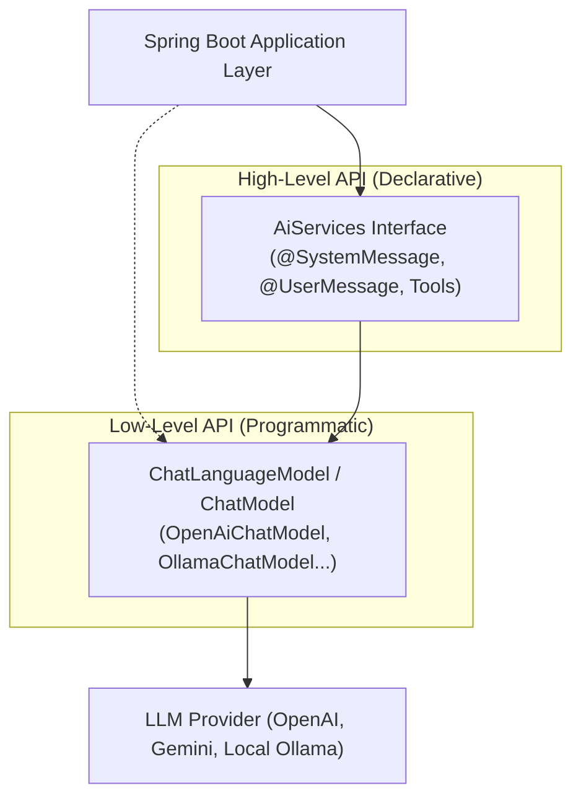
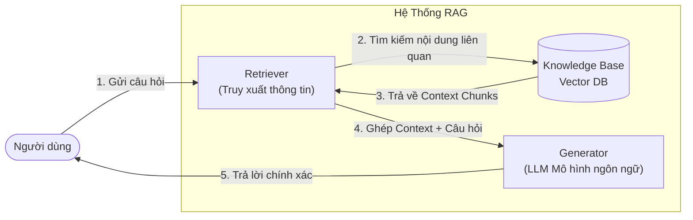
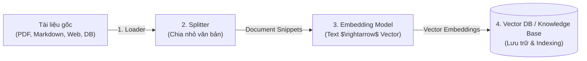
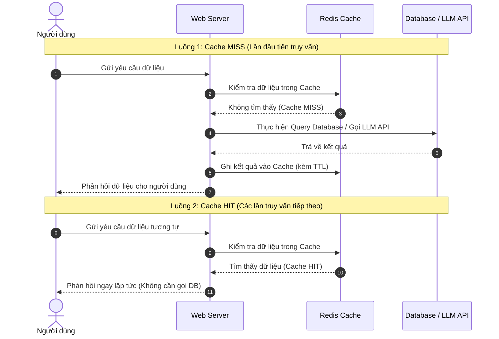

# Developing Smart Web Apps with Spring Boot & AI
## Session 4 — 10: Xây Dựng AI Chatbot Với LangChain4J & Kỹ Thuật Tối Ưu Nâng Cao

---

## Mục Lục
1. [01. Xây Dựng AI Chatbot Với LangChain4J](#01-xây-dựng-ai-chatbot-với-langchain4j)
   - [Giới thiệu LangChain4J & Tài nguyên tham khảo](#giới-thiệu-langchain4j--tài-nguyên-tham-khảo)
   - [Phân tầng kiến trúc: ChatModel vs. AiServices](#phân-tầng-kiến-trúc-chatmodel-vs-aiservices)
   - [Các loại Message trong hội thoại AI](#các-loại-message-trong-hội-thoại-ai)
   - [Quản lý bộ nhớ hội thoại (DB Memory)](#quản-lý-bộ-nhớ-hội-thoại-db-memory)
   - [Kiến trúc RAG (Retrieval-Augmented Generation)](#kiến-trúc-rag-retrieval-augmented-generation)
   - [Quy trình Indexing dữ liệu](#quy-trình-indexing-dữ-liệu)
   - [Chiến lược chia đoạn văn bản (Chunking Strategies)](#chiến-lược-chia-đoạn-văn-bản-chunking-strategies)
   - [Chiến lược truy vấn thông minh (Query Strategies)](#chiến-lược-truy-vấn-thông-minh-query-strategies)
   - [Cơ chế gọi công cụ (Tool Calling / Function Calling)](#cơ-chế-gọi-công-cụ-tool-calling--function-calling)
   - [Giao thức ngữ cảnh mô hình (Model Context Protocol - MCP)](#giao-thức-ngữ-cảnh-mô-hình-model-context-protocol---mcp)
2. [02. Kỹ Thuật Tối Ưu Hệ Thống Nâng Cao (Enhance Concepts)](#02-kỹ-thuật-tối-ưu-hệ-thống-nâng-cao-enhance-concepts)
   - [SSE vs. HTTP: Kỹ thuật truyền phát phản hồi (Streaming AI Response)](#sse-vs-http-kỹ-thuật-truyền-phát-phản-hồi-streaming-ai-response)
   - [Cơ chế Caching trong kiến trúc Web](#cơ-chế-caching-trong-kiến-trúc-web)
   - [Giới hạn tần suất gọi (Rate Limit)](#giới-hạn-tần-suất-gọi-rate-limit)
   - [Các chiến lược Rate Limiting phổ biến](#các-chiến-lược-rate-limiting-phổ-biến)
   - [Redis: Cơ sở dữ liệu In-Memory hiệu năng cao](#redis-cơ-sở-dữ-liệu-in-memory-hiệu-năng-cao)
3. [03. Tổng Kết (Summary)](#03-tổng-kết-summary)

---

## 01. Xây Dựng AI Chatbot Với LangChain4J

### Giới thiệu LangChain4J & Tài nguyên tham khảo
* **LangChain4J** là thư viện Java mã nguồn mở giúp đơn giản hóa việc tích hợp các mô hình ngôn ngữ lớn (LLM), cơ sở dữ liệu vector và các công cụ AI vào các ứng dụng Java/Spring Boot.
* **Tài liệu tham khảo chính thức:**
  * Trang tài liệu chính thức: [docs.langchain4j.dev](https://docs.langchain4j.dev/)
  * Hướng dẫn cho người mới bắt đầu của Microsoft: [langchain4j-for-beginners](https://github.com/microsoft/langchain4j-for-beginners)
  * Bộ tích hợp với Spring Boot: [langchain4j-spring](https://github.com/langchain4j/langchain4j-spring)

---

### Phân tầng kiến trúc: ChatModel vs. AiServices

* **`ChatModel` (hoặc `ChatLanguageModel`):**
  * Tầng API cấp thấp (Low-level layer) giao tiếp trực tiếp với LLM.
  * Lập trình viên phải tự xử lý việc nối chuỗi prompt, gom danh sách message, parse kết quả và gọi tool thủ công.
* **`AiServices`:**
  * Tầng API trừu tượng hóa cấp cao (High-level layer).
  * Biến LLM thành một **Java Service/Interface** thông thường (tương tự phong cách khai báo của Spring Data JPA hoặc Feign Client).
  * Tự động xử lý Prompt Template, cấu hình Chat Memory, gọi Tool/Function Calling và ánh xạ kết quả trả về Java Object.

---

### Các loại Message trong hội thoại AI
Khi tương tác với các LLM hiện đại, ngữ cảnh hội thoại được phân tách thành các vai trò rõ ràng:
* **`SystemMessage`:** Chỉ thị nền tảng (System Instructions/Prompts) thiết lập danh tính, tính cách, quy tắc và phạm vi hoạt động của AI.
* **`UserMessage`:** Câu hỏi, dữ liệu hoặc yêu cầu nhập vào từ phía người dùng.
* **`AiMessage`:** Câu trả lời hoặc quyết định do chính mô hình AI sinh ra (có thể chứa yêu cầu gọi tool).
* **`ToolExecutionResultMessage`:** Thông điệp chứa kết quả trả về sau khi ứng dụng thực thi công cụ cục bộ, gửi lại cho LLM để tổng hợp câu trả lời hoàn chỉnh.

---

### Quản lý bộ nhớ hội thoại (DB Memory)
* **Vấn đề:** Các API LLM bản chất là **Stateless** (không tự lưu trạng thái giữa các lần gọi). Muốn Chatbot hiểu được ngữ cảnh của những câu chat trước đó, ứng dụng phải gửi kèm toàn bộ lịch sử cuộc trò chuyện.
* **Cơ chế Chat Memory trong LangChain4J:**
  * **In-Memory Store:** Lưu lịch sử trò chuyện tạm thời trong RAM (phù hợp thử nghiệm cục bộ).
  * **Persistent DB Memory:** Tích hợp `ChatMemoryStore` với các cơ sở dữ liệu quan hệ (PostgreSQL, MySQL) hoặc NoSQL (Redis, MongoDB) để lưu trữ vĩnh viễn tin nhắn theo từng `chatId` / `userId`.
  * **Message Windowing:** Giới hạn số lượng tin nhắn gần nhất (ví dụ: 10 tin nhắn gần nhất) hoặc giới hạn theo số lượng token tối đa để kiểm soát chi phí gọi API.

---

### Kiến trúc RAG (Retrieval-Augmented Generation)

> **Định nghĩa:**
> *Retrieval-Augmented Generation (RAG) là một mô hình kiến trúc tối ưu hóa hiệu năng của mô hình AI bằng cách kết nối nó với các nguồn tri thức bên ngoài (Knowledge Base). RAG giúp LLM đưa ra câu trả lời chính xác, cập nhật và hạn chế tối đa hiện tượng "ảo tưởng" (hallucination).*

* **3 thành phần cốt lõi của RAG:**
  1. **Retriever (Bộ truy xuất):** Tiếp nhận câu hỏi của người dùng, chuyển đổi câu hỏi thành vector và truy vấn các đoạn tài liệu tương đồng nhất từ Knowledge Base.
  2. **Context / Knowledge Base (Nguồn dữ liệu tri thức):** Nơi lưu trữ tài liệu nội bộ đã được tiền xử lý, chia nhỏ thành các chunks và lưu dưới dạng vector embedding (sử dụng Pinecone, PGVector, Milvus, Qdrant...).
  3. **Generator (Bộ sinh phản hồi):** Mô hình LLM tiếp nhận prompt đã được bổ sung ngữ cảnh (Prompt Enrichment) và tổng hợp thành câu trả lời bằng ngôn ngữ tự nhiên.

---

### Quy trình Indexing dữ liệu

1. **Loader (Bộ nạp dữ liệu):** Đọc dữ liệu thô từ nhiều nguồn khác nhau (file PDF, Word, tài liệu Wiki, database hoặc trang web).
2. **Splitter (Bộ chia văn bản):** Cắt nhỏ tài liệu thành các đoạn văn ngắn gọn (Chunks/Document Snippets) để tối ưu hóa việc tìm kiếm và phù hợp với giới hạn ngữ cảnh của LLM.
3. **Embedding Model:** Chuyển đổi ngữ nghĩa của từng chunk văn bản thành các vector số học đa chiều (Embedding Vectors).
4. **Vector Store & Indexing:** Lưu trữ vector kèm nội dung gốc và metadata vào cơ sở dữ liệu vector để hỗ trợ tìm kiếm độ tương đồng siêu tốc (*Similarity Search / Cosine Similarity*).

---

### Chiến lược chia đoạn văn bản (Chunking Strategies)
*(Tham khảo: [5 Chunking Strategies for RAG - Daily Dose of Data Science](https://www.dailydoseofds.com/p/5-chunking-strategies-for-rag/))*

| Chiến lược Chunking | Cơ chế hoạt động | Ưu & Nhược điểm |
| :--- | :--- | :--- |
| **1. Fixed-size Chunking** | Cắt đoạn theo số lượng ký tự, từ hoặc token cố định (ví dụ: mỗi chunk 500 token, overlap 50 token). | *Ưu:* Đơn giản, thực thi nhanh. *Nhược:* Dễ cắt ngang câu, mất ngữ cảnh ngữ nghĩa. |
| **2. Semantic Chunking** | Phân tích khoảng cách ngữ nghĩa giữa các câu, chỉ tách đoạn khi nội dung chuyển sang một chủ đề mới. | *Ưu:* Bảo toàn tính toàn vẹn của ý nghĩa. *Nhược:* Tốn tài nguyên embedding khi tiền xử lý. |
| **3. Recursive Chunking** | Chia theo thứ tự ưu tiên các ký tự phân tách: đoạn văn (`\n\n`) $\rightarrow$ dòng (`\n`) $\rightarrow$ khoảng trắng. | *Ưu:* Rất cân bằng, giữ được ngữ pháp câu. *Nhược:* Cần căn chỉnh các tham số ngưỡng kích thước. |
| **4. Document Structure-based** | Tách tài liệu dựa trên cấu trúc định dạng sẵn có: tiêu đề (H1, H2, H3), section, bảng biểu hoặc trang sách. | *Ưu:* Cực kỳ hiệu quả với văn bản kỹ thuật, tài liệu luật. *Nhược:* Phụ thuộc vào chất lượng định dạng tài liệu gốc. |
| **5. LLM-based Chunking** | Sử dụng một model ngôn ngữ nhỏ để đọc hiểu và xác định điểm ngắt đoạn tối ưu nhất. | *Ưu:* Chất lượng phân đoạn cao nhất. *Nhược:* Chi phí cao và tốc độ xử lý chậm nhất. |

---

### Chiến lược truy vấn thông minh (Query Strategies)
Để nâng cao độ chính xác khi tìm kiếm trong RAG:
* **Multi-Query Expansion:** Dùng LLM viết lại câu hỏi của người dùng thành 3–5 câu hỏi tương đương ở các góc độ khác nhau để truy xuất bao quát hơn.
* **Hybrid Search (Tìm kiếm lai):** Kết hợp giữa tìm kiếm từ khóa truyền thống (Keyword Search / BM25) và tìm kiếm theo ngữ nghĩa (Vector Semantic Search).
* **Re-ranking (Tái xếp hạng):** Sau khi Retriever lấy về danh sách ứng viên (Top-K candidates), sử dụng mô hình Re-ranker chuyên biệt (Cross-Encoder) để chấm điểm và chọn ra những đoạn tài liệu thực sự liên quan nhất đưa vào prompt.

---

### Cơ chế gọi công cụ (Tool Calling / Function Calling)
* **Khái niệm:** Là khả năng của LLM nhận diện khi nào cần sử dụng công cụ bên ngoài, từ đó sinh ra cấu trúc lệnh (thường ở định dạng JSON) yêu cầu hệ thống ứng dụng thực thi API hoặc hàm nghiệp vụ.
* **Lợi ích:**
  * Giúp AI giải quyết các tác vụ tính toán chính xác, tra cứu thời tiết, gửi email hoặc truy vấn dữ liệu theo thời gian thực từ cơ sở dữ liệu nội bộ.
* *(Tham khảo: [OpenAI Function Calling Guide](https://developers.openai.com/api/docs/guides/function-calling))*

---

### Giao thức ngữ cảnh mô hình (Model Context Protocol - MCP)
* **Khái niệm:** **MCP** là một giao thức chuẩn hóa mở (Open Standard Protocol) do Anthropic tiên phong phát triển, giúp kết nối các ứng dụng AI với các nguồn dữ liệu, công cụ và dịch vụ bên thứ ba một cách an toàn và thống nhất.
* **Ý nghĩa:** Thay vì mỗi ứng dụng phải viết adapter riêng cho từng nguồn dữ liệu (GitHub, Slack, PostgreSQL, Google Drive...), MCP cung cấp một cổng giao tiếp chung tương tự như giao thức USB-C cho thế giới AI.
* *(Tham khảo: [Visual Guide to Model Context Protocol - MCP](https://www.dailydoseofds.com/p/visual-guide-to-model-context-protocol-mcp/))*

---

## 02. Kỹ Thuật Tối Ưu Hệ Thống Nâng Cao (Enhance Concepts)

### SSE vs. HTTP: Kỹ thuật truyền phát phản hồi (Streaming AI Response)
* **Vấn đề với HTTP Request-Response thông thường:**
  * Quá trình LLM sinh văn bản mất từ vài giây đến hàng chục giây. Nếu dùng HTTP thông thường, người dùng phải chờ đợi toàn bộ câu trả lời hoàn tất mới thấy giao diện thay đổi, tạo trải nghiệm sử dụng chậm chạp (high latency).
* **Giải pháp: Server-Sent Events (SSE):**
  * Thiết lập kết nối một chiều bền vững qua giao thức HTTP (`Content-Type: text/event-stream`).
  * Server liên tục "bắn" từng token văn bản (chunk) về trình duyệt ngay khi LLM vừa sinh ra.
  * Người dùng nhìn thấy hiệu ứng chữ chạy gõ phím theo thời gian thực (*Typewriter Effect*), giảm thiểu cảm giác chờ đợi.

---

### Cơ chế Caching trong kiến trúc Web
* **Khái niệm:** Caching là kỹ thuật lưu tạm thời kết quả của các thao tác tốn kém (truy vấn DB, tính toán phức tạp, gọi API AI bên ngoài) vào bộ nhớ tốc độ cao để tái sử dụng cho các yêu cầu tương tự tiếp theo.

* **Lợi ích nổi bật:**
  * Phản hồi siêu tốc (từ hàng trăm miligiây xuống còn vài miligiây).
  * Tiết kiệm chi phí gọi API LLM (giảm số lần gọi lặp lại cho các prompt giống nhau).
  * Giảm tải áp lực truy vấn cho cơ sở dữ liệu quan hệ.

---

### Giới hạn tần suất gọi (Rate Limit)
* **Khái niệm:** Rate Limiting là cơ chế kiểm soát số lượng request mà một client/người dùng được phép gửi đến hệ thống máy chủ trong một khoảng thời gian xác định (ví dụ: tối đa 100 requests/phút).
* **Mục tiêu:**
  * Bảo vệ hệ thống khỏi các cuộc tấn công từ chối dịch vụ (DoS / DDoS) hoặc các công cụ cào dữ liệu (Web Scrapers).
  * Kiểm soát chi phí hạ tầng và ngăn chặn việc lạm dụng API AI trả phí.
* **Mã lỗi phản hồi chuẩn:** Khi vượt quá hạn mức, máy chủ sẽ từ chối xử lý và phản hồi mã **`HTTP 429 Too Many Requests`** (kèm header `Retry-After`).

---

### Các chiến lược Rate Limiting phổ biến
*(Tham khảo: [ByteByteGo - Top 5 Caching & Rate Limiting Strategies](https://bytebytego.com/guides/top-5-caching-strategies/))*

1. **Token Bucket (Xô thẻ):**
   * Một "xô" chứa thẻ được bổ sung định kỳ theo tốc độ nhất định. Mỗi request đến sẽ tiêu thụ 1 token. Nếu xô hết thẻ, request bị từ chối. Hỗ trợ tốt các đợt lưu lượng tăng đột biến ngắn hạn (*Burst Traffic*).
2. **Leaky Bucket (Xô rò rỉ):**
   * Các request được xếp hàng vào xô và được xử lý theo tốc độ không đổi (FIFO). Tránh áp lực đột ngột lên hệ thống Backend.
3. **Fixed Window Counter (Cửa sổ cố định):**
   * Chia thời gian thành các khung cố định (ví dụ: từ 00:00 - 00:01). Đơn giản nhưng dễ bị lỗi nghẽn lưu lượng ở ranh giới giữa 2 cửa sổ.
4. **Sliding Window Log / Counter (Cửa sổ trượt):**
   * Tính toán số lượng request trong một khoảng thời gian động trượt về quá khứ, giải quyết triệt để vấn đề ranh giới của Fixed Window.

---

### Redis: Cơ sở dữ liệu In-Memory hiệu năng cao
* **Khái niệm:** **Redis** (*Remote Dictionary Server*) là hệ thống lưu trữ dữ liệu dạng Key-Value trong bộ nhớ RAM, mã nguồn mở với độ trễ cực thấp.
* **Vì sao Redis cực kỳ nhanh? (Câu hỏi phỏng vấn kinh điển):**
  1. **Lưu trữ hoàn toàn trên RAM:** Tốc độ truy xuất dữ liệu từ RAM nhanh gấp ít nhất 1.000 lần so với đọc/ghi ngẫu nhiên trên ổ cứng SSD/HDD.
  2. **Mô hình I/O Multiplexing & Vòng lặp đơn luồng (Single-Threaded Event Loop):**
     * Tránh được chi phí hoán đổi ngữ cảnh (*Context Switching*) giữa các luồng.
     * Không gặp tình trạng tranh chấp tài nguyên, khóa tài nguyên (*Locking/Deadlock*).
  3. **Cấu trúc dữ liệu cấp thấp tối ưu:** Sử dụng các cấu trúc dữ liệu tinh gọn như SDS (Simple Dynamic Strings), SkipList, ZipList tối ưu hóa đến từng byte bộ nhớ.

---

## 03. Tổng Kết (Summary)

* **1. Xây dựng AI Chatbot với LangChain4J:**
  * Hiểu sâu kiến trúc `ChatModel` (Low-level) vs `AiServices` (High-level).
  * Nắm vững cơ chế lưu trữ bộ nhớ hội thoại (Chat Memory).
  * Quy trình chuẩn của hệ thống RAG: Indexing, Chunking strategies, Retrieval, Re-ranking và Tool/Function Calling.
  * Tầm nhìn chuẩn hóa kết nối với giao thức MCP.
* **2. Các kỹ thuật tối ưu kiến trúc chuyên sâu:**
  * Triển khai truyền phát dữ liệu thời gian thực với Server-Sent Events (SSE).
  * Thiết kế kiến trúc Caching tối ưu hiệu năng và chi phí.
  * Bảo vệ hệ thống bằng các thuật toán Rate Limiting (Token Bucket, Sliding Window).
  * Tận dụng sức mạnh xử lý tốc độ cao của Redis In-Memory Database.
