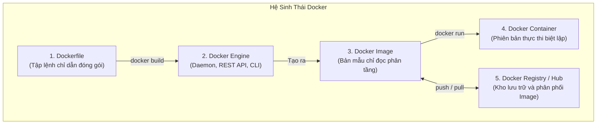
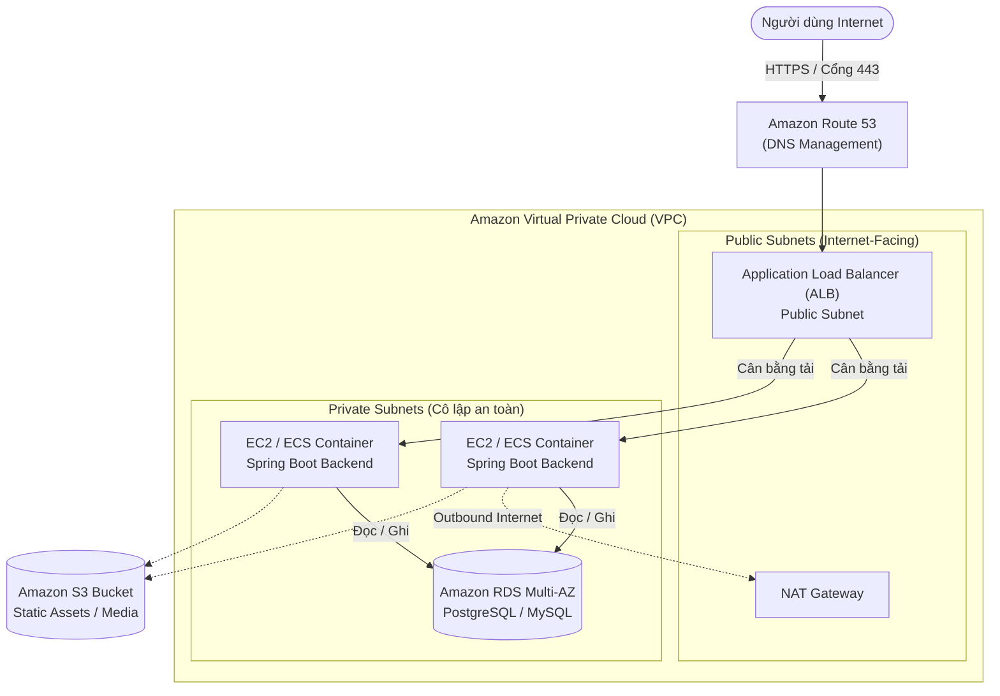

# Developing Smart Web Apps with Spring Boot & AI
## Session 4: Triển Khai Sản Phẩm Trong Doanh Nghiệp (Deployment)

---

## Mục Lục
1. [01. Đóng Gói Ứng Dụng Với Docker & Docker Compose](#01-đóng-gói-ứng-dụng-với-docker--docker-compose)
   - [Tổng quan về Docker & các thành phần cốt lõi](#tổng-quan-về-docker--các-thành-phần-cốt-lõi)
   - [Lợi ích vượt trội của Docker](#lợi-ích-vượt-trội-của-docker)
   - [Quy trình đóng gói ứng dụng Spring Boot thành Docker Image](#quy-trình-đóng-gói-ứng-dụng-spring-boot-thành-docker-image)
   - [Tự động hóa hệ thống đa Container với Docker Compose](#tự-động-hóa-hệ-thống-đa-container-với-docker-compose)
2. [02. Chiến Lược Triển Khai Sản Phẩm (Deployment Strategies)](#02-chiến-lược-triển-khai-sản-phẩm-deployment-strategies)
   - [Triển khai Frontend (Next.js / React với Vercel)](#triển-khai-frontend-nextjs--react-với-vercel)
   - [Triển khai Backend (Spring Boot trên Cloud / VPS)](#triển-khai-backend-spring-boot-trên-cloud--vps)
   - [Triển khai Fullstack trọn gói với Docker Compose](#triển-khai-fullstack-trọn-gói-với-docker-compose)
   - [Dịch vụ cơ sở dữ liệu & Storage miễn phí (Free-tier)](#dịch-vụ-cơ-sở-dữ-liệu--storage-miễn-phí-free-tier)
   - [Kiến trúc triển khai tiêu chuẩn trên AWS Cloud](#kiến-trúc-triển-khai-tiêu-chuẩn-trên-aws-cloud)
3. [03. Tổng Kết (Summary)](#03-tổng-kết-summary)

---

## 01. Đóng Gói Ứng Dụng Với Docker & Docker Compose

### Tổng quan về Docker & các thành phần cốt lõi
* **Docker** là một nền tảng mã nguồn mở (*Open-source Platform*) cho phép các nhà phát triển xây dựng, đóng gói, triển khai và vận hành ứng dụng bên trong các môi trường biệt lập gọi là **Container**.
* Mỗi Container bao gồm đầy đủ: mã nguồn, môi trường thực thi (*Runtime*), thư viện hệ thống (*System Libraries*), các dependencies và các tệp cấu hình cần thiết, giúp ứng dụng luôn hoạt động đồng nhất trên mọi môi trường phát triển, kiểm thử hay vận hành thực tế.



* **Các thành phần nền tảng:**
  1. **Docker Engine:** Nền tảng cốt lõi chịu trách nhiệm build image và chạy container theo mô hình Client - Server:
     * *Docker Daemon (`dockerd`):* Tiến trình dịch vụ chạy ngầm quản lý container, image, network và storage volume.
     * *REST API:* Cầu nối giao tiếp giữa Client và Daemon.
     * *Docker CLI (`docker`):* Giao diện dòng lệnh để người dùng thao tác.
  2. **Dockerfile:** Tệp văn bản chứa các chỉ dẫn từng bước để lắp ráp nên một Docker Image (khai báo base image, copy source code, cài thư viện, mở port mạng và lệnh khởi chạy).
  3. **Docker Image:** Bản mẫu chỉ đọc (*Read-only Template*) được cấu tạo từ nhiều lớp (*Layers*). Image chính là trạng thái tĩnh, khi được khởi chạy sẽ trở thành Container.
  4. **Docker Registry & Docker Hub:**
     * *Docker Registry:* Hệ thống lưu trữ và phân phối Docker Images theo các repository và phân biệt bởi `tag`.
     * *Docker Hub:* Dịch vụ Registry đám mây công cộng chính thức do tập đoàn Docker Inc. cung cấp.

---

### Lợi ích vượt trội của Docker
* **\"Build once, run anywhere\":** Image được đóng gói biệt lập với hệ điều hành bên ngoài, giải quyết triệt để vấn đề kinh điển của lập trình viên: *"Code chạy ngon lành ở máy tôi, nhưng sang máy ông/máy chủ thì lại lỗi!"*
* **Chuẩn mực của ngành:** Ngày nay, hầu hết các hệ sinh thái DevOps và hệ thống điều phối container hiện đại (Kubernetes, AWS ECS, Google Cloud Run) đều hoạt động dựa trên nền tảng Docker.
* **Tối ưu tài nguyên & Khởi động tức thì:** Nhẹ hơn rất nhiều so với máy ảo truyền thống (Virtual Machine - VM) vì chia sẻ chung kernel hệ điều hành của host, không cần cài đặt cả một OS riêng biệt.
* **Thiết lập nhanh chóng:** Môi trường phát triển của thành viên mới trong nhóm có thể được thiết lập và chạy hoàn hảo chỉ sau vài phút.

---

### Quy trình đóng gói ứng dụng Spring Boot thành Docker Image

#### Ví dụ tệp `Dockerfile` đa tầng (Multi-stage Build) tối ưu:
```dockerfile
# Stage 1: Build file JAR từ mã nguồn
FROM eclipse-temurin:21-jdk-alpine AS builder
WORKDIR /app
COPY .mvn/ .mvn/
COPY mvnw pom.xml ./
RUN ./mvnw dependency:go-offline
COPY src ./src
RUN ./mvnw clean package -DskipTests

# Stage 2: Runtime JRE tối giản, bảo mật
FROM eclipse-temurin:21-jre-alpine
WORKDIR /app
COPY --from=builder /app/target/*.jar app.jar
EXPOSE 8080
ENTRYPOINT ["java", "-jar", "app.jar"]
```

#### 3 bước thực thi kinh điển:
```bash
# Bước 1: Đóng gói mã nguồn thành file JAR (nếu không dùng multi-stage build)
./mvnw clean package -DskipTests

# Bước 2: Xây dựng Docker Image từ Dockerfile
docker build -t spring-app:latest .

# Bước 3: Khởi chạy Container dưới dạng chạy ngầm (-d) và map cổng 8080
docker run -d --name spring-app -p 8080:8080 spring-app:latest
```

---

### Tự động hóa hệ thống đa Container với Docker Compose
* **Vấn đề thực tế:** Một ứng dụng Backend Spring Boot hoàn chỉnh không bao giờ đứng một mình, nó cần cơ sở dữ liệu (PostgreSQL/MySQL), cache lưu trữ (Redis), dịch vụ tìm kiếm vector (PGVector).
  * Nếu cài đặt từng phần mềm thủ công lên máy tính: Tốn rất nhiều thời gian, dễ xung đột phiên bản, khó khăn khi người mới gia nhập dự án.
* **Giải pháp: Docker Compose**
  * Công cụ cho phép định nghĩa và cấu hình toàn bộ hệ sinh thái dịch vụ đa container (*Multi-container Application*) thông qua một tệp khai báo duy nhất `docker-compose.yml`.
  * Khởi động toàn bộ cơ sở hạ tầng chỉ bằng **một câu lệnh duy nhất**:
    ```bash
    docker-compose up -d
    ```

#### Ví dụ tệp `docker-compose.yml` hoàn chỉnh:
```yaml
version: '3.8'

services:
  postgres:
    image: pgvector/pgvector:pg16
    container_name: postgres-db
    environment:
      POSTGRES_DB: smartapp_db
      POSTGRES_USER: postgres
      POSTGRES_PASSWORD: password123
    ports:
      - "5432:5432"
    volumes:
      - postgres_data:/var/lib/postgresql/data

  redis:
    image: redis:7-alpine
    container_name: redis-cache
    ports:
      - "6379:6379"

  backend:
    build: .
    container_name: spring-backend
    ports:
      - "8080:8080"
    environment:
      SPRING_DATASOURCE_URL: jdbc:postgresql://postgres:5432/smartapp_db
      SPRING_DATA_REDIS_HOST: redis
    depends_on:
      - postgres
      - redis

volumes:
  postgres_data:
```

---

## 02. Chiến Lược Triển Khai Sản Phẩm (Deployment Strategies)

### Triển khai Frontend (Next.js / React với Vercel)
* **Vercel** là nền tảng điện toán đám mây tiên tiến nhất dành cho các ứng dụng Frontend và Serverless Functions (do chính đội ngũ phát triển framework **Next.js** tạo nên).
* **Quy trình triển khai tự động (Automated Git Integration):**
  1. Đẩy toàn bộ mã nguồn Frontend lên repository (GitHub / GitLab).
  2. Truy cập [vercel.com](https://vercel.com), bấm **New Project** $\rightarrow$ Chọn repository tương ứng.
  3. Cài đặt các biến môi trường cần thiết (ví dụ: `NEXT_PUBLIC_API_URL=https://api.yourdomain.com`).
  4. Bấm **Deploy**. Vercel sẽ tự động build và cấp phát tên miền SSL miễn phí (`*.vercel.app`).
  5. Mọi lần `git push` tiếp theo vào nhánh chính sẽ tự động kích hoạt tiến trình Preview và Production Deployment mà không cần thao tác thêm.
* **Các lựa chọn thay thế:** Render Static Site, AWS S3 + CloudFront, Cloudflare Pages, GitHub Pages...

---

### Triển khai Backend (Spring Boot trên Cloud / VPS)

| Lựa chọn | Đặc điểm & Ưu điểm | Nhược điểm & Chi phí |
| :--- | :--- | :--- |
| **1. Thuê VPS độc lập** *(VietTel, Hetzner, Linode, DigitalOcean)* | Toàn quyền kiểm soát quyền root của máy chủ Linux; chi phí cố định rẻ (từ $4 - $10/tháng). | Phải tự quản lý bảo mật, cài đặt Docker, cấu hình tường lửa (firewall) và sao lưu dữ liệu. |
| **2. AWS EC2 (Elastic Compute Cloud)** | Nền tảng hạ tầng chuẩn doanh nghiệp; có gói **Free-tier 750 giờ/tháng** (máy ảo `t2.micro` hoặc `t3.micro` trong 12 tháng đầu). | Giao diện cấu hình phức tạp (VPC, Security Groups, IAM Role, Elastic IP). |
| **3. AWS ECS / EKS** | Điều phối container tự động, quy mô lớn, tính sẵn sàng cao (High Availability). | Cấu hình phức tạp, **không có gói miễn phí**, chi phí khá cao đối với dự án sinh viên/startup. |
| **4. PaaS (Render, Heroku, Railway)** | Cực kỳ đơn giản: chỉ cần nối repo GitHub là tự build và chạy Docker container. | Bị giới hạn tài nguyên và chính sách gói miễn phí ngày càng thu hẹp; có thể ngủ đông (*Cold Start*). |

---

### Triển khai Fullstack trọn gói với Docker Compose
* Trên một máy chủ VPS duy nhất, ta hoàn toàn có thể triển khai cả hệ thống bao gồm:
  1. `nginx`: Đóng vai trò Reverse Proxy, cân bằng tải và tự động cấp chứng chỉ SSL Let's Encrypt qua Certbot.
  2. `frontend`: Image chứa giao diện Next.js chạy cổng nội bộ `3000`.
  3. `backend`: Image chứa ứng dụng Spring Boot chạy cổng nội bộ `8080`.
  4. `database`: PostgreSQL / PGVector và Redis Cache.
* Tất cả giao tiếp nội bộ thông qua mạng ảo của Docker (`docker network`), chỉ mở duy nhất cổng `80` (HTTP) và `443` (HTTPS) ra thế giới bên ngoài.

---

### Dịch vụ cơ sở dữ liệu & Storage miễn phí (Free-tier)
Để tiết kiệm chi phí vận hành cho dự án Capstone Project:
* **Cơ sở dữ liệu Quan hệ & Vector:**
  * **Supabase:** Cung cấp sẵn PostgreSQL kèm tiện ích mở rộng `pgvector` cực mạnh, miễn phí 500MB database.
  * **Neon Serverless Postgres:** Hỗ trợ autoscaling, branching cơ sở dữ liệu như Git, gói miễn phí rất hào phóng.
  * **MongoDB Atlas:** Miễn phí 512MB cluster cơ sở dữ liệu Document NoSQL.
* **Redis Cache:**
  * **Upstash Redis:** Serverless Redis tính phí theo số lượng request, cung cấp gói miễn phí 10.000 requests/ngày.
* **Lưu trữ tệp tin & Ảnh tĩnh:**
  * **Cloudinary:** Dịch vụ lưu trữ, nén và tối ưu hóa hình ảnh/video tự động với hạn mức miễn phí 25 credits/tháng.
  * **AWS S3 Free-tier:** 5GB lưu trữ đối tượng tiêu chuẩn trong 12 tháng đầu tiên.

---

### Kiến trúc triển khai tiêu chuẩn trên AWS Cloud



* **VPC (Virtual Private Cloud):** Mạng đám mây riêng biệt, chia thành các phân vùng mạng:
  * **Public Subnet:** Chứa Application Load Balancer (ALB) tiếp nhận lưu lượng truy cập trực tiếp từ Internet.
  * **Private Subnet:** Chứa các máy chủ ứng dụng Backend và Cơ sở dữ liệu RDS, tuyệt đối không mở IP công khai ra ngoài, tránh khỏi nguy cơ tấn công mạng.
* **NAT Gateway:** Cho phép các máy chủ trong Private Subnet truy cập Internet ra ngoài (để gọi API OpenAI, Gemini, tải dependencies) nhưng chặn chiều ngược lại.

---

## 03. Tổng Kết (Summary)

* **1. Docker & Docker Compose:**
  * Thấu hiểu cơ chế Containerization, nắm vững các khái niệm Docker Engine, Dockerfile, Docker Image, Docker Registry.
  * Thành thạo quy trình đóng gói ứng dụng Spring Boot đa tầng (Multi-stage build).
  * Làm chủ Docker Compose để quản lý toàn diện hệ thống gồm Backend, Database và Cache chỉ với 1 câu lệnh.
* **2. Triển khai sản phẩm thực tế:**
  * Phân tách chiến lược triển khai: Frontend đưa lên Vercel để hưởng lợi thế CDN và Serverless; Backend đưa lên VPS hoặc AWS EC2 với Docker.
  * Tận dụng tối đa các giải pháp Cloud Free-tier (Supabase, Neon, Upstash, Cloudinary) để tiết kiệm chi phí tối đa khi làm dự án.
  * Hiểu được mô hình kiến trúc hạ tầng mạng an toàn và chuyên nghiệp chuẩn doanh nghiệp trên AWS Cloud.
