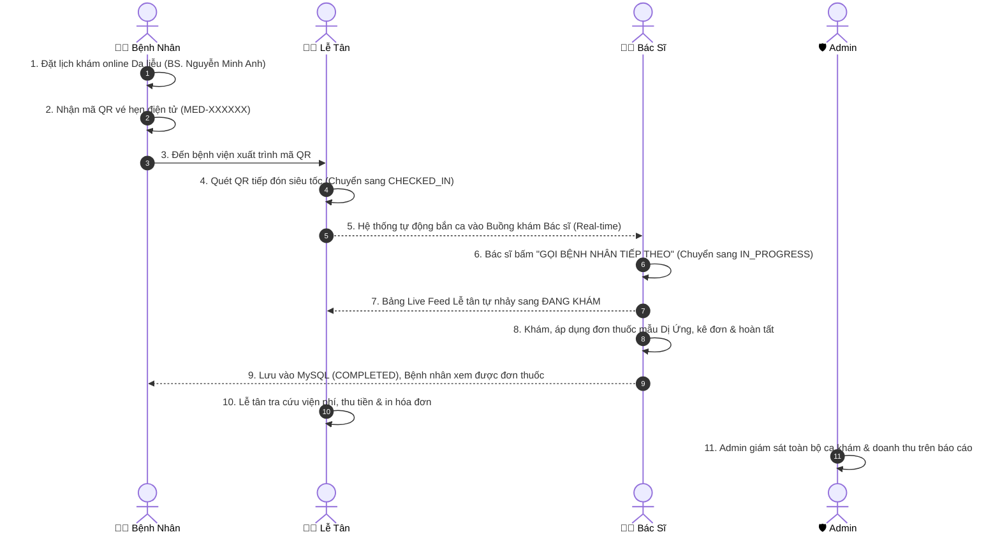

# KẾ HOẠCH KIỂM THỬ CHI TIẾT THEO TỪNG VAI TRÒ NGƯỜI DÙNG (USER TEST PLAN)
## DỰ ÁN: HỆ THỐNG Y TẾ THÔNG MINH MEDSCHED (SPRING BOOT 3 + NEXT.JS 15)

---

> **NGƯỜI THỰC HIỆN KIỂM THỬ (TESTER):** **Tân**  
> **NGÀY GIAO VIỆC:** 25/09/2026  
> **MÔI TRƯỜNG KIỂM THỬ:**
> * Frontend: `http://localhost:3000`
> * Backend: `http://localhost:8080/api`
> * Cơ sở dữ liệu: MySQL `medsched_db` (Port 3306)
> * Công cụ hỗ trợ: Trình duyệt Chrome / Edge (khuyến nghị mở 2 cửa sổ hoặc 1 tab thường + 1 tab ẩn danh để test tương tác realtime).

---

## 🔑 BẢNG TÀI KHOẢN KIỂM THỬ CHUẨN (TEST ACCOUNTS)

Tân sử dụng các tài khoản có sẵn trong CSDL sau đây để test các vai trò:

| Vai trò (Role) | Họ và Tên | Email đăng nhập | Mật khẩu chung | URL Truy cập |
| :--- | :--- | :--- | :--- | :--- |
| **🛡️ Admin** | Quản Trị Viên Hệ Thống | `admin@medsched.vn` | `Medsched@123` | `http://localhost:3000/admin` |
| **👩‍💼 Lễ Tân** | Lễ Tân Tiếp Đón 01 | `letan.q1@medsched.vn` | `Medsched@123` | `http://localhost:3000/reception` |
| **👨‍⚕️ Bác Sĩ 1** | BS.CKII Nguyễn Minh Anh *(Da liễu - P.205)* | `dr.minhanh@medsched.vn` | `Medsched@123` | `http://localhost:3000/doctor` |
| **👨‍⚕️ Bác Sĩ 2** | PGS.TS Trần Văn Hùng *(Nội khoa - P.208)* | `dr.tranhung@medsched.vn` | `Medsched@123` | `http://localhost:3000/doctor` |
| **🧑‍🦱 Bệnh Nhân** | Trần Văn Hoàng *(CCCD: 079201008899)* | `benhnhan.demo@gmail.com` | `Medsched@123` | `http://localhost:3000/my-appointments` |

---

# PHẦN 1: CHI TIẾT TEST CHO BỆNH NHÂN (PATIENT)

### 📌 TC-PAT-01: Đăng ký & Khởi tạo Tài khoản Tự động
* **Mục tiêu:** Kiểm tra bệnh nhân mới có thể tự đăng ký và tài khoản tự sinh `PatientProfileEntity`.
* **URL:** `http://localhost:3000/register`
* **Các bước test:**
  1. Nhập Họ và tên: `Nguyễn Văn Test`, Số điện thoại: `0933112233`, Email: `test.patient1@gmail.com`, Mật khẩu: `Patient@123`.
  2. Bấm nút **"Đăng Ký Khám Mới"**.
* **Kết quả mong đợi (Expected):**
  * Hiển thị thông báo thành công và tự động chuyển hướng sang trang Đăng nhập / Đặt khám.
  * Trong bảng `users` có 1 dòng mới; trong bảng `patient_profiles` tự sinh 1 dòng `relationship = SELF` gắn với user vừa tạo.
* **Tiêu chí Đạt (Pass):** `[ ] Đạt` | `[ ] Lỗi`

---

### 📌 TC-PAT-02: Đặt Lịch Khám Trực Tuyến & Phân Tích Triệu Chứng Spring AI
* **Mục tiêu:** Đặt hẹn online 4 bước, kiểm tra Spring AI tóm tắt bệnh án và sinh mã QR.
* **URL:** `http://localhost:3000/booking`
* **Các bước test:**
  1. Đăng nhập với tài khoản `benhnhan.demo@gmail.com`.
  2. Vào trang Đặt Lịch:
     * **Bước 1:** Chọn chi nhánh `Bệnh Viện Đa Khoa MedSched - Chi Nhánh Quận 1`.
     * **Bước 2:** Chọn Chuyên khoa `Da liễu` ➔ Chọn Bác sĩ `BS.CKII Nguyễn Minh Anh`.
     * **Bước 3:** Chọn ngày hôm nay hoặc ngày mai ➔ Chọn 1 khung giờ slot còn mở (ví dụ: `09:00 - 09:30`).
     * **Bước 4:** Nhập mô tả triệu chứng: *"Tôi bị nổi mẩn đỏ, ngứa ngáy nhiều ở vùng cổ và lưng sau khi ăn hải sản 2 ngày trước"*.
  3. Bấm **"Xác Nhận Đặt Lịch Khám"**.
* **Kết quả mong đợi (Expected):**
  * Modal thành công xuất hiện, hiển thị:
    * Mã vé hẹn dạng `MED-XXXXXX` (hoặc `MED-YYYY-XXXX`).
    * Số thứ tự tiếp đón (STT).
    * Khung hiển thị **Mã QR vé hẹn điện tử** (mã QR thật, có thể dùng camera điện thoại quét ra chuỗi mã vé).
    * Hộp thoại **Spring AI**: Xuất hiện tóm tắt chẩn đoán sơ bộ định hướng dị ứng.
* **Tiêu chí Đạt (Pass):** `[ ] Đạt` | `[ ] Lỗi`

---

### 📌 TC-PAT-03: Xem Lịch Hẹn & Quét QR Code ("Lịch Hẹn Của Tôi")
* **Mục tiêu:** Kiểm tra phiếu hẹn đã lưu trong DB và chức năng hiển thị mã QR cỡ lớn.
* **URL:** `http://localhost:3000/my-appointments`
* **Các bước test:**
  1. Mở trang "Lịch Hẹn Của Tôi".
  2. Tìm phiếu hẹn vừa đặt ở `TC-PAT-02`.
  3. Bấm nút **"Mã QR Check-in Quầy"**.
* **Kết quả mong đợi (Expected):**
  * Phiếu hẹn có trạng thái màu cam: `Chờ khám (CONFIRMED)`.
  * Popup vé khám điện tử hiển thị mã QR kích thước lớn sắc nét và nút "Sao chép mã vé".
  * Thử quét bằng camera điện thoại: Đọc chính xác chuỗi mã `bookingCode`.
* **Tiêu chí Đạt (Pass):** `[ ] Đạt` | `[ ] Lỗi`

---

### 📌 TC-PAT-04: Đổi Lịch Khám (Reschedule) & Hủy Lịch Khám (Cancel)
* **Mục tiêu:** Kiểm tra tính linh hoạt khi bệnh nhân bận đột xuất.
* **URL:** `http://localhost:3000/my-appointments`
* **Các bước test:**
  1. Tại phiếu hẹn đang ở trạng thái `CONFIRMED`, bấm **"Đổi Lịch"**.
  2. Chọn ngày mới hoặc slot giờ khác ➔ Bấm **"Xác Nhận Đổi Lịch"**.
  3. Kiểm tra thông tin giờ khám trên thẻ lịch hẹn có cập nhật sang giờ mới không.
  4. Đặt 1 lịch test khác, sau đó bấm nút **"Hủy Lịch"** ➔ Xác nhận hộp thoại.
* **Kết quả mong đợi (Expected):**
  * Ca đổi lịch: Cập nhật `slot_id` và giờ khám mới thành công.
  * Ca hủy lịch: Trạng thái chuyển sang `CANCELLED (Đã hủy)` và slot khám cũ được trả lại tự do cho người khác đặt.
* **Tiêu chí Đạt (Pass):** `[ ] Đạt` | `[ ] Lỗi`

---

### 📌 TC-PAT-05: Tra Cứu Kết Quả Khám & Đơn Thuốc Sau Khi Bác Sĩ Khám Xong
* **Mục tiêu:** Kiểm tra bệnh nhân xem được chẩn đoán và đơn thuốc điện tử khi bác sĩ hoàn tất ca khám.
* **URL:** `http://localhost:3000/my-appointments`
* **Các bước test:**
  1. Sau khi Bác sĩ hoàn tất khám ở Phần 3, Bệnh nhân F5 lại trang "Lịch Hẹn Của Tôi".
  2. Phiếu hẹn chuyển sang màu xanh lá: `Đã khám xong (COMPLETED)`.
  3. Bấm nút **"Xem Đơn Thuốc & Kết Quả"**.
* **Kết quả mong đợi (Expected):**
  * Bật Modal Đơn thuốc điện tử hiển thị đầy đủ:
    * Bác sĩ khám: `BS.CKII Nguyễn Minh Anh`.
    * Chẩn đoán: Kết luận bệnh án bác sĩ đã nhập.
    * Danh mục thuốc: Tên thuốc, số lượng, liều dùng, đơn giá, thành tiền và tổng tiền thuốc.
    * Lời dặn dò tái khám của bác sĩ.
  * Bấm nút **"In Đơn Thuốc"** ➔ Mở hộp thoại in trình duyệt chuẩn A4/A5.
* **Tiêu chí Đạt (Pass):** `[ ] Đạt` | `[ ] Lỗi`

---

# PHẦN 2: CHI TIẾT TEST CHO LỄ TÂN (STAFF / RECEPTION DESK)

> **Lưu ý quan trọng cho Tân:** Mở trang Lễ tân trên tab Chrome thường, mở trang Bác sĩ trên tab Incognito để kiểm tra tính năng đồng bộ không cần F5!

### 📌 TC-REC-01: Tiếp Đón Bằng Mã QR Vé Hẹn (Tab 1: "1. QR Vé")
* **Mục tiêu:** Tiếp đón bệnh nhân đã đặt online trong vòng ~1 giây.
* **URL:** `http://localhost:3000/reception`
* **Các bước test:**
  1. Đăng nhập với tài khoản Lễ tân: `letan.q1@medsched.vn`.
  2. Tại Tab **"1. QR Vé"**:
     * Lấy mã booking của bệnh nhân ở `TC-PAT-02` (hoặc bấm nút *"Tạo mã test"*).
     * Dán vào ô "Mã Vé Hẹn Khám" ➔ Nhấn Enter hoặc nút **"Tiếp Nhận & Check-in"**.
* **Kết quả mong đợi (Expected):**
  * Thông báo thành công: *"Tiếp đón thành công qua mã QR vé hẹn! Mời bệnh nhân vào phòng chờ"*.
  * Hàng đầu tiên trong bảng Live Feed xuất hiện ca này với trạng thái màu vàng: **`ĐÃ TIẾP ĐÓN`**.
  * Trong CSDL MySQL: Ca khám chuyển `status = CHECKED_IN`, có lưu `check_in_time`.
* **Tiêu chí Đạt (Pass):** `[ ] Đạt` | `[ ] Lỗi`

---

### 📌 TC-REC-02: Tiếp Đón Bằng Thẻ CCCD Gắn Chip (Tab 2: "2. Thẻ CCCD")
* **Mục tiêu:** Kiểm tra 2 trường hợp: Bệnh nhân đã có hẹn và Bệnh nhân vãng lai chưa từng đặt hẹn.
* **URL:** `http://localhost:3000/reception`
* **Các bước test:**
  * **Trường hợp A (Có hẹn trước):**
    1. Chọn Tab **"2. Thẻ CCCD"**.
    2. Nhập số CCCD mẫu của anh Hoàng: `079201008899`, Tên: `Trần Văn Hoàng`.
    3. Bấm **"Tiếp Nhận & Check-in"**.
  * **Trường hợp B (Khách vãng lai, chưa có hẹn trước):**
    1. Nhập 1 số CCCD bất kỳ chưa từng có lịch: `079099887766`, Tên: `Lê Văn Vãng Lai`.
    2. Bấm **"Tiếp Nhận & Check-in"**.
* **Kết quả mong đợi (Expected):**
  * **Trường hợp A:** Nhận diện đúng ca hẹn, chuyển sang `ĐÃ TIẾP ĐÓN`.
  * **Trường hợp B:** Hệ thống **tự động tạo ca khám vãng lai mới vào MySQL**, cấp số STT hôm nay và đưa vào hàng đợi bác sĩ trực.
* **Tiêu chí Đạt (Pass):** `[ ] Đạt` | `[ ] Lỗi`

---

### 📌 TC-REC-03: Cấp Tài Khoản & Tiếp Nhận Vãng Lai Tại Quầy (Tab 3: "3. Cấp TK Quầy")
* **Mục tiêu:** Tiếp đón người già/người không có smartphone, vừa cấp tài khoản vừa lưu ca khám vào MySQL.
* **URL:** `http://localhost:3000/reception`
* **Các bước test:**
  1. Chọn Tab **"3. Cấp TK Quầy"**.
  2. Nhập thông tin:
     * Họ và tên: `Bác Ba Phi`
     * Số ĐT (Username): `0911223344` (Mật khẩu tự sinh: `Med@3344`)
     * Số CCCD: `079150009999`
     * Chuyên khoa: `Chuyên khoa Da liễu` ➔ Chọn Bác sĩ: `BS.CKII Nguyễn Minh Anh - P.205`.
  3. Bấm nút **"Cấp Tài Khoản & In Phiếu Bàn Giao"**.
* **Kết quả mong đợi (Expected):**
  * Modal **Phiếu Bàn Giao Tài Khoản & Số Thứ Tự Khám** bật lên có đầy đủ Username, Password, STT, Phòng khám P.205.
  * Bảng Live Feed tại quầy cập nhật ngay ca `Bác Ba Phi` (Mã `WALK-XXXXXX`).
  * **Kiểm tra DB:** Bảng `users`, `patient_profiles` và `appointments` đều có bản ghi với `status = CHECKED_IN`, `doctorId` trỏ đúng vào BS. Nguyễn Minh Anh.
* **Tiêu chí Đạt (Pass):** `[ ] Đạt` | `[ ] Lỗi`

---

### 📌 TC-REC-04: Kiểm Tra Đồng Bộ Hai Chiều Real-Time (Live Feed)
* **Mục tiêu:** Kiểm tra bảng Live Feed của Lễ tân tự động đổi trạng thái khi Bác sĩ gọi ca mà không cần bấm F5.
* **Các bước test:**
  1. Để nguyên màn hình Lễ tân ở 1 nửa màn hình.
  2. Ở nửa màn hình còn lại (tab Incognito), đăng nhập Bác sĩ Nguyễn Minh Anh.
  3. Bác sĩ bấm nút **"GỌI BỆNH NHÂN TIẾP THEO"**.
* **Kết quả mong đợi (Expected):**
  * Bảng Live Feed của Lễ tân tự động đổi trạng thái của ca đó từ **`ĐÃ TIẾP ĐÓN`** sang màu xanh dương **`ĐANG KHÁM`** sau 1-2 giây.
  * Khi Bác sĩ bấm hoàn tất kê đơn: Live Feed tự nhảy sang màu xanh lá **`ĐÃ KHÁM`**.
* **Tiêu chí Đạt (Pass):** `[ ] Đạt` | `[ ] Lỗi`

---

### 📌 TC-REC-05: Thu Ngân & Xác Nhận Thanh Toán Viện Phí (CLAB-108)
* **Mục tiêu:** Xem bảng kê chi phí (Công khám + Tiền thuốc) và thanh toán viện phí.
* **Các bước test:**
  1. Sau khi ca khám hoàn tất ở Buồng khám Bác sĩ (đã có kết luận và kê đơn thuốc).
  2. Lễ tân vào phân hệ Thu ngân / Thanh toán viện phí hoặc gọi API `GET /api/reception/appointments/{id}/bill`.
  3. Bấm **"Xác Nhận Thanh Toán"** (`POST /api/reception/invoices/{invoiceId}/pay`).
* **Kết quả mong đợi (Expected):**
  * Bảng kê thể hiện chính xác: Tiền khám (ví dụ 150.000đ) + Tiền thuốc (tổng các loại thuốc bác sĩ kê).
  * Hóa đơn chuyển trạng thái sang `PAID`, in biên lai thu tiền.
* **Tiêu chí Đạt (Pass):** `[ ] Đạt` | `[ ] Lỗi`

---

# PHẦN 3: CHI TIẾT TEST CHO BÁC SĨ (DOCTOR)

### 📌 TC-DOC-01: Hàng Đợi Khám Hôm Nay & Nhận Ca Tức Thì
* **Mục tiêu:** Kiểm tra hàng đợi khám hiển thị đúng bệnh nhân và tự nạp ca tiếp đón mới.
* **URL:** `http://localhost:3000/doctor`
* **Các bước test:**
  1. Đăng nhập tài khoản Bác sĩ: `dr.minhanh@medsched.vn` (Mật khẩu: `Medsched@123`).
  2. Mở tab **"Buồng Khám Lâm Sàng"**.
  3. Quan sát danh sách "Hàng Đợi Khám Hôm Nay".
  4. Sang tab Lễ tân tiếp đón thêm 1 bệnh nhân mới ➔ Quay lại tab Bác sĩ (không F5).
* **Kết quả mong đợi (Expected):**
  * Danh sách hiển thị đúng các ca khám của BS. Nguyễn Minh Anh (Phòng P.205).
  * Ca mới do lễ tân tiếp đón lập tức tự động xuất hiện ở trạng thái `Đang chờ`.
* **Tiêu chí Đạt (Pass):** `[ ] Đạt` | `[ ] Lỗi`

---

### 📌 TC-DOC-02: Quy Tắc Gọi Khám 1:1 & Đồng Hồ Đếm Giờ Ca Khám
* **Mục tiêu:** Kiểm tra nguyên tắc y tế chỉ khám 1 ca duy nhất tại 1 thời điểm và đồng hồ đếm ngược.
* **URL:** `http://localhost:3000/doctor`
* **Các bước test:**
  1. Bác sĩ bấm nút xanh lớn: **"GỌI BỆNH NHÂN TIẾP THEO (CALL NEXT)"**.
  2. Bệnh nhân đầu tiên trong hàng chờ chuyển sang buồng khám chính (`IN_CONSULTATION`).
  3. Đồng hồ đếm ngược bắt đầu chạy từ `30:00`.
  4. Bác sĩ bấm nút **"Gia hạn +10 phút"**.
  5. Thử bấm gọi ca tiếp theo khi ca cũ chưa xong.
* **Kết quả mong đợi (Expected):**
  * Ca được gọi chuyển sang trạng thái đang khám, các ca còn lại giữ trạng thái chờ.
  * Đồng hồ cộng thêm đúng 10 phút (thành `39:xx`).
  * F5 lại trang: Mốc đếm giờ và bệnh nhân đang khám được bảo toàn (không bị reset về đầu).
* **Tiêu chí Đạt (Pass):** `[ ] Đạt` | `[ ] Lỗi`

---

### 📌 TC-DOC-03: Thao Tác Lâm Sàng (Xét Nghiệm, Tạm Hoãn, Vắng Mặt, Gọi Lại)
* **Mục tiêu:** Kiểm tra các nhánh điều phối chuyên biệt của bác sĩ buồng khám.
* **URL:** `http://localhost:3000/doctor`
* **Các bước test:**
  * **Test 1 - Chỉ định Cận lâm sàng:** Bấm **"Chỉ định xét nghiệm"** ➔ Ca bệnh chuyển trạng thái `Chờ kết quả CLS`, buồng khám được giải phóng và tự gọi ca kế tiếp.
  * **Test 2 - Tạm hoãn:** Bấm **"Tạm hoãn ca này"** ➔ Ca bệnh chuyển sang trạng thái `Tạm hoãn (DEFERRED)`.
  * **Test 3 - Bỏ qua lượt:** Bấm **"Bỏ qua lượt (Vắng mặt)"** ➔ Ca bệnh chuyển `MISSED_CALL`, ghi nhận `MISSED_NO_SHOW` vào DB.
  * **Test 4 - Tiếp nhận lại:** Bấm nút **"Tiếp nhận lại"** tại ca xét nghiệm vừa có kết quả ➔ Ca bệnh được đưa trở lại buồng khám ưu tiên.
* **Kết quả mong đợi (Expected):**
  * Tất cả các thao tác cập nhật mượt mà, gọi API backend tương ứng (`/lab`, `/defer`, `/miss`, `/call`).
* **Tiêu chí Đạt (Pass):** `[ ] Đạt` | `[ ] Lỗi`

---

### 📌 TC-DOC-04: Kê Đơn Thuốc Mẫu (Presets) & Tự Động Lưu Nháp (Draft)
* **Mục tiêu:** Kiểm tra tốc độ kê đơn thuốc bằng mẫu phác đồ chuẩn và cơ chế chống mất dữ liệu.
* **URL:** `http://localhost:3000/doctor`
* **Các bước test:**
  1. Trong ca bệnh đang khám, bấm chọn đơn thuốc mẫu: **"Dị Ứng / Mề Đay"** (hoặc Viêm họng cấp, Dạ dày GERD).
  2. Bác sĩ chỉnh sửa số lượng 1 loại thuốc từ 10 viên lên 15 viên.
  3. Thêm 1 thuốc thủ công: Tên: `Vitamin C 500mg`, Số lượng: `20`, Đơn giá: `2000`.
  4. F5 lại trình duyệt hoặc tắt tab mở lại đột ngột.
* **Kết quả mong đợi (Expected):**
  * Nạp nhanh chẩn đoán, lời dặn dò và danh mục thuốc của phác đồ mẫu.
  * Tổng tiền thuốc nhảy tự động chính xác theo số lượng và đơn giá.
  * Khi F5: Bản nháp đơn thuốc tự động khôi phục nguyên vẹn, hiện chữ *"Đã khôi phục bản nháp tự động"*.
* **Tiêu chí Đạt (Pass):** `[ ] Đạt` | `[ ] Lỗi`

---

### 📌 TC-DOC-05: Hoàn Tất Khám & Lưu Đơn Thuốc Vào MySQL (CLAB-107)
* **Mục tiêu:** Lưu kết quả khám và đơn thuốc điện tử vĩnh viễn vào CSDL.
* **URL:** `http://localhost:3000/doctor`
* **Các bước test:**
  1. Nhập chẩn đoán và danh mục thuốc.
  2. Bấm nút **"HOÀN TẤT CA KHÁM & KÊ ĐƠN THUỐC"**.
  3. Modal xác nhận chống bấm nhầm bật lên ➔ Bấm **"Xác nhận hoàn tất"**.
* **Kết quả mong đợi (Expected):**
  * Modal In Đơn Thuốc Điện Tử xuất hiện với đầy đủ thông tin thuốc, tổng tiền và chữ ký bác sĩ.
  * Ca bệnh chuyển trạng thái `COMPLETED (Đã khám)`.
  * **Kiểm tra MySQL:**
    * Bảng `medical_records` có dòng mới chứa chẩn đoán và lời khuyên.
    * Bảng `prescriptions` có đơn thuốc với tổng tiền tương ứng.
    * Bảng `prescription_items` có danh sách chi tiết các loại thuốc.
* **Tiêu chí Đạt (Pass):** `[ ] Đạt` | `[ ] Lỗi`

---

### 📌 TC-DOC-06: Đăng Ký Ca Trực Bác Sĩ & Chặn Giờ Quá Khứ (Smart Validation)
* **Mục tiêu:** Kiểm tra CRUD ca trực và tính năng làm tròn thông minh chống đăng ký giờ quá khứ.
* **URL:** `http://localhost:3000/doctor` (Chuyển sang Tab: **"Quản Lý Lịch Trực & Khung Giờ (CRUD)"**)
* **Các bước test:**
  1. Chọn ngày làm việc là **Hôm nay**.
  2. Quan sát ô "Giờ bắt đầu": Hệ thống tự động đẩy lên mốc giờ tương lai tiếp theo (ví dụ hiện tại là 11h thì giờ bắt đầu tự nhảy 11:30 hoặc 12:00).
  3. Thử cố tình chỉnh giờ bắt đầu về giờ trong quá khứ (ví dụ 08:00 sáng nay) ➔ Bấm **"Đăng Ký Ca Trực"**.
  4. Đăng ký 1 ca trực hợp lệ cho ngày mai: từ `08:00` đến `12:00`.
* **Kết quả mong đợi (Expected):**
  * Trường hợp cố tình chọn giờ quá khứ: Bị chặn lại với thông báo lỗi rõ ràng.
  * Trường hợp ca hợp lệ: Tạo thành công ca trực trong CSDL, tự động phân tách thành các slot 30 phút (`08:00-08:30`, `08:30-09:00`...).
* **Tiêu chí Đạt (Pass):** `[ ] Đạt` | `[ ] Lỗi`

---

### 📌 TC-DOC-07: Khóa / Mở Khóa Khung Giờ Nghỉ (Toggle Slot Lock)
* **Mục tiêu:** Bác sĩ chủ động khóa slot khám nghỉ trưa / hội chẩn.
* **URL:** `http://localhost:3000/doctor`
* **Các bước test:**
  1. Tại bảng danh sách ca trực, tìm khung giờ `11:30 - 12:00`.
  2. Bấm vào icon **Ổ khóa (Khóa slot)**.
  3. Mở tab Bệnh nhân đặt khám: Kiểm tra slot `11:30 - 12:00` có bị ẩn/vô hiệu hóa không.
  4. Bấm mở khóa lại slot đó trên màn hình Bác sĩ.
* **Kết quả mong đợi (Expected):**
  * Khi khóa: Slot chuyển sang màu vàng biểu tượng ổ khóa đóng, bệnh nhân không thể click đặt.
  * Khi mở: Slot chuyển lại màu xanh lá khả dụng.
* **Tiêu chí Đạt (Pass):** `[ ] Đạt` | `[ ] Lỗi`

---

# PHẦN 4: CHI TIẾT TEST CHO QUẢN TRỊ VIÊN (ADMIN)

### 📌 TC-ADM-01: Quản Trị Người Dùng & Phân Quyền (RBAC)
* **Mục tiêu:** Xem danh sách, tìm kiếm, lọc theo vai trò và kiểm tra phân trang.
* **URL:** `http://localhost:3000/admin`
* **Các bước test:**
  1. Đăng nhập với tài khoản Admin: `admin@medsched.vn`.
  2. Lọc danh sách theo vai trò: `ROLE_DOCTOR`, `ROLE_STAFF`, `ROLE_PATIENT`.
  3. Nhập từ khóa tìm kiếm: `Nguyễn Minh Anh` hoặc `0988776655`.
* **Kết quả mong đợi (Expected):**
  * Lọc chính xác danh sách tài khoản theo vai trò được chọn.
  * Tìm kiếm tức thì theo họ tên, email hoặc số điện thoại.
* **Tiêu chí Đạt (Pass):** `[ ] Đạt` | `[ ] Lỗi`

---

### 📌 TC-ADM-02: Tạo Mới Tài Khoản Bác Sĩ & Lễ Tân
* **Mục tiêu:** Tạo tài khoản nhân sự mới và gán chi nhánh, chuyên khoa.
* **URL:** `http://localhost:3000/admin`
* **Các bước test:**
  1. Bấm nút **"Thêm Bác Sĩ Mới"**:
     * Họ tên: `ThS.BS Đặng Hoàng Nam`, Email: `dr.hoangnam@medsched.vn`, SĐT: `0977889900`.
     * Chuyên khoa: `Khoa Tim Mạch`, Phòng: `P.301`, Giá khám: `200.000đ`.
  2. Bấm nút **"Thêm Nhân Viên Lễ Tân"**:
     * Họ tên: `Lễ Tân Ca Chiều`, Email: `letan.chieu@medsched.vn`, SĐT: `0966554433`.
* **Kết quả mong đợi (Expected):**
  * Tài khoản được tạo thành công, có thể dùng tài khoản mới đăng nhập vào hệ thống bình thường.
* **Tiêu chí Đạt (Pass):** `[ ] Đạt` | `[ ] Lỗi`

---

### 📌 TC-ADM-03: Khóa / Kích Hoạt Tài Khoản & Đặt Lại Mật Khẩu
* **Mục tiêu:** Kiểm tra xử lý vi phạm hoặc hỗ trợ nhân viên quên mật khẩu.
* **URL:** `http://localhost:3000/admin`
* **Các bước test:**
  1. Tại 1 tài khoản test, bấm nút chuyển toggle sang **"Khóa tài khoản" (`active = false`)**.
  2. Thử dùng tài khoản đó đăng nhập lại.
  3. Bấm nút **"Đặt lại mật khẩu"** ➔ Nhập mật khẩu mới `Reset@2026`.
* **Kết quả mong đợi (Expected):**
  * Khi bị khóa: Đăng nhập báo lỗi tài khoản bị vô hiệu hóa.
  * Khi reset mật khẩu: Đăng nhập được bằng mật khẩu mới vừa đặt.
* **Tiêu chí Đạt (Pass):** `[ ] Đạt` | `[ ] Lỗi`

---

### 📌 TC-ADM-04: Quản Lý Danh Mục Y Tế Toàn Bệnh Viện (Catalog)
* **Mục tiêu:** Kiểm tra thêm/sửa chuyên khoa và chi nhánh.
* **URL:** `http://localhost:3000/admin`
* **Các bước test:**
  1. Vào tab Quản lý Chuyên Khoa: Kiểm tra danh sách các khoa (Da liễu, Tim mạch, Tai mũi họng, Nội khoa...).
  2. Vào tab Cơ Sở Y Tế: Kiểm tra thông tin các chi nhánh.
* **Kết quả mong đợi (Expected):**
  * Danh mục hiển thị đầy đủ, đồng bộ chính xác sang form Đặt khám của Bệnh nhân.
* **Tiêu chí Đạt (Pass):** `[ ] Đạt` | `[ ] Lỗi`

---

# PHẦN 5: KỊCH BẢN KIỂM THỬ TÍCH HỢP TOÀN TRÌNH (END-TO-END FLOW)

Tân thực hiện kịch bản này từ đầu đến cuối trong 1 lượt để kiểm tra tính liên kết toàn diện giữa 4 vai trò:



---

## 📋 BẢNG CHECKLIST TỔNG HỢP KẾT QUẢ KIỂM THỬ (DÀNH CHO TÂN ĐÁNH DẤU)

| STT | Mã Test Case | Tên Chức Năng Cần Kiểm Thử | Trạng thái | Ghi chú / Lỗi nếu có |
| :---: | :--- | :--- | :---: | :--- |
| 1 | `TC-PAT-01` | Đăng ký & Tự động tạo PatientProfile | `[ ] PASS` / `[ ] FAIL` | |
| 2 | `TC-PAT-02` | Đặt lịch khám 4 bước & Trợ lý Spring AI | `[ ] PASS` / `[ ] FAIL` | |
| 3 | `TC-PAT-03` | Xem lịch hẹn & Mã QR vé hẹn điện tử | `[ ] PASS` / `[ ] FAIL` | |
| 4 | `TC-PAT-04` | Đổi lịch khám (Reschedule) & Hủy lịch | `[ ] PASS` / `[ ] FAIL` | |
| 5 | `TC-PAT-05` | Xem kết quả chẩn đoán & Đơn thuốc sau khám | `[ ] PASS` / `[ ] FAIL` | |
| 6 | `TC-REC-01` | Tiếp đón siêu tốc bằng Mã QR vé hẹn | `[ ] PASS` / `[ ] FAIL` | |
| 7 | `TC-REC-02` | Tiếp đón bằng Thẻ CCCD chip (Có hẹn & Vãng lai) | `[ ] PASS` / `[ ] FAIL` | |
| 8 | `TC-REC-03` | Cấp tài khoản & Phiếu tiếp nhận vãng lai tại quầy | `[ ] PASS` / `[ ] FAIL` | |
| 9 | `TC-REC-04` | Giám sát Live Feed & Kiểm tra đồng bộ Real-time | `[ ] PASS` / `[ ] FAIL` | |
| 10 | `TC-REC-05` | Thu ngân, kiểm tra bảng kê & Thu tiền viện phí | `[ ] PASS` / `[ ] FAIL` | |
| 11 | `TC-DOC-01` | Hàng đợi khám hôm nay & Nhận ca mới tức thì | `[ ] PASS` / `[ ] FAIL` | |
| 12 | `TC-DOC-02` | Gọi khám 1:1, Đếm giờ 30p & Gia hạn ca bệnh | `[ ] PASS` / `[ ] FAIL` | |
| 13 | `TC-DOC-03` | Thao tác lâm sàng (Xét nghiệm, Hoãn, Vắng mặt) | `[ ] PASS` / `[ ] FAIL` | |
| 14 | `TC-DOC-04` | Kê đơn mẫu Presets & Auto-save bản nháp | `[ ] PASS` / `[ ] FAIL` | |
| 15 | `TC-DOC-05` | Hoàn tất ca khám & Kê đơn thuốc vào MySQL | `[ ] PASS` / `[ ] FAIL` | |
| 16 | `TC-DOC-06` | Đăng ký ca trực & Chặn giờ quá khứ | `[ ] PASS` / `[ ] FAIL` | |
| 17 | `TC-DOC-07` | Khóa / Mở khóa khung giờ nghỉ (Toggle Slot Lock) | `[ ] PASS` / `[ ] FAIL` | |
| 18 | `TC-ADM-01` | Quản trị người dùng, lọc vai trò & tìm kiếm | `[ ] PASS` / `[ ] FAIL` | |
| 19 | `TC-ADM-02` | Thêm mới tài khoản Bác sĩ & Lễ tân | `[ ] PASS` / `[ ] FAIL` | |
| 20 | `TC-ADM-03` | Khóa/Mở khóa tài khoản & Reset mật khẩu | `[ ] PASS` / `[ ] FAIL` | |
| 21 | `TC-ADM-04` | Quản lý danh mục Chi nhánh, Chuyên khoa, Bác sĩ | `[ ] PASS` / `[ ] FAIL` | |
| 22 | `TC-E2E-01` | Kịch bản tích hợp toàn trình liên thông 4 vai trò | `[ ] PASS` / `[ ] FAIL` | |

---

## 🐞 BIỂU MẪU BÁO CÁO LỖI (NẾU TÂN PHÁT HIỆN LỖI)

Nếu trong quá trình test gặp bất kỳ lỗi nào, Tân vui lòng ghi chú theo mẫu sau vào cuối file này:

```markdown
### ❌ BÁO CÁO LỖI #01
* **Mã Test Case bị lỗi:** TC-...
* **Mô tả hiện tượng:** (Ví dụ: Bấm nút xong màn hình quay mãi không dừng...)
* **Các bước tái hiện:** 
  1. Đăng nhập tài khoản...
  2. Bấm vào nút...
* **Kết quả thực tế:** ...
* **Kết quả mong đợi:** ...
* **Ảnh chụp màn hình (nếu có):** ...
```
