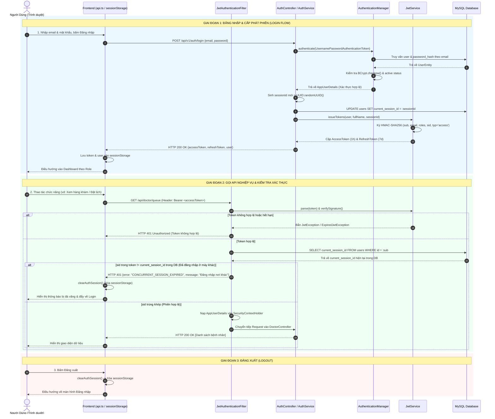
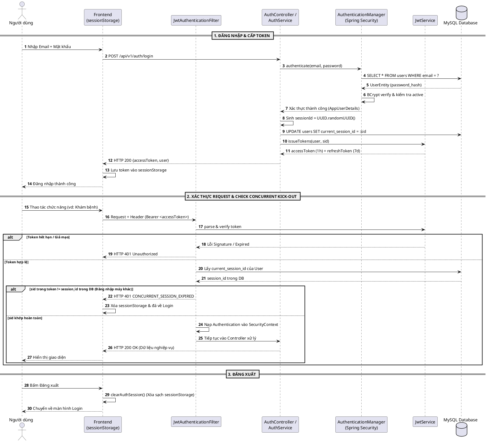

# TÀI LIỆU LUỒNG XÁC THỰC (AUTHENTICATION & SESSION FLOW)

**Hệ Thống Đặt Lịch Khám Bệnh Trực Tuyến - MedSched**

---

## 1. TỔNG QUAN KIẾN TRÚC XÁC THỰC

Hệ thống MedSched áp dụng mô hình bảo mật **Stateless JWT kết hợp Kiểm soát phiên đăng nhập đơn (Single Active Session / Zalo-style Concurrent Kick-out)**:

- **Mã hóa mật khẩu:** `BCryptPasswordEncoder` (cost 10).
- **Chuẩn Token:** JSON Web Token (JWT) ký bằng thuật toán đối xứng `HMAC-SHA256` (HS256) với secret key tối thiểu 256-bit.
- **Thời hạn Token (Token TTL):**
  - **Access Token:** `1 giờ` (dùng để gửi kèm Header trong mọi request nghiệp vụ).
  - **Refresh Token:** `7 ngày` (dùng để cấp phát Access Token mới khi hết hạn mà không cần nhập lại mật khẩu).
- **Lưu trữ phía Client:** Sử dụng **`sessionStorage`** của trình duyệt (`sessionStorage.getItem("token")`). Khi đóng tab hoặc tắt trình duyệt, phiên tự động xóa sạch để đảm bảo an toàn bảo mật y tế trên máy dùng chung.
- **Cơ chế chống đăng nhập trùng lặp (Concurrent Session Control):**
  - Mỗi lần đăng nhập, server sinh một `sessionId` (UUID) mới và lưu vào cột `users.current_session_id` trong MySQL, đồng thời nhúng vào claim `sid` của Token.
  - Nếu tài khoản đăng nhập trên một trình duyệt/thiết bị khác, `current_session_id` trong CSDL bị ghi đè $\rightarrow$ Phiên trên trình duyệt cũ lập tức bị đá văng (HTTP 401 Kick-out).

---

## 2. CÁC THÀNH PHẦN THAM GIA HỆ THỐNG

| Thành phần          | File mã nguồn                                                                                                                                                           | Vai trò                                                                                         |
| :------------------ | :---------------------------------------------------------------------------------------------------------------------------------------------------------------------- | :---------------------------------------------------------------------------------------------- |
| **Frontend Client** | [api.ts](file:///d:/MonHocITC/Javaspring2/DuAnChinhThuc/Source_code/frontend/src/shared/lib/api.ts)                                                                     | Gửi request đăng nhập, quản lý `sessionStorage`, bắt sự kiện kick-out để điều hướng.            |
| **Auth Controller** | [AuthController.java](file:///d:/MonHocITC/Javaspring2/DuAnChinhThuc/Source_code/backend/app/src/main/java/com/medsched/auth/AuthController.java)                       | Endpoint công khai: `/api/v1/auth/login`, `/register`, `/refresh`.                              |
| **Auth Service**    | [AuthService.java](file:///d:/MonHocITC/Javaspring2/DuAnChinhThuc/Source_code/backend/app/src/main/java/com/medsched/auth/AuthService.java)                             | Thực hiện kiểm tra mật khẩu, sinh session ID, khởi tạo hồ sơ `SELF` cho bệnh nhân.              |
| **JWT Service**     | [JwtService.java](file:///d:/MonHocITC/Javaspring2/DuAnChinhThuc/Source_code/backend/app/src/main/java/com/medsched/security/JwtService.java)                           | Sinh chuỗi token, giải mã (parse), kiểm tra tính hợp lệ và chữ ký số.                           |
| **Auth Filter**     | [JwtAuthenticationFilter.java](file:///d:/MonHocITC/Javaspring2/DuAnChinhThuc/Source_code/backend/app/src/main/java/com/medsched/security/JwtAuthenticationFilter.java) | Chặn mọi request đến, kiểm tra token, đối chiếu `sid` với CSDL để phát hiện đăng nhập nơi khác. |
| **Security Config** | [SecurityConfig.java](file:///d:/MonHocITC/Javaspring2/DuAnChinhThuc/Source_code/backend/app/src/main/java/com/medsched/security/SecurityConfig.java)                   | Cấu hình Stateless, phân quyền endpoint mở vs endpoint cần đăng nhập.                           |
| **Database**        | MySQL (`users`, `patient_profiles`)                                                                                                                                     | Lưu tài khoản, mật khẩu hash, quyền hạn, `current_session_id`.                                  |

---

## 3. CHI TIẾT CÁC LUỒNG XÁC THỰC

### Luồng 1: Đăng ký tài khoản Bệnh nhân mới (`POST /api/v1/auth/register`)

1. Người dùng nhập: `email`, `password`, `fullName`, `phone`.
2. Backend kiểm tra tính duy nhất của email. Nếu đã tồn tại $\rightarrow$ Trả về lỗi `409 Conflict`.
3. Mã hóa mật khẩu bằng BCrypt: `passwordEncoder.encode(rawPassword)`.
4. Tạo tài khoản trong bảng `users`, đồng thời gán `currentSessionId = UUID.randomUUID()`.
5. **Tự động tạo hồ sơ bệnh nhân chính chủ (`RelationshipType.SELF`)** trong bảng `patient_profiles` để người dùng có thể đặt lịch ngay mà không cần qua bước khai báo phụ.
6. Cấp cặp Access Token + Refresh Token và trả về cho Client.

---

### Luồng 2: Đăng nhập (`POST /api/v1/auth/login`)

1. Client gửi `email` + `password` lên `POST /api/v1/auth/login`.
2. `AuthenticationManager` gọi `DaoAuthenticationProvider` xác minh email & mật khẩu BCrypt.
   - Sai email/mật khẩu: Trả về lỗi `401 Bad credentials`.
   - Tài khoản bị khóa (`active = false`): Trả về `403 Account disabled`.
3. Xác thực thành công:
   - Backend sinh mã phiên mới: `sessionId = UUID.randomUUID().toString()`.
   - Cập nhật `users.current_session_id = sessionId` vào MySQL.
   - `JwtService` đóng gói thông tin vào Access Token:
     - `sub`: User ID
     - `email`: Email người dùng
     - `roles`: Danh sách quyền (`ROLE_PATIENT`, `ROLE_DOCTOR`, v.v.)
     - `sid`: Mã session ID vừa sinh
     - `typ`: `access`
4. Client nhận response:
   - Lưu `accessToken` vào `sessionStorage.setItem("token", ...)`.
   - Lưu thông tin người dùng vào `sessionStorage.setItem("user", ...)`.
   - Điều hướng vào Dashboard tương ứng theo Role.

---

### Luồng 3: Xác thực Request nghiệp vụ & Kiểm tra Phiên (Zalo-style Kick-out)

Mỗi khi người dùng gọi API cần quyền (Ví dụ: `GET /api/doctor/queue`, `POST /api/appointments`):

1. Client đính kèm Header: `Authorization: Bearer <accessToken>`.
2. `JwtAuthenticationFilter` chặn request:
   - **Bước 3.1 - Kiểm tra định dạng:** Header có bắt đầu bằng `Bearer ` không?
   - **Bước 3.2 - Kiểm tra chữ ký & hạn dùng:** `JwtService.parse(token)`.
   - **Bước 3.3 - Kiểm tra loại token:** Token phải có `typ == "access"`. Nếu gửi Refresh Token vào API nghiệp vụ $\rightarrow$ Từ chối.
   - **Bước 3.4 - Kiểm tra phiên đăng nhập đồng thời (Concurrent Session Check):**
     - Đọc `sid` trong token và so sánh với `user.getCurrentSessionId()` trong MySQL.
     - **Nếu trùng khớp:** Nạp `AppUserDetails` vào `SecurityContextHolder`, request được chuyển tiếp đến Controller xử lý tiếp.
     - **Nếu KHÁC NHAU** (do tài khoản vừa đăng nhập trên máy khác):
       - Lập tức xóa `SecurityContext`.
       - Trả về HTTP `401 Unauthorized` kèm body:
         ```json
         {
           "status": 401,
           "error": "CONCURRENT_SESSION_EXPIRED",
           "message": "Tài khoản của bạn đã được đăng nhập trên một trình duyệt/thiết bị khác. Phiên làm việc tại đây đã kết thúc."
         }
         ```
       - Frontend tại [api.ts](file:///d:/MonHocITC/Javaspring2/DuAnChinhThuc/Source_code/frontend/src/shared/lib/api.ts#L98-L108) bắt sự kiện này, xóa sạch `sessionStorage` và tự động hiển thị popup cảnh báo / đẩy về trang Login.

---

### Luồng 4: Làm mới Token (`POST /api/v1/auth/refresh`)

1. Khi Access Token gần hết hạn (sau 1 giờ), Client gửi `refreshToken` lên `POST /api/v1/auth/refresh`.
2. Backend kiểm tra:
   - Token phải có `typ == "refresh"`.
   - Chữ ký hợp lệ và chưa quá 7 ngày.
3. Tải lại quyền hạn mới nhất từ CSDL (nếu Admin vừa đổi quyền của user, token mới sẽ phản ánh ngay).
4. Cấp cặp Token mới (Refresh Token Rotation).

---

### Luồng 5: Đăng xuất (Logout)

- Do hệ thống là **Stateless**, đăng xuất chủ yếu xử lý ở phía Client:
  1. Frontend gọi hàm `clearAuthSession()` tại [api.ts](file:///d:/MonHocITC/Javaspring2/DuAnChinhThuc/Source_code/frontend/src/shared/lib/api.ts#L37-L43).
  2. Xóa toàn bộ `sessionStorage` (`token`, `user`, `role`).
  3. Chuyển hướng người dùng về trang chủ hoặc màn hình Đăng nhập.

---

## 4. MÃ NGUỒN VẼ SƠ ĐỒ TRÊN DRAW.IO

Bạn có thể copy mã dưới đây và dán trực tiếp vào **Draw.io (diagrams.net)** để tạo sơ đồ tương tác hoàn chỉnh.

### CÁCH 1: DÙNG MÃ MERMAID (Khuyên dùng - Nhanh & Đẹp nhất)

> **Hướng dẫn thao tác trên Draw.io:**
>
> 1. Mở trang web [draw.io](https://app.diagrams.net).
> 2. Trên thanh menu trên cùng, chọn: **Arrange** $\rightarrow$ **Insert** $\rightarrow$ **Advanced** $\rightarrow$ **Mermaid**.
> 3. Xóa đoạn mã mẫu và dán toàn bộ đoạn mã bên dưới vào $\rightarrow$ Nhấn **Insert**.



---

### CÁCH 2: DÙNG MÃ PLANTUML

> **Hướng dẫn thao tác trên Draw.io:**
>
> 1. Trên thanh menu Draw.io, chọn: **Arrange** $\rightarrow$ **Insert** $\rightarrow$ **Advanced** $\rightarrow$ **PlantUML**.
> 2. Dán đoạn mã dưới đây vào và bấm **Insert**.



---

## 5. BẢNG MÃ LỖI XÁC THỰC THƯỜNG GẶP (HTTP STATUS CODES)

|      Mã lỗi HTTP       | Tên mã lỗi                   | Nguyên nhân                                                                    | Cách xử lý                                                               |
| :--------------------: | :--------------------------- | :----------------------------------------------------------------------------- | :----------------------------------------------------------------------- |
|      **`200 OK`**      | `SUCCESS`                    | Đăng nhập / Xác thực thành công.                                               | Chuyển trang và lưu token vào `sessionStorage`.                          |
| **`400 Bad Request`**  | `VALIDATION_FAILED`          | Định dạng email không hợp lệ hoặc mật khẩu rỗng.                               | Báo lỗi trực tiếp trên form nhập liệu.                                   |
| **`401 Unauthorized`** | `BAD_CREDENTIALS`            | Sai email hoặc mật khẩu đăng nhập.                                             | Thông báo: _"Email hoặc mật khẩu không chính xác"_.                      |
| **`401 Unauthorized`** | `CONCURRENT_SESSION_EXPIRED` | Tài khoản vừa đăng nhập trên máy khác $\rightarrow$ Phiên hiện tại bị đá văng. | Frontend xóa session và bật modal cảnh báo kick-out.                     |
|  **`403 Forbidden`**   | `ACCESS_DENIED`              | Tài khoản không có Role yêu cầu (vd: Bệnh nhân cố gọi API Bác sĩ).             | Thông báo: _"Tài khoản của bạn không có quyền thực hiện chức năng này"_. |
|   **`409 Conflict`**   | `EMAIL_ALREADY_EXISTS`       | Email đăng ký đã tồn tại trong CSDL.                                           | Yêu cầu người dùng dùng email khác hoặc bấm Đăng nhập.                   |
